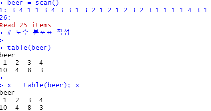
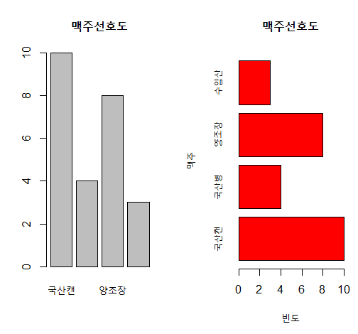
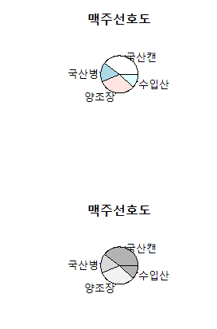
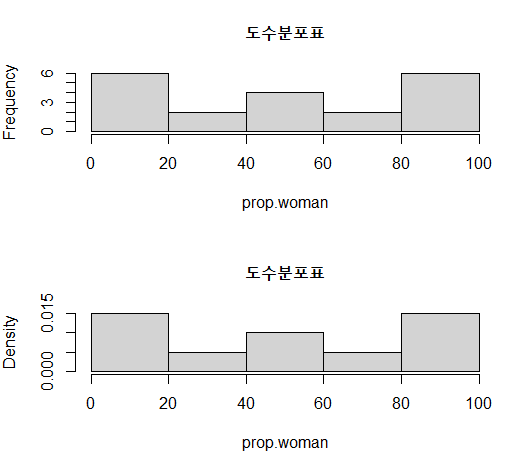
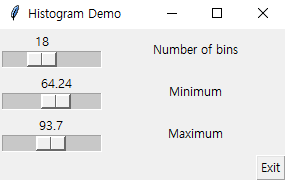
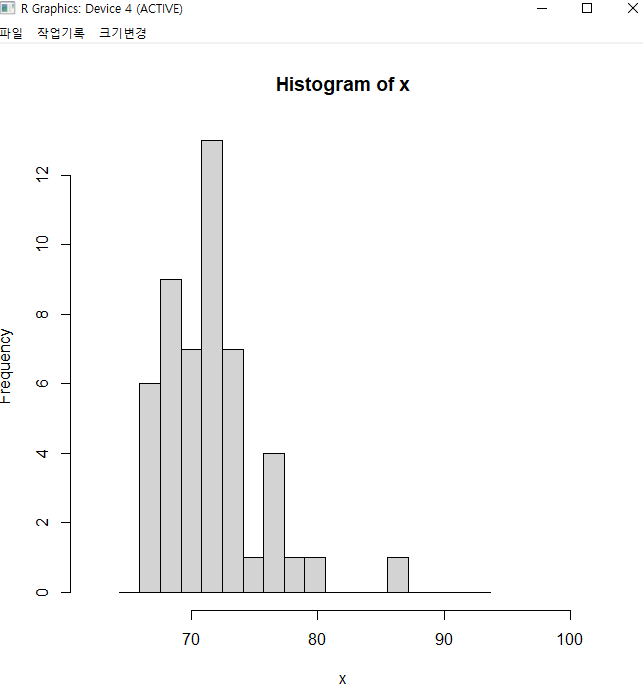
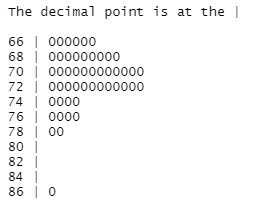
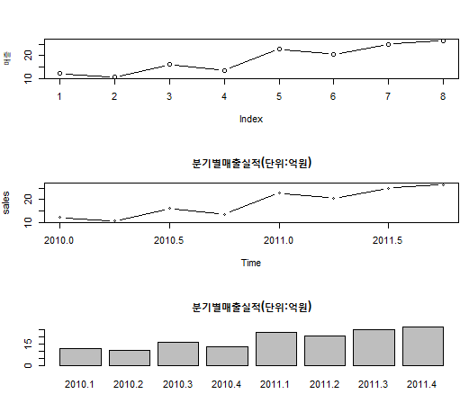

# R Graph Basic


## 1. 막대그래프


### 1) 도수 분포표 작성

```R
# 1. 막대 그래프(bar chart, barplot)
# 맥주선호도 자료 (1=, 국산캔, 2=국산병, 3=양조장, 4=수입)

beer = scan()
3 4 1 1 3 4 3 3 1 3 2 1 2 1 2 3 2 3 1 1 1 1 4 3 1

# 도수 분포표 작성

table(beer)

x = table(beer); x
names(x) = c("국산캔", "국산병", "양조장", "수입산"); x
```




### 2) 막대 그래프 그리기

```R
# 막대그래프

par(mfrow=c(1,2))
barplot(x, main="맥주선호도")
barplot(x, col="red", horiz=T, xlab="빈도", ylab="맥주", main="맥주선호도")
```




## 2. 원형 그래프

- '1'의 도수분포표를 그대로 사용


### 1) 원형 그래프 그리기

```R
# 2. 원형 그래프(pie chart)

par(mfrow=c(2,1))
pie(x, main="맥주선호도")
pie(x,col=grey(c(0.7,0.85,0.95)), main="맥주선호도")
```




## 3. 히스토그램


### 1) 도수분포표를 이용한 히스토그램 그리기

```R
prop.woman  = c(18,7,24,8,59,99,74,51,66,17,99,12,20,42,98,100,33,97,97,53)
n = length(prop.woman)

cat.job = cut(prop.woman,breaks=c(0,20,40,60,80,100))
cat.job

table(cat.job)

levels(cat.job)=c("0-20%","20-40%","40-60%","60-80%","80-100%")
table(cat.job)

hist(prop.woman,breaks=c(0,20,40,60,80,100),main="도수분포표")
hist(prop.woman,
```




### 2) 계급에 따른 히스토그램 데모


```R
install.packages("TeachingDemos")
library(TeachingDemos)

wgt = scan()
72 74 73 76 66 86 70 71 77 71
70 72 71 72 70 72 79 74 70 74
72 77 78 72 69 68 76 67 69 73
72 73 66 67 72 68 68 67 71 67
69 75 70 68 73 70 68 69 70 71


x11()
run.hist.demo(wgt)
```

- 히스토그램 조정

  

- 결과

  

## 4. 줄기 잎 그래프

- Data는 '3'의 wgt를 사용함.


### 1) 줄기-잎 그림

```R
stem(wgt)
```




## 5. 시계열 그래프


### 1) 시계열 그래프 그리기

```R
매출=c(12.0,10.5,16.0,13.5,23.0,20.5,25.0,26.5)
sales = ts(매출,frequency=4,start=c(2010,1))	# 분기별 자료
sales

par(mfrow=c(3,1))
plot(매출,type="b")
plot(sales,type="b",main="분기별매출실적(단위:억원)")
names(매출)= c(paste("2010.",1:4,sep=""),paste("2011.",1:4,sep=""))
barplot(매출,main="분기별매출실적(단위:억원)")
```



