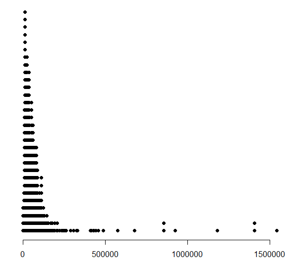
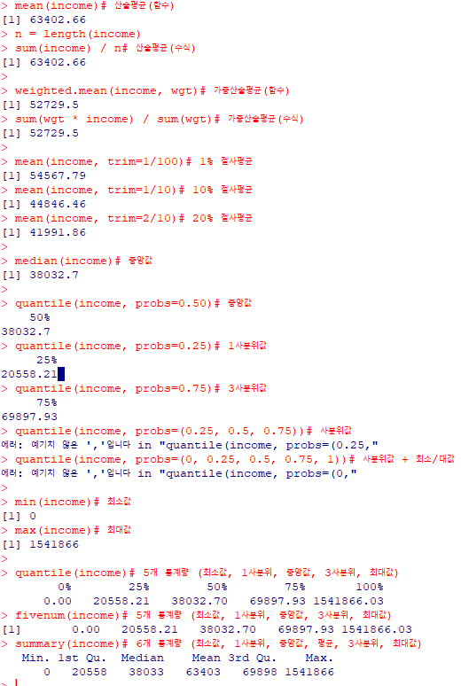
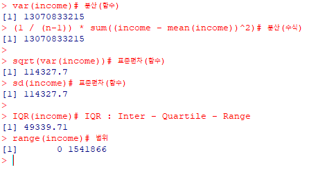
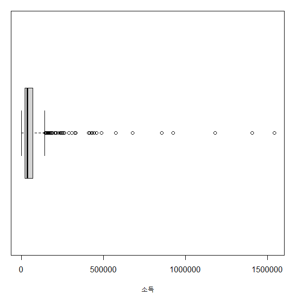
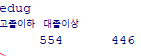
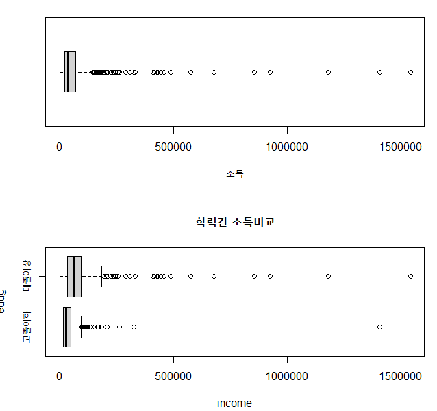

# R Using Package Basic


## 1. 점산도(dotplot)


### 1) 점산도 그리기

```R
### 1. 점산도(dotplot)

install.packages("UsingR") 	# Package install
library(UsingR) 			# Package Read

str(cfb)				# DataSet of UsingR

# 1) DataFrame의 특정 값을 담을 변수 선언
income = cfb$INCOME
wgt = cfb$WGT
age = cfb$AGE

# 2) 점산도 그리기
DOTplot(income)			# DOTplot (UsingR) 사용한 점산도 그리기
```




### 2) 중심측도 구하기

```R
mean(income)			# 산술평균(함수)
n = length(income)
sum(income) / n			# 산술평균(수식)

weighted.mean(income, wgt)	# 가중산술평균(함수)
sum(wgt * income) / sum(wgt)	# 가중산술평균(수식)

mean(income, trim=1/100)	# 1% 절사평균
mean(income, trim=1/10)		# 10% 절사평균
mean(income, trim=2/10)		# 20% 절사평균

median(income)			# 중앙값

quantile(income, probs=0.50)	# 중앙값
quantile(income, probs=0.25)	# 1사분위값
quantile(income, probs=0.75)	# 3사분위값
quantile(income, probs=(0.25, 0.5, 0.75))	# 사분위값
quantile(income, probs=(0, 0.25, 0.5, 0.75, 1))	# 사분위값 + 최소/대값

min(income)				# 최소값
max(income)				# 최대값

quantile(income)			# 5개 통계량 (최소값, 1사분위, 중앙값, 3사분위, 최대값)
fivenum(income)			# 5개 통계량 (최소값, 1사분위, 중앙값, 3사분위, 최대값)
summary(income)			# 6개 통계량 (최소값, 1사분위, 중앙값, 평균, 3사분위, 최대값)
```




### 3) 산포측도 구하기

```R
var(income)				# 분산(함수)
(1 / (n-1)) * sum((income - mean(income))^2)	# 분산(수식)

sqrt(var(income))			# 표준편차(함수)
sd(income)				# 표준편차(함수)

IQR(income)				# IQR : Inter - Quartile - Range
range(income)			# 범위
```




## 2. 상자그림(boxplot)


### 1) 상자그림 그리기

```R
boxplot(income, horizontal=TRUE, xlab="소득")	# 상자그림
```



- 교육분류하여 그리기

```R
edu = cfb$EDUC
edug = rep("고졸이하", n)
edug[edu > 13] = "대졸이상"
table(edug)

par(mfrow=c(2,1))
boxplot(income, horizontal=TRUE, xlab="소득")	# 상자그림
boxplot(income~edug, horizontal=TRUE, main="학력간 소득비교")
```





