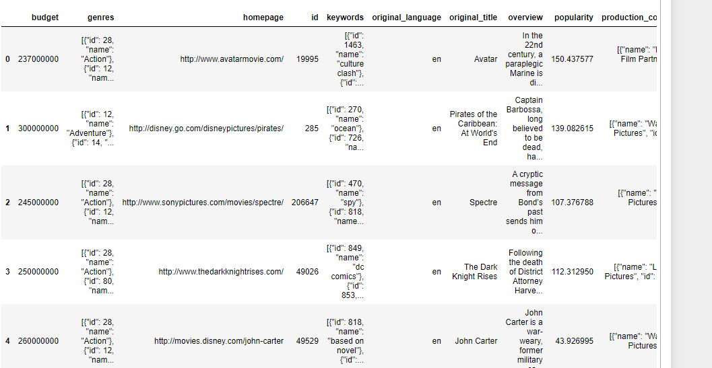
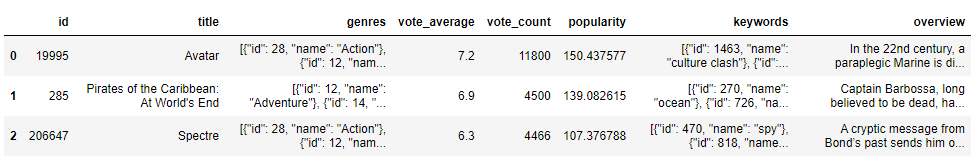
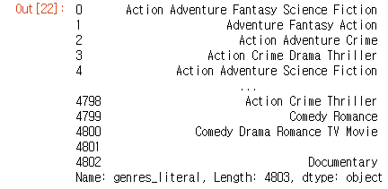
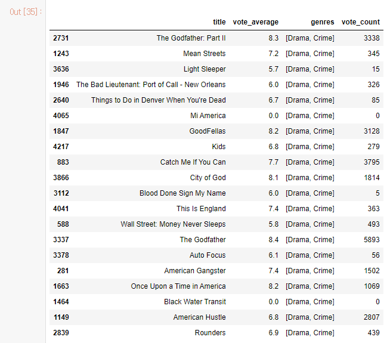
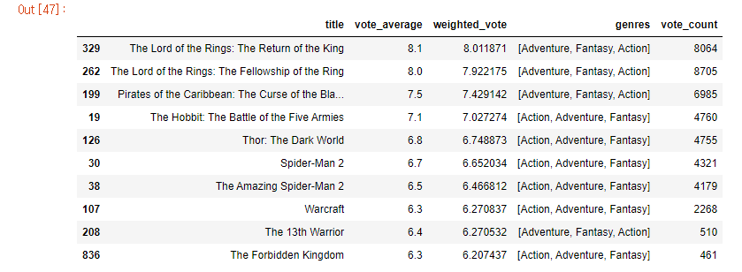

# 장르 유사도 기반 영화 추천 시스템(CBF)


- 사용 데이터 셋 : https://www.kaggle.com/tmdb/tmdb-movie-metadata


## 1. 데이터 로드

```python
import pandas as pd  # 데이터 분석을 위한 라이브러리
import numpy as np   # 넘파이 : 숫자 계산

# 워닝(버전, 업데이트 문제, 에러는 아님) 코드는 실행되는데 정보. 귀찮을 때 워닝 끄기
import warnings
warnings.filterwarnings('ignore')

movies = pd.read_csv('tmdb_5000_movies.csv')

print(movies.shape)  # 행, 열 개수 파악
movies.head()
```




## 2. 데이터 전처리

### 1) 필요 컬럼 추출

```python
# 필요한 컬럼만 추출
movies_df = movies[['id','title','genres','vote_average','vote_count','popularity','keywords','overview']]
movies_df.head(3)
```




### 2) genres, keywords 칼럼들의 str형태를 list형태로 바꿔주기

```python
from ast import literal_eval  # 문자열 파싱 라이브러리
movies_df['genres'] = movies_df['genres'].apply(literal_eval)
movies_df['keywords'] = movies_df['keywords'].apply(literal_eval)
```


### 3) list 내 여러개 딕셔너리의 name키에 해당하는 값들을 리스트로 변환

```python
movies_df['genres'] = movies_df['genres'].apply(lambda x : [ y['name'] for y in x])
movies_df['keywords'] = movies_df['keywords'].apply(lambda x : [ y['name'] for y in x])
```


## 3. 장르 유사도 측정

- 장르 CBF 추천 : 장르를 피처 벡터화한 후 행렬 데이터 값을 코사인 유사도(0~1)로 계산하기
- 프로세스
  - 장르 피처 벡터화: 문자열로 변환된 genres 칼럼을 Count 기반으로 피처 벡터화 변환
  - 코사인 유사도 계산 : genres 문자열을 피처 벡터화한 행렬로 변환한 데이터 세트를 코사인 유사도로 비교
  - 평점으로 계산 : 장르 유사도가 높은 영화 중 평점이 높은 순으로 영화 추천

### 1) CountVectorizer를 적용하기 위해 공백문자로 word 단위가 구분되는 문자열로 변환

```python
from sklearn.feature_extraction.text import CountVectorizer

movies_df['genres_literal'] = movies_df['genres'].apply(lambda x : (' ').join(x))
movies_df['genres_literal']
```



### 2) CounterVectorizer 적용하여 장르 매트릭스 생성

```python
count_vect = CountVectorizer(min_df=0, ngram_range=(1, 2))  # min_df: 단어장에 들어갈 최소빈도, ngram_range: 1 <= n <= 2
genre_mat = count_vect.fit_transform(movies_df['genres_literal'])
```


```python
# CountVectorizer로 학습시켰더니 4803개 영화에 대한 22개 장르의 '장르 매트릭스'가 생성되었다.
count_vect2 = CountVectorizer(min_df=1, ngram_range=(1, 1))  # min_df: 단어장에 들어갈 최소빈도, ngram_range: 1 <= n <= 2
genre_mat2 = count_vect2.fit_transform(movies_df['genres_literal'])
```


### 3) 코사인 유사도(cosine_similarity)이용해서 영화별 유사도 계산

```python
from sklearn.metrics.pairwise import cosine_similarity
genre_sim = cosine_similarity(genre_mat, genre_mat)
```

```python
# 자료를 정렬하는 것이 아니라 순서만 알고 싶다면 argsort
# 유사도가 높은 영화를 앞에서부터 순서대로 보여줌

# 0번째 영화의 경우 유사도 순서 : 0번, 3494번, 813번, ..., 2401 순서
genre_sim_sorted_ind = genre_sim.argsort()[:, ::-1] # ::-1 : 역순으로 정렬
print(genre_sim_sorted_ind[:5])
```


## 4. 장르 코사인 유사도 기반 영화 추천

```python
def find_sim_movie_ver1(df, sorted_ind, title_name, top_n=10):
    
    # 인자로 입력된 movies_df DataFrame에서 'title' 컬럼이 입력된 title_name 값인 DataFrame추출
    title_movie = df[df['title'] == title_name]
    
    # title_named을 가진 DataFrame의 index 객체를 ndarray로 반환하고 
    # sorted_ind 인자로 입력된 genre_sim_sorted_ind 객체에서 유사도 순으로 top_n 개의 index 추출
    title_index = title_movie.index.values
    similar_indexes = sorted_ind[title_index, :(top_n)]
    
    # 추출된 top_n index들 출력. top_n index는 2차원 데이터 임.
    # dataframe에서 index로 사용하기 위해서 1차원 array로 변경
    print(similar_indexes)    
    # 2차원 데이터를 1차원으로 변환
    similar_indexes = similar_indexes.reshape(-1)
    
    return df.iloc[similar_indexes]
```

```python
similar_movies = find_sim_movie_ver1(movies_df, genre_sim_sorted_ind, 'Once Upon a Time in America', 20)

similar_movies[['title', 'vote_average', 'genres', 'vote_count']]
# 문제 ; 평점 기반으로 추천하고자 하는데, vote_count가 낮은 영화는 제외하고 싶음
```




## 5. 가중평점 반영 영화 추천

```tex
@ 가중평점(Weighted Rating):

   (v/(v+m))*R + (m/(v+m))*C

- v : 영화별 평점을 투표한 횟수(vote_count) ★ 투표횟수가 많은 영화에 가중치 부여
- m : 평점을 부여하기 위한 최소 투표 횟수 -> 여기서는 투표수 상위 60%
- R : 개별 영화에 대한 평균 평점(vote_average)
- C : 전체 영화에 대한 평균 평점(movies_df['vote_average'].mean()
# C, m은 영화마다 고정값
# v,R은 영화마다 변동값
```


### 1) 가중평점 계산 함수

```python
def weighted_vote_average(record):
    v = record['vote_count']
    R = record['vote_average']
    
    return ( (v/(v+m)) * R ) + ( (m/(m+v)) * C )
```

```python
# 기존 데이터에 가중평점 칼럼 추가
movies_df['weighted_vote'] = movies_df.apply(weighted_vote_average, axis=1)
```


### 2) 먼저 장르 유사성 높은 영화 20개 선정 후(F1), 가중평점순 10개 선정(F2)

```python
def find_sim_movie_ver2(df, sorted_ind, title_name, top_n=10):
    title_movie = df[df['title'] == title_name]
    title_index = title_movie.index.values
    
    # top_n의 2배에 해당하는 쟝르 유사성이 높은 index 추출
    similar_indexes = sorted_ind[title_index, :(top_n*2)]
    similar_indexes = similar_indexes.reshape(-1)

    # 기준 영화 index는 제외
    similar_indexes = similar_indexes[similar_indexes != title_index]
    
    # top_n의 2배에 해당하는 후보군에서 weighted_vote 높은 순으로 top_n 만큼 추출 
    return df.iloc[similar_indexes].sort_values('weighted_vote', ascending=False)[:top_n]
```


### 3) Spider-Man 3 좋아하는 사람 기준으로 장르가 유사한 영화를 추천

```
similar_movies = find_sim_movie_ver2(movies_df, genre_sim_sorted_ind, 'The Amazing Spider-Man',10)
similar_movies[['title', 'vote_average', 'weighted_vote', 'genres', 'vote_count']]
```



