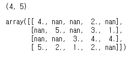
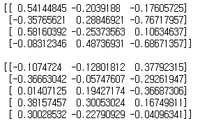
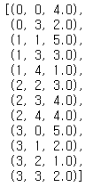
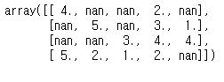
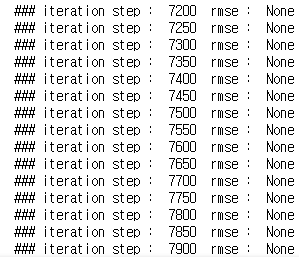
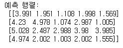
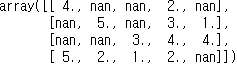

# MF기반 잠재요인 협업 필터링


## 1. MF 잠재요인 협업 필터링

- 행렬 분해 기반의 협업필터링의 핵심은 사용자-아이템 평점 매트릭스 속에 숨어있는 잠재 요인을 추출해서 영화 별 예측 평점을 계산하여 영화 등 아이템 추천을 가능하게 해주는 것이다.

- 실제 평점 행렬(R)을 행렬 분해(Matrix Factorization) 기법으로 분해해서 잠재 요인을 추출한다.
- 행렬 분해(MF) 기법은 넷플릭스 경연 대회에서 사용되었다.
- 많은 추천시스템이 행렬 분해에 기반한 잠재 요인 협업필터링을 적용하고 있다.


## 2. 경사하강법을 이용한 행렬 분해 이해


```python
import numpy as np

# 원본 행렬 R 생성, 
# 분해 행렬 P와 Q 초기화, 잠재요인 차원 K는 3 설정. 
R = np.array([[4, np.NaN, np.NaN, 2, np.NaN ],
              [np.NaN, 5, np.NaN, 3, 1 ],
              [np.NaN, np.NaN, 3, 4, 4 ],
              [5, 2, 1, 2, np.NaN ]])

print(R.shape)
R # R은 4X5 행렬이다.
```



- Matrix Factorization : 행렬 R을 행렬 P, Q로 분해

```python
num_users, num_items = R.shape

K=3  # 잠재 요인은 3개

print(num_users) # M
print(num_items) # N
```

```python
# P, Q 찾기
# P와 Q 매트릭스의 크기를 지정하고 정규분포를 가진 random한 값으로 입력합니다.
np.random.seed(1)

P = np.random.normal(scale=1./K, size=(num_users, K))  # 4X3 P행렬
Q = np.random.normal(scale=1./K, size=(num_items, K))  # 5X3 Q행렬
# (4, 3) * (5, 3)T -> (4, 5)

# 행렬 P, Q 초기화 상태 
print(P,'\n')
print(Q)
```



- 비용계산 함수를 생성하고 분해된 행렬 P와 Q.T를 내적하여 예측 행렬을 생산한다.
- 실제 행렬에서 null이 아닌 위치 값만 예측 행렬의 값과 비교하여 RMSE(오차) 값을 계산하고 반환한다.

```python
from sklearn.metrics import mean_squared_error

# 실제 행렬 R과 예측 행렬 간 오차(RMSE)를 구하는 함수
# R 행렬에서 비어있지 않은 값 : non_zeros
def get_rmse(R, P, Q, non_zeros):
    error = 0
    # 두개의 분해된 행렬 P와 Q.T의 내적으로 예측 R 행렬 생성
    full_pred_matrix = np.dot(P, Q.T)
    
    # 실제 R 행렬에서 널이 아닌 값의 위치 인덱스 추출하여 실제 R 행렬과 예측 행렬의 RMSE 추출
    x_non_zero_ind = [non_zero[0] for non_zero in non_zeros]
    y_non_zero_ind = [non_zero[1] for non_zero in non_zeros]
    R_non_zeros = R[x_non_zero_ind, y_non_zero_ind]
    full_pred_matrix_non_zeros = full_pred_matrix[x_non_zero_ind, y_non_zero_ind]
      
    mse = mean_squared_error(R_non_zeros, full_pred_matrix_non_zeros)
    rmse = np.sqrt(mse)
    
    return rmse
```

- 경사하강법에 기반하여 P와 Q의 원소들을 업데이트

```python
# R > 0 인 행 위치, 열 위치, 값을 non_zeros 리스트에 저장. 
non_zeros = [ (i, j, R[i,j]) for i in range(num_users) for j in range(num_items) if R[i,j] > 0 ]
non_zeros
```



```python
R
```



```python
steps=10000
learning_rate=0.01
r_lambda=0.01

# P와 Q 매트릭스를 계속 업데이트(확률적 경사하강법)
for step in range(steps):  # 10000회 업데이트
    for i, j, r in non_zeros:
        
        # 실제 값과 예측 값의 차이인 오류 값 구함
        eij = r - np.dot(P[i, :], Q[j, :].T)
        
        # Regularization을 반영한 SGD(확률적 경사하강법) 업데이트 공식 적용
        P[i,:] = P[i,:] + learning_rate * ( eij * Q[j,:] - r_lambda*P[i,:] )
        Q[j,:] = Q[j,:] + learning_rate * ( eij * P[i,:] - r_lambda*Q[j,:] )

    rmse = get_rmse(R, P, Q, non_zeros)
    if (step % 50) == 0 :
        print("### iteration step : ", step," rmse : ", rmse)
```



- 실제 행렬과 예측 행렬 간 오차를 최소화하는 방향(rmse 감소)으로 경사하강법 진행
-> P와 Q 행렬이 업데이트 된다.

```python
pred_matrix = np.dot(P, Q.T)
print('예측 행렬:\n', np.round(pred_matrix, 3))
```



```python
# 원본 행렬 R
R
```



- 예측 행렬과 실제 행렬의 값이 최대한 비슷하게 만들어 진 것을 확인할 수 있다.