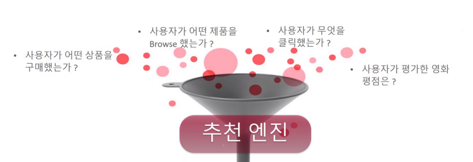
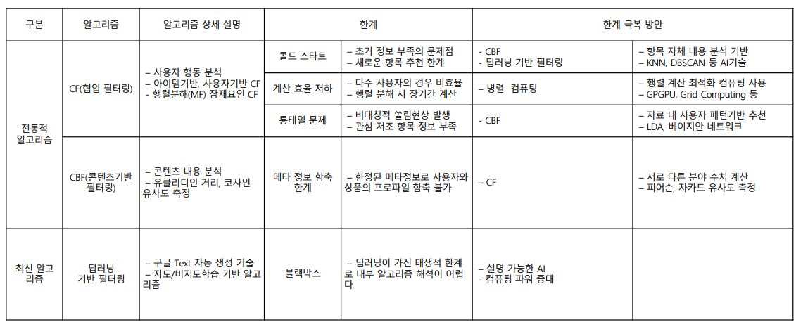

# 추천시스템의 이해

## 1. 추천시스템이란?

- 개인 맞춤형 서비스 제공을 위해 구매패턴 등 과거 데이터를 분석하여 상품을 추천하는 시스템

- 추천시스템의 이점
  - 롱테일 문제를 해결한다.
    - 80:20 법칙에서 소외된 80퍼센트의 고객에서도 상당한 영업기회가 존재한다는 현상(즉, 주력 상품 외의 수입원도 중요함)
  - 고객, 기업 양측 모두에게 이익이된다.
    - 고객 : 원하는 상품을 빠르게 찾음.
    - 기업 : 더 다양한 상품을 고객에게 판매할 수 있음.
- 추천시스템의 종류
  - 사용자 프로파일링 기반
  - Segment 기반
  - 상품 연관규칙 기반
  - CF(협업 필터링) 기반
  - CBF(컨텐츠 베이스 필터링) 기반
  - 딥러닝 기반

