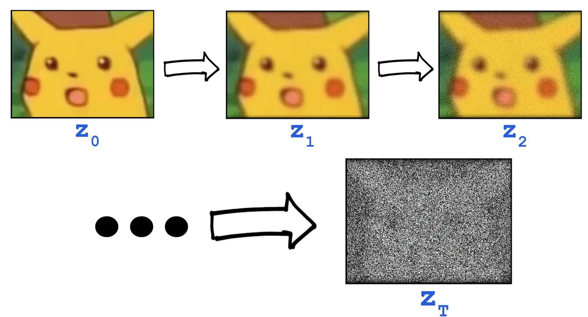
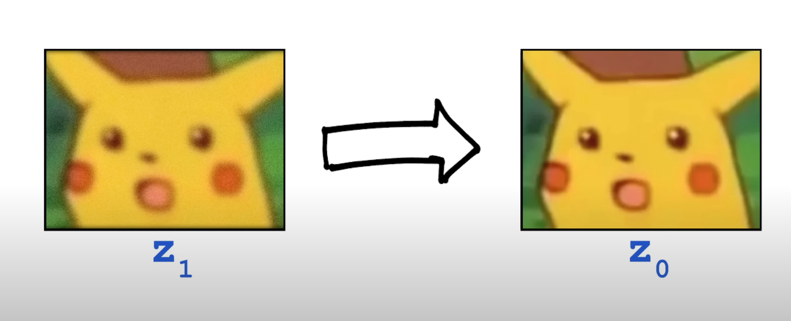

# Stable diffusion

## 1. Stable diffusion이란 무엇인가?

1. 서론

   Stable Diffusion은 기본적으로 생성모델로는 Latent Diffusion Model(LDM), 근사모델로는 AutoEncoder + GAN의 원리를 사용하였다.

2. 원리

   Stable diffusion은 어떠한 학습방법을 통해서 이미지를 생성하고 변환시키는가? 그것은 바로 noising - denoising을 통한 단계별 변환방법을 사용하였다.

   

   즉, 하나의 이미지를 강도에 따라 여러 단계의 노이즈를 섞는다. (원본 이미지가 사라질 때까지) 그리고 완전히 노이즈가 섞인 이미지를 단계별로 denoising하여 복원하며 학습을 한다. 

   이렇게 하면 모델은 최종적으로 noise가 엄청나게 섞인 이미지를 입력받아도 noise가 거의 없는 방향으로 변환할 수 있는 지능을 가지게 된다.

3. 예시.

   

   다음과 같이 단계별 noise를 부여하는 과정을 거친다.

   

   이후에 모델은 단계별로 노이즈를 제거하면서 원본을 복구하도록 학습된다. 이 방법을 모델은 다음과 같은 결과를 얻을 수 있다.

   

   img2img 기능에서 input을 노이즈가 많이 섞인 이미지로 판단하고 거기에 학습된 지능으로 복원을 한다.

## 2. Stable Diffusion이 각광 받을 수 있었던 이유?

> Stable Diffusion은 기존 Diffusion 방식에서 학습방식을 변경시킨 것에 불과하다. 하지만 이러한 간단한 변화만 주었음에도 기존 Diffusion보다 엄청나게 각광받는 이유는 무엇일까? 그 이유는 다음 4가지로 설명할 수 있다.

1. 좋은 성능과 결과

   Stable Diffusion은 기본적으로 매우 고품질의 Output을 제공한다. 따라서 사용자의 만족감을 충족할 수 있었고 각광받게 되었다.

2. 무료 제공

   Stable Diffusion은 무료로 제공되었기 때문에 해당 모델을 사용하고 싶은 사람들은 언제든지 다운로드를 통하여 사용할 수 있다.

3. 오픈 소스

   Stable Diffusion은 한화 약 8억원의 연구비를 들여가며 개발했음에도 불구하고 이에 대한 소스코드를 오픈하여 제공한다. 이를 기반으로 현재도 비디오 생성, 3D 이미지 생성 등 다양한 모델이 만들어지고 있다.

4. 컴퓨터 자원의 소모 최소화

   이미지 관련 AI 모델은 기본적으로 매우 높은 컴퓨터 성능, 자원을 요구한다. 따라서 일반인들은 이미지 관련 AI 모델을 학습하거나 사용하는 것에 매우 제한적이다. 하지만 Stable Diffusion은 VRAM 12G만 있어도 무리 없이 동작하는 모습을 보여 접근성이 매우 낮다.

## [Reference]

- [Youtube - Edan Meyer](https://www.youtube.com/watch?v=ltLNYA3lWAQ&t=448s)
- [Papers](https://arxiv.org/pdf/2112.10752.pdf)
- [Source Code](https://github.com/CompVis/stable-diffusion)