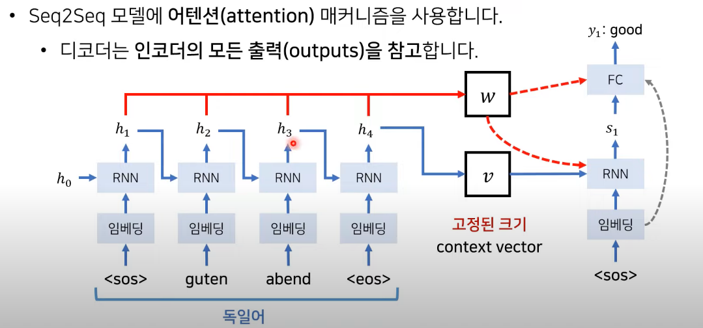
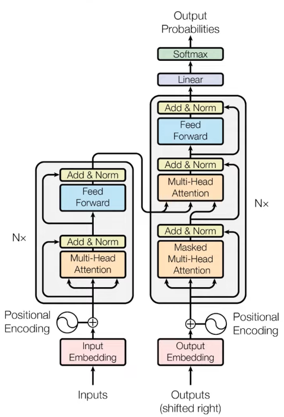
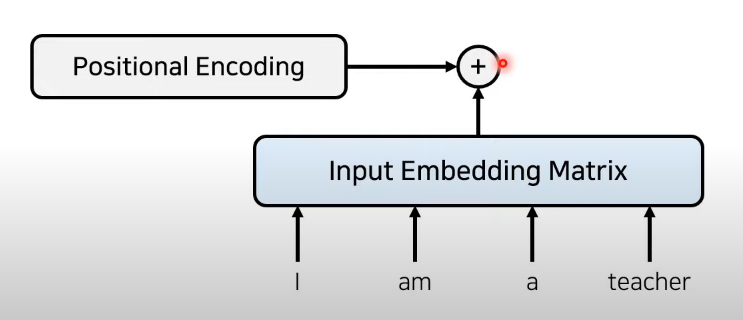
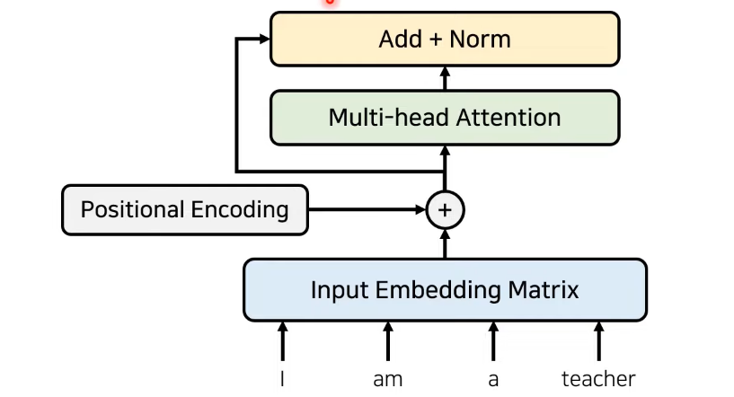

# Transformer 논문 분석

> 해당 분석에서는 *Attention Is All You Need* 논문을 분석하고 Transformer를 이해한다.

## 1. 서론

### (1) 현대 고성능 NLP 모델

- GPT : Transformer의 디코더(Decoder) 구조를 활용
- BERT : Transformer의 인코더(Encoder) 구조를 활용

이처럼 최신 NLP 모델들은 Transformer 구조를 이용하고 있다. 따라서 최신 모델들을 이해하기 위해서는 Transformer의 구조를 이해할 필요가 있다.

### (2) NLP 모델

1. RNN 기반 구조 활용 -> Seq2Seq 구조에서 하나의 문맥 벡터가 소스 문장의 모든 정보를 가지고 있어야하므로 성능 저하의 원인(병목현상)

2. Attention 기법을 사용하는 구조 활용 (성능이 매우 향상)

   - Attention 구조는 하나의 컨텍스트 벡터만을 사용하는 것이 아닌 hidden state의 모든 출력값을 참고한다.
   - 즉, 디코더는 인코더의 모든 출력을 참고한다.

   

   [참고- 동빈나]

   - 디코더는 매번 인코더의 모든 출력 중에서 어떤 정보가 중요한지 계산한다.

## 2. Transformer

- Transformer은 Attention 기능만 사용하고 CNN, RNN 을 전혀 사용하지 않는다.
- 인코더와 디코더로 구성되며 Attention 과정을 여러 레이어에서 반복한다.

### (1) 구조 및 동작원리

1. 전통적인 임베딩 과정을 거친다. (각 단어에 대한 임베딩 값을 구한다) -> 임베딩 값은 사용자 정의 가능하다. (본 논문에서는 512의 크기로 설계)
2. Transformer는 각 단어의 위치 정보도 함께 저장하기 위해 **Positional Encoding** 기법을 사용한다.

3. 임베딩 후 셀프 어텐션(Attention)을 진행한다. -> 각 단어가 서로 어떠한 연관성을 지니는지에 대한 Attention Score를 구하기 위함.

4. 이후 성능 향상을 위해 Residual Learning(잔여학습)을 사용 -> 값을 반복적으로 갱신하는 것이 아닌 특정 Layer를 건너뛰어서 값을 입력하는 방식 -> 기존 네트워크는 입력받으면서 잔여학습을 진행하면 학습난이도가 낮고 초기 모델 수렴속도가 상승 -> Global Optimer을 찾기가 쉬워진다.

   

5. Attention과 Normalization 과정을 반복

   - 각 레이어는 서로 다른 파라미터를 가짐에 주의한다!

6. 마지막 Layer에서 나온 값은 Decoder로 입력된다.

   - 이 과정을 통해 어떤 단어가 중심이 되는지 파악할 수 있다.

7. Decoder에 존재하는 2개의 Attention

   1. Self Attention -> 출력되는 문장에 대해 학습
   2. Encoder Attention -> 인코더의 출력 단어가 소스 문장의 어떠한 단어와 연관이 있는지 알아내기 위한 Attention

8. Transformer에서는 마지막 인코더 레이어의 출력이 모든 디코더 레이어에 입력된다.

   - Transformer는 Encoder, Decoder 구조를 따른다.
   - RNN을 사용하지 않는다.
   - Encoder와 Decoder를 다수 사용한다.

 

### (2) Multi - Head Attention이란

- Attention을 위한 세가지 요소
  1. 쿼리(Query)
  2. 키(Key)
  3. 값(value)
- 예시) I am a teacher
  - Q. I가 해당 문장과 어느 정도 연관성이 있는가?
    - Query : I
    - Key : 'I', 'am', 'a', 'teacher'
- Transformer에 사용되는 Attension 종류
  1. Encoder Self-Attention
  2. Masked Decoder Self-Attention
  3. Encoder - Decoder Attention