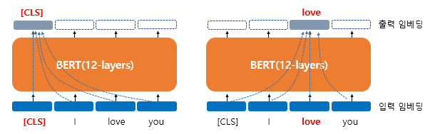
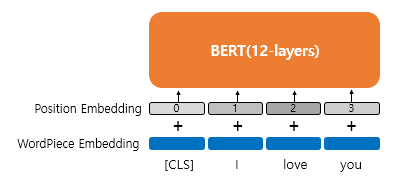
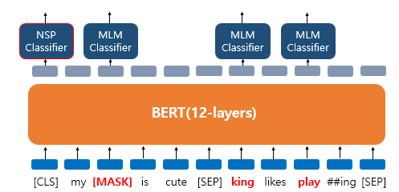
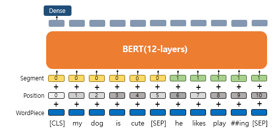
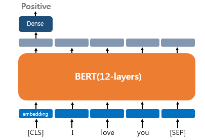
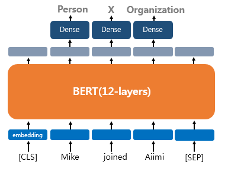
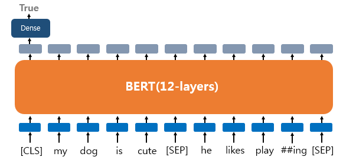
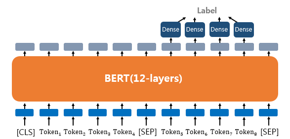

# BERT(Bidirectional Encoder Representations from Transformers)

## 1. BERT란?

- 트랜스포머(transformer) 계열의 사전 훈련된 언어 모델이다.

- 위키피디아(25억 단어)와 BooksCorpus(8억 단어)와 같은 레이블이 없는 텍스트 데이터로 사전 훈련된 언어 모델

## 2. BERT의 문맥을 반영한 임베딩(Contextual Embedding)

- BERT의 연산을 거친 후의 출력 임베딩은 문장의 문맥을 모두 참고한 문맥을 반영한 임베딩이 된다.
- 단순 임베딩에서 BERT 층을 거치면 문맥 정보를 가진 벡터가 된다.
- 이때 '셀프 어텐션'을 사용하여 모든 단어를 참고하여 문맥을 반영한 출력 임베딩을 얻게된다.

## 3. **BERT의 서브워드 토크나이저 : WordPiece**

- BERT는 노이즈 데이터에 대해 서브워드 토크나이저를 통해서 대응한다.
- 서브워드 토크나이저는 기본적으로 자주 등장하는 단어는 그대로 단어 집합에 추가하지만, 자주 등장하지 않는 단어의 경우에는 더 작은 단위인 서브워드로 분리되어 서브워드들이 단어 집합에 추가된다는 아이디어를 가진다.
- ex. 'embeddings'라는 단어가 BERT의 단어 집합에 존재하지 않으면 'em', '##bed', '##ding', '##s'로 서브 토큰화한다.

## 4. **포지션 임베딩(Position Embedding)**

- BERT에 입력되는 단어 토큰들은 서브 토큰화 임베딩과 포지션 임베딩을 겨친 후 입력된다. -> 트랜스포머를 인용한 기법이기 때문에 트랜스포머와 구조가 비슷하다.

## 5. **BERT의 사전 훈련(Pre-training)**

### 1) **마스크드 언어 모델(Masked Language Model, MLM)**

- 입력 텍스트의 15% 단어를 랜덤으로 마스킹(Masking)한다.
- 마스킹된 단어들을 예측하도록 한다.
- Masking 규칙
  - 80%의 단어들은 [MASK]로 변경한다.
    - Ex) The man went to the store → The man went to the [MASK]
  - 10%의 단어들은 랜덤으로 단어가 변경된다.
    - The man went to the store → The man went to the dog
  - 10%의 단어들은 동일하게 둔다.
    - Ex) The man went to the store → The man went to the store

- 이러한 방식의 Masking 규칙을 따르는 이유
  - [MASK]만 사용할 경우에는 [MASK] 토큰이 파인 튜닝 단계에서는 나타나지 않으므로 사전 학습 단계와 파인 튜닝 단계에서의 불일치가 발생하는 문제를 완화하기 위함.

### 2) **다음 문장 예측(Next Sentence Prediction, NSP)**

- 두 개의 문장을 준 후에 이 문장이 이어지는 문장인지 아닌지를 맞추는 방식으로 훈련시킨다.
  - 이어지는 문장의 경우
    - Sentence A : The man went to the store.
    - Sentence B : He bought a gallon of milk.
    - Label = IsNextSentence
  - 이어지지않는 문장의 경우
    - Sentence A : The man went to the store.
    - Sentence B : dogs are so cute.
    - Label = NotNextSentence

- BERT의 입력으로 넣을 때에는 [SEP]라는 특별 토큰을 사용해서 문장을 구분한다.
- 첫번째 문장의 끝에 [SEP] 토큰을 넣고, 두번째 문장이 끝나면 역시 [SEP] 토큰을 붙여준다.
- 이 두 문장이 실제 이어지는 문장인지 아닌지를 [CLS] 토큰의 위치의 출력층에서 이진 분류 문제를 풀도록 한다.
  - [CLS] 토큰은 BERT가 분류문제를 풀기위해 추가된 특별 토큰이다.
- 마스크드 언어 모델과 다음 문장 예측은 따로 학습하는 것이 아닌 loss를 합하여 학습이 동시에 이루어진다.

## 6. **세그먼트 임베딩(Segment Embedding)**

- 문장 구분을 위해서 BERT는 세그먼트 임베딩이라는 또 다른 임베딩 층(Embedding layer)을 사용한다.
- 첫번째 문장에는 Sentence 0 임베딩, 두번째 문장에는 Sentence 1 임베딩을 더해주는 방식이며 임베딩 벡터는 두 개만 사용된다.

## 7. BERT를 파인 튜닝(Fine-tuning)하기

### 1) 파인 튜닝이란?

- 사전 학습 된 BERT에 우리가 풀고자 하는 태스크의 데이터를 추가로 학습 시켜서 테스트하는 것

### 2) 하나의 텍스트에 대한 텍스트 분류 유형(Single Text Classification)

- 텍스트 분류 문제를 풀기 위해서 [CLS] 토큰의 위치의 출력층에서 밀집층(Dense layer) 또는 같은 이름으로는 완전 연결층(fully-connected layer)이라고 불리는 층들을 추가하여 분류에 대한 예측을 한다.

### 3) 하나의 텍스트에 대한 태깅 작업(Tagging)

-  출력층에서는 입력 텍스트의 각 토큰의 위치에 밀집층을 사용하여 분류에 대한 예측을 한다.

### 4) 텍스트의 쌍에 대한 분류 또는 회귀 문제(Text Pair Classification or Regression)

- 자연어 추론 문제라고도 한다.
- 두 문장이 주어졌을 때, 하나의 문장이 다른 문장과 논리적으로 어떤 관계에 있는지를 분류
- 텍스트의 쌍을 입력받는 이러한 태스크의 경우에는 입력 텍스트가 1개가 아니므로, 텍스트 사이에 [SEP] 토큰을 집어넣고, Sentence 0 임베딩과 Sentence 1 임베딩이라는 두 종류의 세그먼트 임베딩을 모두 사용하여 문서를 구분

### 5) 질의 응답(Question Answering)

-  BERT로 QA를 풀기 위해서 질문과 본문이라는 두 개의 텍스트의 쌍을 입력하여 질문에 대한 답을 도출하는 것.
- Ex. 
  - 질문 : "강우가 떨어지도록 영향을 주는 것은?"
  - 본문 :  "기상학에서 강우는 대기 수증기가 응결되어 중력의 영향을 받고 떨어지는 것을 의미합니다. 강우의 주요 형태는 이슬비, 비, 진눈깨비, 눈, 싸락눈 및 우박이 있습니다."
  - 답 : "중력"