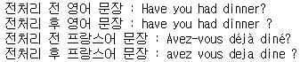
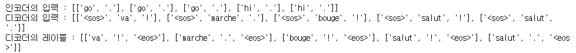
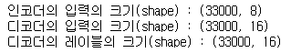
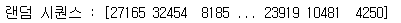
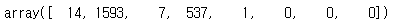
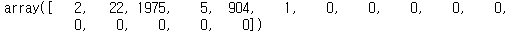
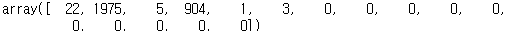
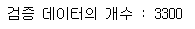
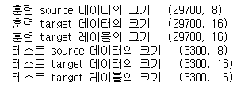
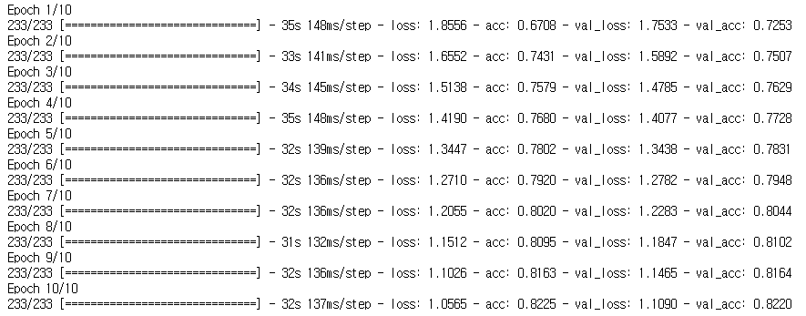

# 단어 레벨 기계 번역기

- 입력문장과 출력문장이 다름에 유의해야한다.


## 1. 패키지 로드

```python
import os
import re
import shutil
import zipfile

import numpy as np
import pandas as pd
import tensorflow as tf
import unicodedata
import urllib3
from tensorflow.keras.layers import Embedding, GRU, Dense
from tensorflow.keras.preprocessing.sequence import pad_sequences
from tensorflow.keras.preprocessing.text import Tokenizer
```


## 2. 데이터 로드 및 전처리

```python
http = urllib3.PoolManager()
url ='http://www.manythings.org/anki/fra-eng.zip'
filename = 'fra-eng.zip' # 병렬 corpus (영어 - 프랑스어)
path = os.getcwd()
zipfilename = os.path.join(path, filename)
zipfilename
```

```python
with http.request('GET', url, preload_content=False) as r, open(zipfilename, 'wb') as out_file:
    shutil.copyfileobj(r, out_file)

    # zip 파일 생성
with zipfile.ZipFile(zipfilename, 'r') as zip_ref:
    zip_ref.extractall(path)
```

- 약 19만개의 데이터 중 33,000개의 샘플만 사용(컴퓨팅 성능 고려)

```python
num_samples = 33000
```

### 1) 전처리 함수 구현

```python
def to_ascii(s):
    # 프랑스어 악센트(accent) 삭제
    # 예시 : 'déjà diné' -> deja dine
    return ''.join(c for c in unicodedata.normalize('NFD', s)
                   if unicodedata.category(c) != 'Mn')

def preprocess_sentence(sent):
    # 악센트 제거 함수 호출
    sent = to_ascii(sent.lower())

    # 단어와 구두점 사이에 공백 추가.
    # ex) "I am a student." => "I am a student ."
    sent = re.sub(r"([?.!,¿])", r" \1", sent)

    # (a-z, A-Z, ".", "?", "!", ",") 이들을 제외하고는 전부 공백으로 변환.
    sent = re.sub(r"[^a-zA-Z!.?]+", r" ", sent)

    # 다수 개의 공백을 하나의 공백으로 치환
    sent = re.sub(r"\s+", " ", sent)
    return sent  
```

- 전처리 함수 테스트

  ```python
  # 전처리 테스트
  en_sent = u"Have you had dinner?"
  fr_sent = u"Avez-vous déjà diné?"
  
  print('전처리 전 영어 문장 :', en_sent)
  print('전처리 후 영어 문장 :', preprocess_sentence(en_sent))
  print('전처리 전 프랑스어 문장 :', fr_sent)
  print('전처리 후 프랑스어 문장 :', preprocess_sentence(fr_sent))
  ```

  

- 전체 데이터에서 33000개의 샘플에 대해서 전처리 수행

- 교사 강요(Teacher Forcing) 사용

- 훈련 시 사용할 디코더의 입력 시퀀스와 실제값, 즉, 레이블에 해당되는 출력 시퀀스를 따로 분리하여 저장.

- 입력 시퀀스에는 시작을 의미하는 토큰인`` <sos>``를 추가

- 출력 시퀀스에는 종료를 의미하는 토큰 ``<eos>``를 추가

```python
def load_preprocessed_data():
    encoder_input, decoder_input, decoder_target = [], [], []

    with open("fra.txt", "r", encoding="UTF-8") as lines:
        for i, line in enumerate(lines):
            # source 데이터와 target 데이터 분리
            src_line, tar_line, _ = line.strip().split('\t')

            # source 데이터 전처리
            src_line = [w for w in preprocess_sentence(src_line).split()]

            # target 데이터 전처리
            tar_line = preprocess_sentence(tar_line)
            tar_line_in = [w for w in ("<sos> " + tar_line).split()]
            tar_line_out = [w for w in (tar_line + " <eos>").split()]

            encoder_input.append(src_line)
            decoder_input.append(tar_line_in)
            decoder_target.append(tar_line_out)

            if i == num_samples - 1:
                break

    return encoder_input, decoder_input, decoder_target
```

- 3개의 데이터 셋 인코더의 입력, 디코더의 입력, 디코더의 레이블 상위 5개 샘플 출력

```python
sents_en_in, sents_fra_in, sents_fra_out = load_preprocessed_data()
print('인코더의 입력 :',sents_en_in[:5])
print('디코더의 입력 :',sents_fra_in[:5])
print('디코더의 레이블 :',sents_fra_out[:5])
```



>모델을 설계하기 전 의아한 점이 있을 수 있습니다. 현재 시점의 디코더 셀의 입력은 오직 이전 디코더 셀의 출력을 입력으로 받는다고 설명하였는데 디코더의 입력에 해당하는 데이터인 sents_fra_in이 왜 필요할까요? -> 훈련과정에서는 실제 값이 필요하기 때문이다.
>
><교사 강요>
>훈련 과정에서는 이전 시점의 디코더 셀의 출력을 현재 시점의 디코더 셀의 입력으로 넣어주지 않고, 이전 시점의 실제값을 현재 시점의 디코더 셀의 입력값으로 하는 방법을 사용할 겁니다. 그 이유는 이전 시점의 디코더 셀의 예측이 틀렸는데 이를 현재 시점의 디코더 셀의 입력으로 사용하면 현재 시점의 디코더 셀의 예측도 잘못될 가능성이 높고 이는 연쇄 작용으로 디코더 전체의 예측을 어렵게 합니다. 이런 상황이 반복되면 훈련 시간이 느려집니다. 만약 이 상황을 원하지 않는다면 이전 시점의 디코더 셀의 예측값 대신 실제값을 현재 시점의 디코더 셀의 입력으로 사용하는 방법을 사용할 수 있습니다. 
>이와 같이 RNN의 모든 시점에 대해서 이전 시점의 예측값 대신 실제값을 입력으로 주는 방법을 교사 강요라고 합니다.

- keras tokenizer를 통한 단어 집합 생성, 정수 인코딩 진행 후 패딩 진행

```python
tokenizer_en = Tokenizer(filters="", lower=False)
tokenizer_en.fit_on_texts(sents_en_in)
encoder_input = tokenizer_en.texts_to_sequences(sents_en_in)
encoder_input = pad_sequences(encoder_input, padding="post")

tokenizer_fra = Tokenizer(filters="", lower=False)
tokenizer_fra.fit_on_texts(sents_fra_in)
tokenizer_fra.fit_on_texts(sents_fra_out)

decoder_input = tokenizer_fra.texts_to_sequences(sents_fra_in)
decoder_input = pad_sequences(decoder_input, padding="post")

decoder_target = tokenizer_fra.texts_to_sequences(sents_fra_out)
decoder_target = pad_sequences(decoder_target, padding="post")
```

- 데이터 크기 확인

```python
print('인코더의 입력의 크기(shape) :',encoder_input.shape)
print('디코더의 입력의 크기(shape) :',decoder_input.shape)
print('디코더의 레이블의 크기(shape) :',decoder_target.shape)
```



- 샘플은 총 33,000개, 영어 문장의 길이는 8, 프랑스어 문장의 길이는 16이다.
- 단어 집합의 크기 정의
  - 단어 집합의 크기는 각각 영어 4672개와 프랑스어 8153개
  - 단어로부터 정수를 얻는 딕셔너리와 정수로부터 단어를 얻는 딕셔너리를 각각 만들어준다. 이것은 훈련을 마치고 예측값과 실제값을 비교하는 단계에 사용된다.

```python
src_to_index = tokenizer_en.word_index
index_to_src = tokenizer_en.index_word
tar_to_index = tokenizer_fra.word_index
index_to_tar = tokenizer_fra.index_word
```

- 데이터 셔플 (데이터 분리 전)

```python
indices = np.arange(encoder_input.shape[0])
np.random.shuffle(indices)
print('랜덤 시퀀스 :', indices)
```



```python
encoder_input = encoder_input[indices]
decoder_input = decoder_input[indices]
decoder_target = decoder_target[indices]
```

- 샘플 정상여부 확인

```python
encoder_input[30997]
```



```python
decoder_input[30997]
```



```python
decoder_target[30997]
```



- 테스트 데이터 분리

```python
n_of_val = int(33000*0.1)
print('검증 데이터의 개수 :',n_of_val)
```



```python
encoder_input_train = encoder_input[:-n_of_val]
decoder_input_train = decoder_input[:-n_of_val]
decoder_target_train = decoder_target[:-n_of_val]

encoder_input_test = encoder_input[-n_of_val:]
decoder_input_test = decoder_input[-n_of_val:]
decoder_target_test = decoder_target[-n_of_val:]
```

- 훈련데이터와 테스트 데이터의 크기 출력

```python
print('훈련 source 데이터의 크기 :',encoder_input_train.shape)
print('훈련 target 데이터의 크기 :',decoder_input_train.shape)
print('훈련 target 레이블의 크기 :',decoder_target_train.shape)
print('테스트 source 데이터의 크기 :',encoder_input_test.shape)
print('테스트 target 데이터의 크기 :',decoder_input_test.shape)
print('테스트 target 레이블의 크기 :',decoder_target_test.shape)
```




## 3. 기계 번역기 구현

### 1) 패키지 로드

```python
from tensorflow.keras.layers import Input, LSTM, Embedding, Dense, Masking
from tensorflow.keras.models import Model
```

### 2) 임베딩 차원 정의

```python
# 임베딩 벡터의 차원과 LSTM의 은닉 상태의 크기를 64로 사용합니다.
embedding_dim = 64
hidden_units = 64
```

### 3) 인코더 생성

- 인코더를 자세히보면 함수형 API(funtional API)를 사용한다는 것 외에는 LSTM 설계와 크게 다르지 않다.

- Masking은 패딩 토큰인 숫자 0의 경우에는 연산을 제외하는 역할을 한다.
- 인코더의 내부 상태를 디코더로 넘겨주어야 하기 때문에 return_state=True로 설정한다. 인코더에 입력을 넣으면 내부 상태를 리턴한다.

- LSTM에서  state_h, state_c를 리턴받는데, 이는 각각 은닉 상태와 셀 상태에 해당된다. 이 두가지를 encoder_states에 저장한다.
- encoder_states를 디코더에 전달하므로서 이 두 가지 상태 모두를 디코더로 전달한다. 이것이 컨텍스트 벡터이다.

```python
# 인코더
encoder_inputs = Input(shape=(None,))
enc_emb = Embedding(src_vocab_size, embedding_dim)(encoder_inputs) # 임베딩 층
enc_masking = Masking(mask_value=0.0)(enc_emb) # 패딩 0은 연산에서 제외
encoder_lstm = LSTM(hidden_units, return_state=True) # 상태값 리턴을 위해 return_state는 True
encoder_outputs, state_h, state_c = encoder_lstm(enc_masking) # 은닉 상태와 셀 상태를 리턴
encoder_states = [state_h, state_c] # 인코더의 은닉 상태와 셀 상태를 저장
```

### 4) 디코더 생성

- 디코더는 인코더의 마지막 은닉 상태로부터 초기 은닉 상태를 얻는다.
- initial_state의 인자값으로 encoder_states를 주는 코드가 이에 해당된다.
- 디코더도 은닉 상태, 셀 상태를 리턴하기는 하지만 훈련 과정에서는 사용하지 않는다.
- seq2seq의 디코더는 기본적으로 각 시점마다 다중 클래스 분류 문제를 푼다. 매 시점마다 프랑스어 단어 집합의 크기(tar_vocab_size)의 선택지에서 단어를 1개 선택하여 이를 이번 시점에서 예측한 단어로 택한다. 다중 클래스 분류 문제이므로 출력층으로 소프트맥스 함수와 손실 함수로 크로스 엔트로피 함수를 사용한다.
- categorical_crossentropy를 사용하려면 레이블은 원-핫 인코딩이 된 상태여야 한다. 그런데 현재 decoder_outputs의 경우에는 원-핫 인코딩을 하지 않은 상태입니다. 원-핫 인코딩을 하지 않은 상태로 정수 레이블에 대해서 다중 클래스 분류 문제를 풀고자 하는 경우에는 categorical_crossentropy가 아니라 sparse_categorical_crossentropy를 사용하면 된다.

```python
# 디코더
decoder_inputs = Input(shape=(None,))
dec_emb_layer = Embedding(tar_vocab_size, hidden_units) # 임베딩 층
dec_emb = dec_emb_layer(decoder_inputs) # 패딩 0은 연산에서 제외
dec_masking = Masking(mask_value=0.0)(dec_emb)

# 상태값 리턴을 위해 return_state는 True, 모든 시점에 대해서 단어를 예측하기 위해 return_sequences는 True
decoder_lstm = LSTM(hidden_units, return_sequences=True, return_state=True) 

# 인코더의 은닉 상태를 초기 은닉 상태(initial_state)로 사용
decoder_outputs, _, _ = decoder_lstm(dec_masking,
                                     initial_state=encoder_states)

# 모든 시점의 결과에 대해서 소프트맥스 함수를 사용한 출력층을 통해 단어 예측
decoder_dense = Dense(tar_vocab_size, activation='softmax')
decoder_outputs = decoder_dense(decoder_outputs)

# 모델의 입력과 출력을 정의.
model = Model([encoder_inputs, decoder_inputs], decoder_outputs)

model.compile(optimizer='adam', loss='sparse_categorical_crossentropy', metrics=['acc'])
```

### 5) 모델 학습

```python
model.fit(x=[encoder_input_train, decoder_input_train], y=decoder_target_train, \
          validation_data=([encoder_input_test, decoder_input_test], decoder_target_test),
          batch_size=128, epochs=10)
```




## 4. 기계 번역기 테스트

```python
# 인코더
encoder_model = Model(encoder_inputs, encoder_states)

# 디코더 설계 시작
# 이전 시점의 상태를 보관할 텐서
decoder_state_input_h = Input(shape=(hidden_units,))
decoder_state_input_c = Input(shape=(hidden_units,))
decoder_states_inputs = [decoder_state_input_h, decoder_state_input_c]

# 훈련 때 사용했던 임베딩 층을 재사용
dec_emb2 = dec_emb_layer(decoder_inputs)

# 다음 단어 예측을 위해 이전 시점의 상태를 현 시점의 초기 상태로 사용
decoder_outputs2, state_h2, state_c2 = decoder_lstm(dec_emb2, initial_state=decoder_states_inputs)
decoder_states2 = [state_h2, state_c2]

# 모든 시점에 대해서 단어 예측
decoder_outputs2 = decoder_dense(decoder_outputs2)

# 수정된 디코더
decoder_model = Model(
    [decoder_inputs] + decoder_states_inputs,
    [decoder_outputs2] + decoder_states2)
```

```python
def decode_sequence(input_seq):
  # 입력으로부터 인코더의 마지막 시점의 상태(은닉 상태, 셀 상태)를 얻음
  states_value = encoder_model.predict(input_seq)

  # <SOS>에 해당하는 정수 생성
  target_seq = np.zeros((1,1))
  target_seq[0, 0] = tar_to_index['<sos>']

  stop_condition = False
  decoded_sentence = ''

  # stop_condition이 True가 될 때까지 루프 반복
  # 구현의 간소화를 위해서 이 함수는 배치 크기를 1로 가정합니다.
  while not stop_condition:
    # 이점 시점의 상태 states_value를 현 시점의 초기 상태로 사용
    output_tokens, h, c = decoder_model.predict([target_seq] + states_value)

    # 예측 결과를 단어로 변환
    sampled_token_index = np.argmax(output_tokens[0, -1, :])
    sampled_char = index_to_tar[sampled_token_index]

    # 현재 시점의 예측 단어를 예측 문장에 추가
    decoded_sentence += ' '+sampled_char

    # <eos>에 도달하거나 정해진 길이를 넘으면 중단.
    if (sampled_char == '<eos>' or
        len(decoded_sentence) > 50):
        stop_condition = True

    # 현재 시점의 예측 결과를 다음 시점의 입력으로 사용하기 위해 저장
    target_seq = np.zeros((1,1))
    target_seq[0, 0] = sampled_token_index

    # 현재 시점의 상태를 다음 시점의 상태로 사용하기 위해 저장
    states_value = [h, c]

  return decoded_sentence
```

```python
# 원문의 정수 시퀀스를 텍스트 시퀀스로 변환
def seq_to_src(input_seq):
  sentence = ''
  for encoded_word in input_seq:
    if(encoded_word != 0):
      sentence = sentence + index_to_src[encoded_word] + ' '
  return sentence

# 번역문의 정수 시퀀스를 텍스트 시퀀스로 변환
def seq_to_tar(input_seq):
  sentence = ''
  for encoded_word in input_seq:
    if(encoded_word != 0 and encoded_word != tar_to_index['<sos>'] and encoded_word != tar_to_index['<eos>']):
      sentence = sentence + index_to_tar[encoded_word] + ' '
  return sentence
```

- 훈련 데이터에 대해서 임의로 선택한 인덱스의 샘플의 결과 출력

```python
for seq_index in [3, 50, 100, 300, 1001]:
  input_seq = encoder_input_train[seq_index: seq_index + 1]
  decoded_sentence = decode_sequence(input_seq)

  print("입력문장 :",seq_to_src(encoder_input_train[seq_index]))
  print("정답문장 :",seq_to_tar(decoder_input_train[seq_index]))
  print("번역문장 :",decoded_sentence[1:-5])
  print("-"*50)
```

```
1/1 [==============================] - 1s 901ms/step
1/1 [==============================] - 0s 281ms/step
1/1 [==============================] - 0s 13ms/step
1/1 [==============================] - 0s 13ms/step
1/1 [==============================] - 0s 13ms/step
1/1 [==============================] - 0s 13ms/step
1/1 [==============================] - 0s 13ms/step
입력문장 : i m still at home . 
정답문장 : je suis encore chez moi . 
번역문장 : je suis un voiture . 
--------------------------------------------------
1/1 [==============================] - 0s 13ms/step
1/1 [==============================] - 0s 12ms/step
1/1 [==============================] - 0s 13ms/step
1/1 [==============================] - 0s 13ms/step
1/1 [==============================] - 0s 13ms/step
1/1 [==============================] - 0s 14ms/step
1/1 [==============================] - 0s 13ms/step
입력문장 : it s too expensive . 
정답문장 : c est trop cher ! 
번역문장 : c est un tres . 
--------------------------------------------------
1/1 [==============================] - 0s 12ms/step
1/1 [==============================] - 0s 13ms/step
1/1 [==============================] - 0s 14ms/step
1/1 [==============================] - 0s 13ms/step
1/1 [==============================] - 0s 13ms/step
1/1 [==============================] - 0s 13ms/step
입력문장 : tom is a detective . 
정답문장 : tom est detective . 
번역문장 : tom est la . 
--------------------------------------------------
1/1 [==============================] - 0s 12ms/step
1/1 [==============================] - 0s 13ms/step
1/1 [==============================] - 0s 13ms/step
1/1 [==============================] - 0s 13ms/step
1/1 [==============================] - 0s 14ms/step
입력문장 : tom is sobbing . 
정답문장 : tom sanglote . 
번역문장 : tom est . 
--------------------------------------------------
1/1 [==============================] - 0s 13ms/step
1/1 [==============================] - 0s 14ms/step
1/1 [==============================] - 0s 14ms/step
1/1 [==============================] - 0s 13ms/step
1/1 [==============================] - 0s 13ms/step
1/1 [==============================] - 0s 13ms/step
1/1 [==============================] - 0s 13ms/step
1/1 [==============================] - 0s 14ms/step
입력문장 : i lost the game . 
정답문장 : j ai perdu le match . 
번역문장 : j ai besoin de la . 
--------------------------------------------------
```

- 테스트 데이터에 대해서 임의로 선택한 인덱스의 샘플의 결과 출력

```python
for seq_index in [3, 50, 100, 300, 1001]:
  input_seq = encoder_input_test[seq_index: seq_index + 1]
  decoded_sentence = decode_sequence(input_seq)

  print("입력문장 :",seq_to_src(encoder_input_test[seq_index]))
  print("정답문장 :",seq_to_tar(decoder_input_test[seq_index]))
  print("번역문장 :",decoded_sentence[1:-5])
  print("-"*50)
```

```
1/1 [==============================] - 0s 12ms/step
1/1 [==============================] - 0s 14ms/step
1/1 [==============================] - 0s 13ms/step
1/1 [==============================] - 0s 14ms/step
1/1 [==============================] - 0s 14ms/step
1/1 [==============================] - 0s 14ms/step
입력문장 : i need help now . 
정답문장 : c est maintenant que j ai besoin d aide . 
번역문장 : je suis pas . 
--------------------------------------------------
1/1 [==============================] - 0s 13ms/step
1/1 [==============================] - 0s 13ms/step
1/1 [==============================] - 0s 13ms/step
1/1 [==============================] - 0s 13ms/step
1/1 [==============================] - 0s 13ms/step
입력문장 : i despise you . 
정답문장 : je vous meprise . 
번역문장 : je suis . 
--------------------------------------------------
1/1 [==============================] - 0s 12ms/step
1/1 [==============================] - 0s 13ms/step
1/1 [==============================] - 0s 13ms/step
1/1 [==============================] - 0s 14ms/step
1/1 [==============================] - 0s 14ms/step
1/1 [==============================] - 0s 13ms/step
1/1 [==============================] - 0s 13ms/step
입력문장 : i have had it . 
정답문장 : j en ai ma claque . 
번역문장 : je suis un voiture . 
--------------------------------------------------
1/1 [==============================] - 0s 12ms/step
1/1 [==============================] - 0s 13ms/step
1/1 [==============================] - 0s 13ms/step
1/1 [==============================] - 0s 13ms/step
1/1 [==============================] - 0s 14ms/step
1/1 [==============================] - 0s 15ms/step
입력문장 : i felt a bit tired . 
정답문장 : je me sentais un peu fatiguee . 
번역문장 : je suis pas . 
--------------------------------------------------
1/1 [==============================] - 0s 13ms/step
1/1 [==============================] - 0s 13ms/step
1/1 [==============================] - 0s 14ms/step
1/1 [==============================] - 0s 13ms/step
1/1 [==============================] - 0s 13ms/step
1/1 [==============================] - 0s 14ms/step
입력문장 : how about tomorrow ? 
정답문장 : que dis tu de demain ? 
번역문장 : comment tu as ? 
--------------------------------------------------
```