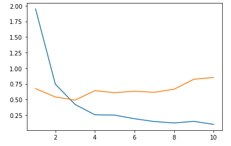

# 딥러닝 : 텍스트 기반 다중분류

## 1. 환경 로드

```python
from sklearn.datasets import fetch_20newsgroups
import pandas as pd
from tensorflow.keras.preprocessing.text import Tokenizer
from tensorflow.keras.utils import to_categorical
from sklearn.model_selection import train_test_split
import matplotlib.pyplot as plt
from tensorflow.keras.models import Sequential
from tensorflow.keras.layers import Dense, Dropout
```


## 2. 데이터 로드

```python
data = fetch_20newsgroups()
X_data = data.data
Y_data = data.target
```


## 3. 데이터 전처리

```python
def text_preprocesser(X_data, Y_data, mode):
    tk = Tokenizer(num_words=10000)
    tk.fit_on_texts(X_data)
    X = tk.texts_to_matrix(X_data, mode=mode)
    Y = to_categorical(Y_data)
    t_x, tt_x, t_y, tt_y = train_test_split(X, Y)
    return t_x, tt_x, t_y, tt_y
```

- ``Tokenizer(num_words=10000)`` : 단어의 종류 즉, 피처의 개수를 10000개로 제한한다. (각 데이터 중 최대 피처와 최소 피처의 차이가 많이나기 때문)
- ``tk.texts_to_matrix(X_data, mode=mode)`` : 단어 데이터를 mode로 설정된 방법으로 인코딩한다.
- ``to_categorical(Y_data)`` : Y_data 원-핫 인코딩 (단, Y_data가 숫자형태로 되어있어야한다.)


## 4. 모델 생성 및 학습

```python
def text_classifier(t_all):
    f_model = Sequential()
    f_model.add(Dense(256, input_shape=(10000,), activation='relu'))
    f_model.add(Dropout(0.5))
    f_model.add(Dense(128, activation='relu'))
    f_model.add(Dropout(0.5))
    f_model.add(Dense(20, activation='softmax'))
    f_model.compile(loss='categorical_crossentropy', optimizer='adam', metrics='accuracy')
    f_model_history = f_model.fit(t_all[0], t_all[2], epochs=10, validation_data=(t_all[1], t_all[3]))
    return f_model_history
```

- 피처의 개수가 많기 때문에 MLP로 구성
- 과대적합을 방지하기 위해 가지치기 진행
- 입력층의 ``input_shape``와 출력층의 출력 개수에 유의(출력층의 경우 신문사가 20가지이기때문에 20으로 설정)


## 5. 결과확인

```python
t_all = text_preprocesser(X_data, Y_data, mode='tfidf')
hy = text_classifier(t_all)

ec = range(1, len(hy.history['accuracy']) + 1)
plt.plot(ec, hy.history['loss'])
plt.plot(ec, hy.history['val_loss'])
plt.show()
```



