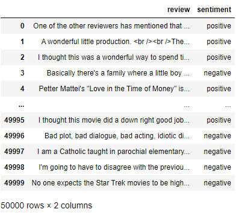
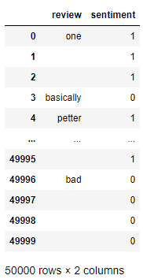
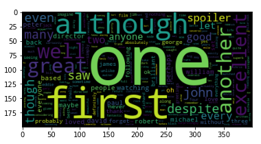
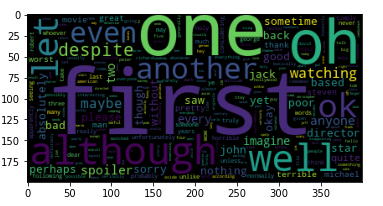
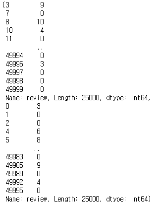
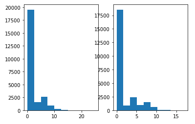
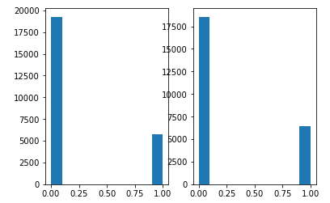
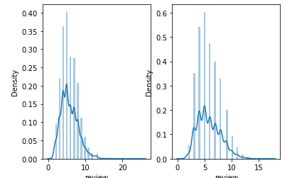

# 통계적 데이터 분석(탐색적 분석) : EDA

- EDA(Exploratory Data Analysis)
  - 데이터를 그래프나 통계적인 방법으로 분석하는 방법
  - 데이터에 대한 잠재적인 문제를 발견할 수 있다
  - EDA 
    1. 분석 목적과 변수 확인
    2. 데이터 전체에 대한 점검
    3. 데이터 개별 속성값 관찰


---

## 코드 예시 : 리뷰 데이터 분류

0. 패키지

   ```python
   from sklearn.feature_extraction.text import CountVectorizer
   from wordcloud import WordCloud, STOPWORDS
   from bs4 import BeautifulSoup
   import re
   import nltk
   from nltk.corpus import stopwords
   from string import punctuation # 글자에 대응되는 부호 배제
   from nltk import pos_tag
   from nltk.corpus import wordnet
   import numpy as np
   import pandas as pd
   import seaborn as sns
   import matplotlib.pyplot as plt
   ```

1. 데이터 로드

   ```python
   import pandas as pd
   
   t_d = pd.read_csv('IMDB Dataset.csv', encoding='utf-8')
   t_d
   ```

   

2. 결측치 확인

   ```python
   t_d.isna().sum()
   ```

   ```
   review       0
   sentiment    0
   dtype: int64
   ```

3. 텍스트 전처리

   ```python
   st = set(stopwords.words('english')) # 불용어
   p_ck = list(punctuation) # 부호처리
   st.update(p_ck) # 불용어 추가
   ```

   - 정리
     - 불용어_정리
       - isalpha : 알파벳인지 확인

   ```python
   def 웹문서_처리(t):
       su = BeautifulSoup(t, 'html.parser')
       return su.get_text()
   
   def 정규표현_정리(t):
       return re.sub('\[[^]*\]', '', t)
   
   def 불필요_정리(t):
       return re.sub('http\S+', '', t)
   
   def 불용어_정리(t):
       f_l = []
       for i in t.split():
           if i.strip().lower() not in st and i.strip().lower().isalpha():
               f_l.append(i.strip().lower())
           return ' '.join(f_l)
   
   def 모두_정리(t):
       t = 웹문서_처리(t)
       #t = 정규표현_정리(t)
       t = 불필요_정리(t)
       t = 불용어_정리(t)
       return t
   ```

   ```python
   t_d['review'] = t_d['review'].apply(모두_정리)
   
   t_d.sentiment.replace('positive', 1, inplace=True)
   t_d.sentiment.replace('negative', 0, inplace=True)
   
   t_d
   ```

   

   - 긍정리뷰 WC

   ```python
   wc = WordCloud(max_words=2000).generate(' '.join(t_d[t_d.sentiment==1].review)) # 1000개 ~ 2000개 정도로 설정
   plt.imshow(wc)
   ```

   

   - 부정리뷰 WC

   ```python
   wc1 = WordCloud(max_words=2000).generate(' '.join(t_d[t_d.sentiment==0].review)) # 1000개 ~ 2000개 정도로 설정
   plt.imshow(wc1)
   ```

   

4. 길이별 검토

   ```python
   t_l_0 = t_d[t_d.sentiment==0]['review'].str.len()
   t_l_1 = t_d[t_d.sentiment==1]['review'].str.len()
   t_l_0, t_l_1
   ```

   

   ```python
   fig, (ax1, ax2) = plt.subplots(1, 2)
   ax1.hist(t_l_0)
   ax2.hist(t_l_1)
   plt.show()
   ```

   

   - 분석
     - 문장의 길이가 긍정인지 부정인지 판별하는 기준이 되지 못한다.

   ```python
   t_l_0 = t_d[t_d.sentiment==0]['review'].str.split().map(lambda x : len(x))
   t_l_1 = t_d[t_d.sentiment==1]['review'].str.split().map(lambda x : len(x))
   fig, (ax1, ax2) = plt.subplots(1, 2)
   ax1.hist(t_l_0)
   ax2.hist(t_l_1)
   plt.show()
   ```

   

   - 분석
     - 문장별 단어의 개수도 판별기준이 되지 못한다.

   ```python
   fig, (ax1, ax2) = plt.subplots(1, 2)
   t_l_0 = t_d[t_d.sentiment==0]['review'].str.split().apply(lambda x : [len(i) for i in x])
   sns.distplot(t_l_0.map(lambda x : np.mean(x)), ax=ax1)
   t_l_1 = t_d[t_d.sentiment==1]['review'].str.split().apply(lambda x : [len(i) for i in x])
   sns.distplot(t_l_1.map(lambda x : np.mean(x)), ax=ax2)
   plt.show()
   ```

   

   - 분석
     - 문장당 단어 평균길이도 분류기준이 되지 못한다.

   ```python
   def N_그램_표현(t, n, g):
       tv = CountVectorizer(ngram_range=(g, g)).fit(t)
       BoW = tv.transform(t)
       sum_Bow = BoW.sum(axis=0)
       w_f = [(w, sum_Bow[0, i]) for w, i in tv.vocabulary_.items()]
       w_f = sorted(w_f, key=lambda x:x[1], reverse=True)
       return w_f[:n]
   ```

   ```python
   N_그램_표현(t_d.review, 20, 1)
   ```

   ```
   [('one', 380),
    ('first', 337),
    ('although', 210),
    ('well', 134),
    ('oh', 132),
    ('like', 123),
    ('another', 118),
    ('even', 100),
    ('let', 94),
    ('despite', 90),
    ('ok', 80),
    ('great', 71),
    ('watching', 70),
    ('john', 67),
    ('saw', 65),
    ('two', 61),
    ('anyone', 61),
    ('every', 61),
    ('though', 58),
    ('maybe', 57)]
   ```

   