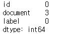
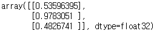

# EDA/RNN을 활용한 리뷰데이터 분류(한글)


## 1. EDA - 성능최적화 방법

---

## *성능최적화


- 기본적인 방법
  - 데이터의 양을 늘리기
  - 데이터의 범위 조정
    - sigmoid : 0~1의 값
    - 하이퍼볼릭 탄젠트 : -1~1의 값
  - 정규화, 규제화, 표준화 등
    - 정규화 : 특성 스케일링
    - 규제화 : 모델 복잡도 줄임 ex. dropout, 조기 종료
    - 표준화 : 평균은 0, 표준편차는 1인 형태의 데이터로 만듬. ex) standard scalar or z-score normalization

- 알고리즘(학습모델)
  - 사용할 수 있는 알고리즘은 다양하기 때문에 데이터의 특성에 맞는 알고리즘을 선택한다.
  - 알고리즘의 하이퍼파라미터 조정을 통해 최적의 성능을 도출한다.
- 여러 방법
  - 가중치
    - 초기값은 작게 지정
    - 오토인코더를 통해 가중치 사전 훈련 후 사용
  - 학습률
    - 초기값은 매우 크거나 작게하여 조금씩 변경
  - 활성화함수 변경
    - 손실함수와 함께 변경되는 부분이므로 신중해야함
  - 배치와 에포크 조절
    - 적절한 배치 크기와 에포크 지정
  - 옵티마이저 및 손실 함수 변경
    - 다양한 옵티마이저와 손실 함수를 적용해보고 성능이 최고인 것을 선택
  - 네트워크 구성 변경
    - 따로 공식이 없기 때문에 뉴런의 수와 계층의 수를 조절하면서 최적의 모델을 찾아야한다.
  - 앙상블 이용
    - 앙상블을 이용하여 성능향상
    - 시간이 오래걸림
- 배치 정규화
  - 입력 분포를 고르게 해주어 과적합을 해소한다.
  - 배치의 크기가 작으면 정규화 값이 다른 방향으로 갈 수 있다는 단점이 존재


- 성능 진단
  - train_data의 학습이 검증 데이터에 비해 눈에 띄게 잘된다면 과적합을 의심해야한다.
  - 훈련, 검증 데이터 모두 성능이 좋지 않다면 과소적합을 의심해야한다.
  - 훈련 성능이 검증을 넘어서는 변곡점이 있다면 조기 종료한다.
  - accuracy 뿐만 아니라 loss 값이 발산하는지의 여부도 유의깊게 살펴보아야한다.

---

## 2. 코드 예시 : 리뷰 데이터 분류(한글)

### 1) 데이터 로드

```python
import pandas as pd
import numpy as np

train_data = pd.read_table('ratings_train.txt')
test_data = pd.read_table('ratings_test.txt')
print('train review : ', len(train_data))
print('test review : ', len(test_data))
```


```python
t_df = test_data
t_df
```


### 2) 데이터 점검 및 정리


1. 결측치 점검 (전처리전)

   ```python
   t_df.isna().sum()
   ```

   

   => null 값이 존재하는 행이 있으므로 이는 제거

2. 결측치 제거 및 확인

   ```python
   t_df.dropna(how='any', inplace=True)
   t_df.isna().sum()
   ```

   

3. 필요없는 column 삭제

   ```python
   del t_df['id']
   t_df
   ```

   

4. 중복 데이터 제거

   ```python
   t_df = t_df.drop_duplicates(subset=['document'])
   t_df
   ```

   

5. 한글 외의 데이터 제거 및 정리

   ```python
   t_df['document'] = t_df.document.str.replace('[^ㄱ-ㅎㅏ-ㅣ가-힣 ]', '')
   t_df['document'] = t_df.document.str.replace('^ +', '')
   t_df
   ```

   

   => 작업 후 데이터 정리

   ```python
   t_df.isna().sum()
   ```

   

   ```python
   t_df['document'] = t_df.document.replace('', np.nan)
   t_df.isna().sum()
   ```

   

   ```python
   t_df.dropna(how='any', inplace=True)
   t_df
   ```

   

   

### 3) 형태소 토큰화 및 불용어 제거

```python
from konlpy.tag import Okt
from tqdm import tqdm

stop_word = ['은', '는', '이', '가', '를', '들', '에게', '의', '을', '도', '으로', '만', '라서', '하다', '너무', '영화']

ok = Okt()

X_data = []

for i in tqdm(t_df.document):
    tk_data = ok.morphs(i)
    tk_end_data = [word for word in tk_data if not word in stop_word]
    X_data.append(tk_end_data)
```

=> 이 후 필터링 및 임베딩 작업

```python
from tensorflow.keras.preprocessing.text import Tokenizer

tk = Tokenizer()
tk.fit_on_texts(X_data)

# 1. ('단어', 빈도수) 형식으로 되어있는 구조를 리스트 형식으로 변경한다 -> 정렬하기 위함
filtered_data = list(tk.word_counts.items())
# 2. 빈도수를 기준으로 오름차순 정렬
sorted_data = sorted(filtered_data, key = lambda x : x[1])
# 3. 빈도수가 4이하인 단어를 제거
removed_data = [d for d in sorted_data if d[1] > 4]

tk = Tokenizer(num_words=10418) # num_words-1의 값이 적용되므로 10417 + 1인 값을 제시한다.
tk.fit_on_texts(X_data)
seq_x = tk.texts_to_sequences(X_data) # 시퀀스 목록을 기반으로 내부 어휘를 업데이트한다.

# 제거할 데이터의 인덱스 추출
remove_target_idx = [i for i, n in enumerate(seq_x) if len(n) < 1]
remove_target_idx

# 빈 리스트가 있는 데이터 정리(반드시 Y 값도 함께 제거해야한다.)
Y_data = np.array(t_df.label) #df의 인덱스를 가져오지 않기위해 넘파이 배열로 변환

X_data = np.delete(seq_x, remove_target_idx, axis=0)
Y_data = np.delete(Y_data, remove_target_idx, axis=0)

# 패딩 작업
from tensorflow.keras.preprocessing.sequence import pad_sequences

X_data = pad_sequences(X_data, maxlen=35)
X_data.shape

Y_data = Y_data.astype(int)
```


### 4) 모델 학습

1. 데이터 분리

```python
from sklearn.model_selection import train_test_split
from tensorflow.keras.models import Sequential
from tensorflow.keras.layers import Dense, Embedding, SimpleRNN, LSTM, GRU, Bidirectional, Dropout
from tensorflow.keras.optimizers import Adam

t_x, tt_x, t_y, tt_y = train_test_split(X_data, Y_data, random_state=1)
```


2. 옵션설정

   ```python
   batch_size = 128
   total_word_n = 10418
   max_sent_len = 35
   embedding_len = 100
   nl_n = 64
   drop_out_size = 0.5
   ada_learing_rate = 0.001
   epochs_n = 4
   ```

3. SimpleRNN 기반 모델 생성 및 학습

   ```python
   import tensorflow as tf
   
   m = Sequential()
   # Embedding(단어수, 피처차원, input_length : 데이터 길이)
   # SimpleRNN(뉴런 개수)
   m.add(Embedding(total_word_n, embedding_len, input_length=max_sent_len))
   m.add(SimpleRNN(nl_n, dropout=drop_out_size, return_sequences=True))
   m.add(SimpleRNN(nl_n, dropout=drop_out_size))
   m.add(Dense(1, activation='sigmoid'))
   m.compile(optimizer=Adam(ada_learing_rate), loss=tf.losses.BinaryCrossentropy(), metrics='acc') # acc = accuracy
   
   m.fit(t_x, t_y, epochs=epochs_n, validation_data=(tt_x, tt_y), validation_freq=2)
   ```

   - SimpleRNN의 return_sequences가 들어가는 위치와 층을 쌓는 순서에 유의

   

4. LSTM 기반 학습

   ```python
   m = Sequential()
   # Embedding(단어수, 피처차원, input_length : 데이터 길이)
   # SimpleRNN(뉴런 개수)
   m.add(Embedding(total_word_n, embedding_len, input_length=max_sent_len))
   m.add(LSTM(nl_n, dropout=drop_out_size, return_sequences=True))
   m.add(LSTM(nl_n, dropout=drop_out_size))
   m.add(Dense(1, activation='sigmoid'))
   m.compile(optimizer=Adam(ada_learing_rate), loss=tf.losses.BinaryCrossentropy(), metrics='acc') # acc = accuracy
   
   m.fit(t_x, t_y, epochs=epochs_n, validation_data=(tt_x, tt_y), validation_freq=2)
   ```

   

5. GRU기반 학습

   ```python
   m = Sequential()
   # Embedding(단어수, 피처차원, input_length : 데이터 길이)
   # SimpleRNN(뉴런 개수)
   m.add(Embedding(total_word_n, embedding_len, input_length=max_sent_len))
   m.add(GRU(nl_n, dropout=drop_out_size, return_sequences=True))
   m.add(GRU(nl_n, dropout=drop_out_size))
   m.add(Dense(1, activation='sigmoid'))
   m.compile(optimizer=Adam(ada_learing_rate), loss=tf.losses.BinaryCrossentropy(), metrics='acc') # acc = accuracy
   
   m.fit(t_x, t_y, epochs=epochs_n, validation_data=(tt_x, tt_y), validation_freq=2)
   ```

​		

6. Bidirectional(양방향 RNN) 기반 학습

   ```python
   # Bidirectional : 양방향 순차 고려
   m = Sequential()
   # Embedding(단어수, 피처차원, input_length : 데이터 길이)
   # SimpleRNN(뉴런 개수)
   m.add(Embedding(total_word_n, embedding_len, input_length=max_sent_len))
   m.add(Bidirectional(LSTM(nl_n)))
   m.add(Dropout(drop_out_size))
   m.add(Dense(1, activation='sigmoid'))
   m.compile(optimizer=Adam(ada_learing_rate), loss=tf.losses.BinaryCrossentropy(), metrics='acc') # acc = accurac
   
   m.fit(t_x, t_y, epochs=epochs_n, validation_data=(tt_x, tt_y), validation_freq=2)
   ```

   


### 5) Predict

1. 테스트할 텍스트

   ```python
   predict_text_0 = '흠... 이 영화는 내 취향이 아닌 것 같아 너무 별로야'
   predict_text_1 = '너무 좋은 영화다... 이 영화를 보기위해 살아있는 느낌이야... 너무 추천해'
   predict_text_2 = '너.무.좋.은.영.화. 꼭.보.길/^^ 하...'
   ```

2. 테스트 텍스트 전처리

   ```python
   import re
   
   predict_list = [predict_text_0, predict_text_1, predict_text_2]
   print(predict_list)
   predict_X = []
   
   for i in predict_list:
       i = re.compile('[^ㄱ-ㅎㅏ-ㅣ가-힣 ]').sub('',i)
       i = re.compile('^ +').sub('',i)
       tk_data = ok.morphs(i)
       tk_end_data = [word for word in tk_data if not word in stop_word]
       predict_X.append(tk_end_data)
       
   tk1 = Tokenizer()
   tk1.fit_on_texts(predict_X)
   seq_x = tk1.texts_to_sequences(predict_X)
   
   predict_X = np.array(seq_x)
   predict_X = pad_sequences(predict_X, maxlen=35)
   ```

3. 예측

   ```python
   m.predict(predict_X)
   ```

   

- 분석
  - 1번 문장 : 대놓고 부정적인 문장인데 0.5 정도로 예측했다. -> 1에 더 가까움으로 살짝의 오차가 존재
  - 2번 문장 : 대놓고 긍정적인 문장인데 0.97 정도로 예측 -> 매우 정확하다.
  - 3번 문장 : 비꼰 문장인데 0.48 정도로 부정에 더 가깝게 예측했다. 솔직히 조금 놀랐다.