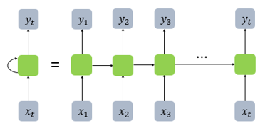
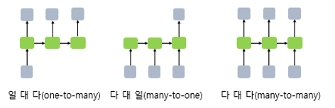
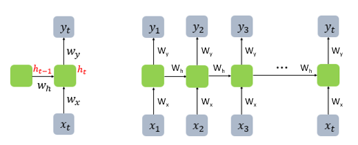
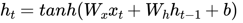
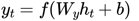
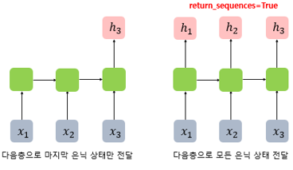
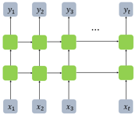
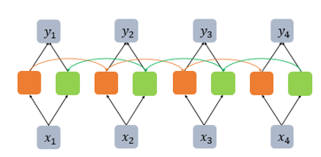

# 순환 신경망(Recurrent Neural Network, RNN)

---

## 1. 순환 신경망(RNN)이란?

- RNN(Recurrent Neural Network)은 입력과 출력을 시퀀스 단위로 처리하는 시퀀스(Sequence) 모델
- LSTM이나 GRU 또한 근본적으로 RNN에 속한다.
- 피드 포워드 신경망(Feed Forward Neural Network)의 입력 수 제한의 단점을 보완한 모델

## 2. 순환 신경망의 은닉층

- 메모리 셀 또는 RNN 셀이라고 표현한다.

초록색으로 표시된 셀이 RNN 셀이다.

- RNN task의 여러 형태

-  RNN 셀의 각 시점의 입, 출력의 단위는 사용자가 정의하기 나름이지만 가장 보편적인 단위는 '단어 벡터' 이다.
- 일 대 다 : 이미지 캡셔닝(Image Captioning) 작업
- 다 대 일 : 감성 분류(sentiment classification), 스팸 메일 분류(spam detection)
-  다 대 다 : 번역기, 태깅 작업, 개체명 인식

## 3. 연산

- RNN의 가중치

- 은닉층 수식
  - ht를 계산하기 위한 활성화 함수로는 주로 tanh가 사용된다.

- 출력층 수식

단, F는 비선형 활성화 함수 중 하나이다.

## 4. Keras 예시

- return_sequences = True로 설정하면 다음층으로 모든 은닉 상태를 전달한다.

- Deep RNN
  - 은닉층이 2개인 RNN

## 5. 양방향 순환 신경망(Bidirectional RNN)

- 양방향 순환 신경망은 시점 t에서의 출력값을 예측할 때 이전 시점의 입력뿐만 아니라, 이후 시점의 입력 또한 예측에 기여할 수 있다는 아이디어에 기반한다.
- 두 개의 RNN 셀을 이용한다.

