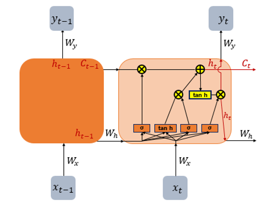

# LSTM(Long Short-Term Memory)

## 1. LSTM(Long Short-Term Memory) 이란?

- 바닐라 RNN(Vanilla RNN)의 장기 의존성 문제(the problem of Long-Term Dependencies)를 개선한 모델
  - 장기 의존성 문제(the problem of Long-Term Dependencies)는 RNN의 시점(time step)이 길어질 수록 앞의 정보가 뒤로 충분히 전달되지 못하는 현상이다.

- 전통적인 RNN의 단점을 보완한 이러한 RNN의 일종을 장단기 메모리(Long Short-Term Memory)라고 하며, 줄여서 LSTM이라고 한다.
- LSTM은 RNN과 비교하여 긴 시퀀스의 입력을 처리하는데 탁월한 성능을 보인다.

