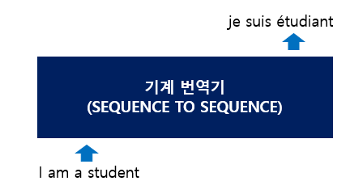
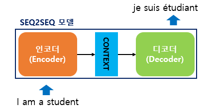
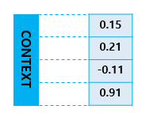
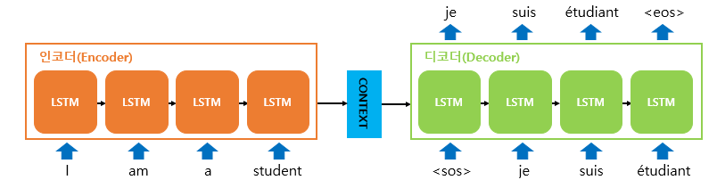
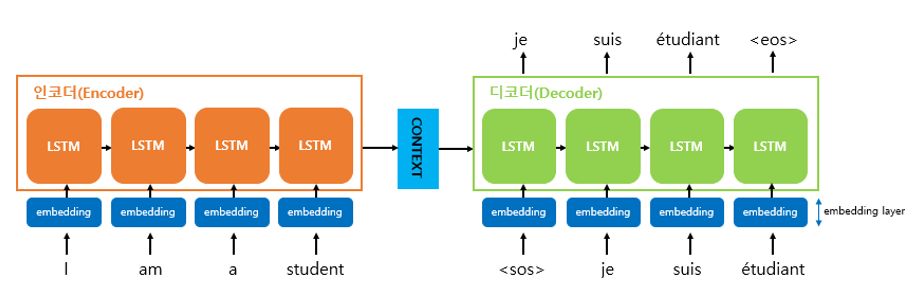
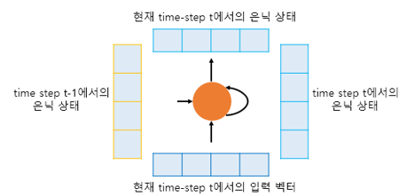
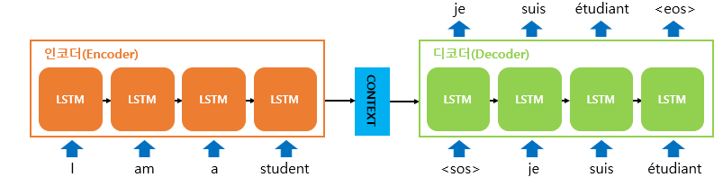
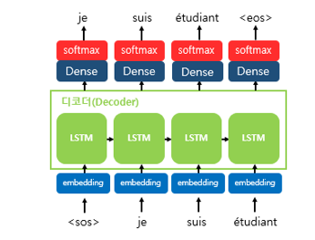

# 시퀀스-투-시퀀스(Sequence-to-Sequence, seq2seq)

## 1. RNN 인코더-디코더

### 1) 인코더-디코더 구조

- 하나의 RNN을 인코더. 또 다른 하나의 RNN을 디코더라는 모듈로 명명하고 두 개의 RNN을 연결해서 사용하는 것
- 주로 입력 문장과 출력 문장의 길이가 다를 경우에 사용
- 번역기, 텍스트 요약
- 번역 평가방법
  - 번역이라는 섬세한 자연어 처리 태스크를 기계적으로 평가할 수 있는 방법인 BLEU(Bilingual Evaluation Understudy Score)

## 2. 시퀀스-투-시퀀스(Sequence-to-Sequence, seq2seq)

- 입력된 시퀀스로부터 다른 도메인의 시퀀스를 출력하는 다양한 분야에서 사용되는 모델

- 예시 : 챗봇(Chatbot)과 기계 번역(Machine Translation)

  - 챗봇 : 입력 시퀀스와 출력 시퀀스를 각각 질문과 대답으로 구성
  - 번역 : 입력 시퀀스와 출력 시퀀스를 각각 입력 문장과 번역 문장으로 구성

  - 그 외에도 내용 요약(Text Summarization), STT(Speech to Text) 등에 쓰인다.

### 1) 번역

- 컨텍스트 벡터(context vector)
  - 인코더가 입력 문장의 모든 단어들을 순차적으로 입력받은 뒤에 마지막에 이 모든 단어 정보들을 압축해서 하나의 벡터로 만는 것

- 입력 문장의 정보가 하나의 컨텍스트 벡터로 모두 압축되면 인코더는 컨텍스트 벡터를 디코더로 전송한다. 디코더는 컨텍스트 벡터를 받아서 번역된 단어를 한 개씩 순차적으로 출력한다.

- 인코더 아키텍처와 디코더 아키텍처

- 디코더는 기본적으로 RNNLM(RNN Language Model)이다.
- !! 훈련과정에서는 반드시 **교사 강요**(teacher forcing)를 사용해야 한다.  단, 테스트 과정에서는 예측을 통한 방법을 사용한다.
- 임베딩 층(embedding layer)
  - 단어 -> 수치화하는 층

- RNN 셀의 은닉 상태와 입력 벡터
  - 현재 시점이 t인 경우
    - t-1에서 은닉 상태
    - t에서 입력 벡터
    - (t-1 은닉 상태, t 입력 벡터) 를 t+1의 은닉 상태로 전달

- 디코더의 단어 출력

- seq2seq 모델은 선택될 수 있는 모든 단어들로부터 하나의 단어를 골라서 예측
- 소프트맥스 함수 사용
- 디코더에서 각 시점(time step)의 RNN 셀에서 출력 벡터가 나오면, 해당 벡터는 소프트맥스 함수를 통해 출력 시퀀스의 각 단어 별 확률값을 반환하고, 디코더는 출력 단어를 결정