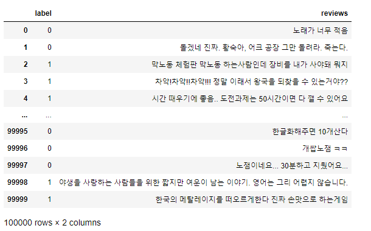
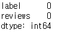
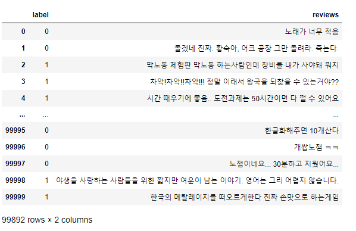
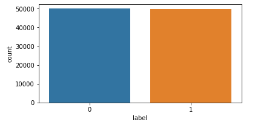
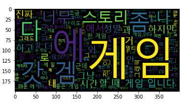
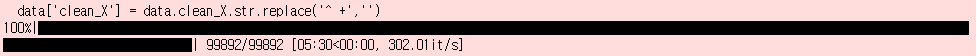
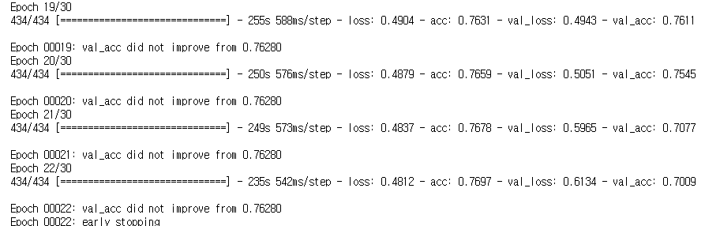
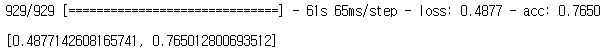
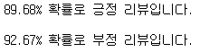

# 한글 게임 리뷰 분류 문제


## 1. 데이터 로드

```python
import pandas as pd
import numpy as np

t_data = pd.read_table('ck_data.txt', names=['label', 'reviews'])
t_data
```



## 2. EDA(탐색적 데이터 분석)


### 1) 결측치 확인

```python
t_data.isna().sum()
```




### 2) 중복 확인

```python
t_data = t_data.drop_duplicates(subset=['reviews'])
t_data
```




### 3) 데이터 분포 확인


1. 정답 분포 확인

   ```python
   import seaborn as sns
   import matplotlib.pyplot as plt
   
   fig, axe = plt.subplots(ncols=1)
   fig.set_size_inches(6, 3)
   sns.countplot(t_data.label)
   plt.show()
   ```

   

2. 정답별 단어 분포 확인

   ```python
   ck_data = t_data.copy()
   ck_data.reviews = ck_data.reviews.str.replace('[^ㄱ-ㅎㅏ-ㅣ가-힣 ]', '')
   ck_data.reviews = ck_data.reviews.str.replace('^ +', '')
   ck_data.reviews = ck_data.reviews.replace('', np.nan)
   ck_data.isna().sum()
   ```

   ```python
   from konlpy.tag import Okt
   from tqdm import tqdm
   from wordcloud import WordCloud, STOPWORDS
   
   stop_word = ['은', '는', '이', '가', '를', '들', '에게', '의', '을', '도', '으로', '만', '라서', '하다']
   
   def for_eda_preprocessing(t):
       f_l = []
       okt = Okt()
       for i in okt.morphs(t):
           if i not in stop_word:
               f_l.append(i.strip())
       return ' '.join(f_l)
   
   ck_data.reviews = ck_data.reviews.apply(for_eda_preprocessing)
   ```

   - 긍정 리뷰

     ```python
     f_path = 'C:\Windows\Fonts\malgun.ttf'
     wc = WordCloud(font_path=f_path, max_words=2000).generate(' '.join(ck_data[ck_data.label==1].reviews)) # 1000개 ~ 2000개 정도로 설정
     plt.imshow(wc)
     ```

     

   - 부정 리뷰

     ```python
     wc1 = WordCloud(font_path=f_path, max_words=2000).generate(' '.join(ck_data[ck_data.label==0].reviews)) # 1000개 ~ 2000개 정도로 설정
     plt.imshow(wc1)
     ```

3. 분석

   - 불용어 추가 : 게임, 진짜, 스토리, 겜, 너무, 좀, 시간
   - label = 1 : 긍정리뷰, label = 0 : 부정리뷰
   - 이진분류의 문제


## 3. 전처리

1. 필요 패키지 로드

```python
from konlpy.tag import Okt
from tensorflow.keras.preprocessing.text import Tokenizer
from tensorflow.keras.preprocessing.sequence import pad_sequences
from sklearn.preprocessing import LabelEncoder
from sklearn.model_selection import train_test_split
from tensorflow.keras.utils import to_categorical 
import numpy as np 
from nltk.corpus import stopwords 
from bs4 import BeautifulSoup 
import re
from tqdm import tqdm
import pandas as pd
from tensorflow.keras.models import Sequential
from tensorflow.keras.layers import Dense, Embedding, LSTM, BatchNormalization, Bidirectional, Dropout
from tensorflow.keras.optimizers import Adam
from tensorflow import keras
from tensorflow.keras.callbacks import EarlyStopping, ModelCheckpoint
import tensorflow as tf
from tensorflow.keras.models import load_model
```


2. 전처리 클래스 정의

```python
class ko_preprocessing:
    def __init__(self, data, x_col_name, y_col_name):
        data = data.rename(columns = {x_col_name : 'X', y_col_name : 'y'})
        self.__data = data
        self.__stopwords = set(['은','는','이','가','를','들','에게','의','을','도','으로','만','라서','하다'])
        self.__wc = 0
        self.__sl = 0
        self.__tobj = None
        
    def add_stopwords(self, stopwords: list):
        for i in stopwords:
            self.__stopwords.add(i)
        return None
    
    def get_stopwords(self):
        return self.__stopwords
    
    def get_word_count(self):
        return self.__wc
    
    def get_sent_maxlen(self):
        return self.__sl
    
    def get_token_object(self):
        return self.__tobj
    
    def ko_preprocessing_func(self, select_y=False, tk_word_bin=4):
        data = self.__data.copy()
        data = data.drop_duplicates(subset=['X'])
        data['clean_X'] = data.X.str.replace('[^ㄱ-ㅎㅏ-ㅣ가-힣 ]','')
        data['clean_X'] = data.clean_X.str.replace('^ +','')
        data['clean_X'] = data.clean_X.replace('',np.nan)
        data = data.dropna(how='any')
        
        okt = Okt()
        X_data = []
        
        for i in tqdm(data['clean_X']): 
            tk_d=okt.morphs(i) 
            end_d=[w for w in tk_d if not w in self.__stopwords] 
            X_data.append(' '.join(end_d)) 
            
        data['y_name'] = data['y']
        data['encoder_y'] = LabelEncoder().fit_transform(data['y'])
        data['categorical_y'] = list(to_categorical(data['encoder_y']))
        
        
        X=np.array(X_data)
        if select_y:
            Y = to_categorical(data['encoder_y'])
        else:
            Y = np.array(data['encoder_y'])
        
        x_data,test_x,y_data,test_y = train_test_split(X,Y,test_size=0.3,random_state=0)
        train_x,val_x,train_y,val_y = train_test_split(x_data,y_data,test_size=0.2,random_state=0)
        
        tk = Tokenizer()
        tk.fit_on_texts(train_x)
        n = len([d for d in sorted(list(tk.word_counts.items()),key=lambda x:x[1]) if d[1]>tk_word_bin])+1
        token = Tokenizer(n)
        token.fit_on_texts(train_x)
        
        token_train_x=token.texts_to_sequences(train_x)
        token_test_x=token.texts_to_sequences(test_x)
        token_val_x=token.texts_to_sequences(val_x)
        
        drop_train = [index for index, sentence in enumerate(token_train_x) if len(sentence) < 1]
        drop_test = [index for index, sentence in enumerate(token_test_x) if len(sentence) < 1]
        drop_val = [index for index, sentence in enumerate(token_val_x) if len(sentence) < 1]
        
        token_train_x = np.delete(token_train_x, drop_train, axis=0)
        train_y = np.delete(train_y, drop_train, axis=0)
        token_test_x = np.delete(token_test_x, drop_test, axis=0)
        test_y = np.delete(test_y, drop_test, axis=0)
        token_val_x = np.delete(token_val_x, drop_val, axis=0)
        val_y = np.delete(val_y, drop_val, axis=0)
        
        w_l = max(len(pad_sequences(token_train_x)[0]),
                  len(pad_sequences(token_test_x)[0]),
                  len(pad_sequences(token_val_x)[0]))
        
        train_inputs = pad_sequences(token_train_x,maxlen=w_l)
        test_inputs = pad_sequences(token_test_x,maxlen=w_l)
        val_inputs = pad_sequences(token_val_x,maxlen=w_l)
        
        train_outputs = train_y
        test_outputs = test_y
        val_outputs = val_y
        
        self.__wc = token.num_words + 1
        self.__sl = w_l
        self.__tobj = token
        
        return train_inputs, train_outputs, test_inputs, test_outputs, val_inputs, val_outputs
```


3. 전처리 및 전처리 데이터 저장

```python
k_pr = ko_preprocessing(t_data, x_col_name='reviews', y_col_name='label')

k_pr.add_stopwords(['게임', '진짜', '스토리', '겜', '너무', '좀', '시간'])

t_x, t_y, tt_x, tt_y, v_x, v_y = k_pr.ko_preprocessing_func()
```



```python
pre_data = {}
pre_data['train_x'] = t_x
pre_data['train_y'] = t_y
pre_data['test_x'] = tt_x
pre_data['test_y'] = tt_y
pre_data['val_x'] = v_x
pre_data['val_y'] = v_y
pre_data['token'] = k_pr.get_token_object()
pre_data['word_n'] = k_pr.get_word_count()
pre_data['stopwords'] = k_pr.get_stopwords()
pre_data['inputLen'] = k_pr.get_sent_maxlen()

import pickle

with open("pre_data.pikle","wb") as fw:
    pickle.dump(pre_data, fw)
```


## 4. 모델 생성 및 튜닝

1. 모델 옵션 설정

```python
batch_size = 128
total_word_n = k_pr.get_word_count()
max_sent_len = k_pr.get_sent_maxlen()
embedding_len = 100
nl_n = 64
drop_out_size = 0.5
ada_learing_rate = 0.001
epochs_n = 30
```

2. 조기종료 및 최적 모델 저장 콜백함수 정의

```python
e_st = EarlyStopping(monitor='val_loss', mode='min', verbose=1, patience=4)
mc = ModelCheckpoint('ko_best_model.h5py', monitor='val_acc', mode='max', verbose=1, save_best_only=True)
```

3. 모델 구축

```python
m = Sequential()
m.add(Embedding(total_word_n, embedding_len, input_length=max_sent_len))
m.add(BatchNormalization())
m.add(LSTM(nl_n, dropout=drop_out_size, return_sequences=True))
m.add(LSTM(nl_n, dropout=drop_out_size))
m.add(BatchNormalization())
m.add(Dense(1, activation='sigmoid'))
m.compile(optimizer='sgd', loss=tf.losses.BinaryCrossentropy(), metrics='acc') # acc = accuracy
```

4. 모델 학습

```python
hy = m.fit(t_x, t_y, epochs=epochs_n, validation_data=(v_x, v_y), batch_size=batch_size, callbacks=[e_st, mc])
```




5. 모델 평가 - best 가중치 저장시에만 유효

```
m.evaluate(tt_x, tt_y)
```


6. 모델 튜닝
   - 1차 튜닝(LSTM + adam)
     - loss 값이 발산 - 과적합 양상
     - test data : [0.5492698550224304, 0.7770971059799194]
     - 튜닝 방향 : 모델 변경 (양방향 RNN을 통해서 문장 앞 뒤 간의 의미를 파악하면 더 성능이 좋아지지 않을까?)
   - 2차 튜닝(bRNN + adam)
     - loss 값이 발산 - 과적합 양상
     - test data : [0.7587145566940308, 0.7663592100143433]
     - 성능이 더 안좋아졌다.
     - 튜닝 방향(1차 튜닝방향적용) : 옵티마이저 변경(SGD)
   - 3차 튜닝(bRNN + sgd)
     - loss 값이 발산하지 않고 성능이 개선됨을 보인다.
     - test data : [0.5233879089355469, 0.7354921102523804]
     - epochs를 늘려서 학습을 진행해 본다.
     - 결과 : loss가 0.5에서 내려가지 않고 성능이 잘 개선되지 않는다.
   - 4차 튜닝(LSTM + sgd)
     - LSTM + SGD
     - test data : [0.4877142608165741, 0.765012800693512]


## 분류기 사용

1. 모델 불러오기

   ```python
   loaded_model = load_model('ko_best_model.h5py')
   
   loaded_model.evaluate(tt_x, tt_y)
   ```

   

2. 동작 확인 함수 정의

   ```python
   def reviews_classifier(sent):
       okt = Okt()
       #tobj = get_token_object()
       
       sent = re.sub(r'[^ㄱ-ㅎㅏ-ㅣ가-힣 ]','', sent)
       sent = okt.morphs(sent, stem=True)
       sent = [w for w in sent if not w in k_pr.get_stopwords()] 
       encoded = k_pr.get_token_object().texts_to_sequences([sent])
       pad_new = pad_sequences(encoded, maxlen = max_sent_len) 
       score = float(loaded_model.predict(pad_new))
       if(score > 0.5):
           print(f"{score * 100:.2f}% 확률로 긍정 리뷰입니다.\n")
       else:
           print(f"{(1 - score) * 100:.2f}% 확률로 부정 리뷰입니다.\n")
   ```

3. 동작확인

   ```python
   reviews_classifier('와... 이런 게임은 처음 해본다.. 연출이랑 타격감이랑 장난없고 스토리도 진짜 대박이네!! 갓겜!')
   reviews_classifier('이딴 게임하느니 플래시 게임하는게 훨씬 나을듯 ㅋㅋㅋㅋㅋ 시간 버리는 게임!')
   ```

   


## * 텐서보드 사용하여 모델 시각화

```python
%load_ext tensorboard
%tensorboard --logdir logs
```


## * 임베딩 보드 사용 시각화

```python
import io

w_l_data = list(token.word_index.keys())
w_l_data.insert(0, 'OOV')
ws = loaded_model.layers[0].get_weights()[0]

out_v = io.open('v_data.tsv', 'w', encoding='utf-8')
out_w = io.open('w_data.tsv', 'w', encoding='utf-8')
for i, w in enumerate(w_l_data):
    if i==0:
        continue
    vec = ws[i]
    out_v.write('\t'.join([str(i) for i in vec])+'\n')
    out_w.write('\t'.join(w+'\n'))
out_v.close()
out_w.close()
```

저장된 파일을 임베딩 보드 사이트로 들어가서 load 후 시각화 가능