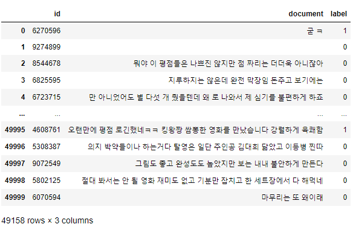
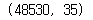

# 영화 리뷰 : 긍정과 부정 리뷰로 분류 (한글)

---

### 1. 패키지 import

```python
# 데이터 로드
import codecs

# 데이터 형식 다루기
import pandas as pd
import numpy as np

# 데이터 시각화
import matplotlib.pyplot as plt

# 데이터 전처리
from tensorflow.keras.preprocessing.text import Tokenizer
from konlpy.tag import Okt
from tensorflow.keras.utils import to_categorical
from sklearn.model_selection import train_test_split

# 데이터 학습
from tensorflow.keras.models import Sequential
from tensorflow.keras.layers import Dense, Dropout
from tensorflow.keras import optimizers
```


### 2. 데이터 로드

```python
with codecs.open('ratings_test.txt', encoding='utf-8') as f:
    data = [i.split('\t') for i in f.read().splitlines()]
    columns_name = data[0]
    data = data[1:]
```

```python
df_data = pd.DataFrame(data, columns=columns_name)
df_data
```


### 3. 데이터 전처리

**1. 초기 결측치 확인**

```python
df_data.loc[df_data.document.isnull()]
```


=> 결측치가 존재하지 않음


**2. 중복 데이터 제거**

- 비정형 데이터이므로 중복데이터의 확인이 필수

```python
df_data = df_data.drop_duplicates(subset=['document'])
len(df_data)
```


=> 데이터 사이즈가 50000 -> 49158로 줄었다 == 중복데이터가 제거되었다.


**2-1. 중복데이터 제거 후 null 값 확인 - 데이터의 상태를 확인**

```python
df_data.document.isnull().sum()
```

```
0
```

```python
df_data
```


=> 정상적으로 중복데이터가 제거되었다.


**3. 한글 이외의 데이터를 정리(제거)**

- 해당 데이터는 리뷰데이터이므로 'ㅋㅋ'와 같이 자음만으로 구성된 단어도 살린다.(유의미하기 때문이다)

```python
df_data['document'] = df_data.document.str.replace('[^ㄱ-ㅎㅏ-ㅣ가-힣 ]', '')
```

- 앞의 코드 실행 후 단어 앞 공백 혹은 단독 공백이 남아있을 수 있으므로 제거해준다.

```python
df_data['document'] = df_data.document.str.replace('^ +', '')
```

- 한글 데이터만 남았는지 확인한다.

```python
df_data
```



=> 정상적으로 한글 데이터만 남았다. 그러나 ''형태로 데이터가 존재하는 행이 있으므로 이를 제거하는 절차가 필요하다.


**4. ''만 존재하는 행 제거**

- dropna를 사용하여 제거하기위해 ''만 남아있는 행을 NaN값으로 변경한다.

```python
df_data['document'] = df_data.document.replace('', np.nan)
```

- NaN으로 잘 바뀌었는지 확인한다.

```python
df_data.isnull().sum()
```


=> NaN로 잘 바뀌었으므로 NaN값을 가진 행을 제거한다.

```python
df_data = df_data.dropna(how='any')
```

- NaN 값을 가진 행이 잘 제거되었는지 확인

```python
df_data.isnull().sum(), len(df_data)
```


=> 정상적으로 제거되었다. 기본적인 데이터 손질이 끝났으므로 데이터의 형태소 토큰화를 진행한다.


**5. 형태소 토큰화**

- 토큰화에 앞서서 토큰화시 처리할 불용어를 지정한다. 이는 학습의 성능에 있어서 중요한 작업이다.
- 데이터로부터 조사를 추출하여 설정하는 경우도 있지만, 부정확할 수 있기때문에 직접 지정한다.

```python
stop_word = ['은', '는', '이', '가', '를', '들', '에게', '의', '을', '도', '으로', '만', '라서', '하다']
```

- 토큰화를 진행한다. (시간이 오래걸리기 때문에 이를 측정하는 tqdm 패키지를 사용하여 남은 시간을 확인한다.)

```python
from tqdm import tqdm

okt = Okt()

X_data = []

for i in tqdm(df_data.document):
    tk_data = okt.morphs(i)
    tk_end_data = [word for word in tk_data if not word in stop_word]
    X_data.append(tk_end_data)
```


- 토큰화된 X_data의 길이 확인

```python
len(X_data)
```

- 1차 형태소 분류 진행

```python
tk = Tokenizer()
tk.fit_on_texts(X_data)
```

- 토큰화된 X_data의 만들어진 단어의 개수 확인

```python
len(tk.word_index)
```


- 단어의 종류가 54256개로 너무 많기때문에 빈도수가 매우 적게 등장한 경우(1~4회)는 의미없는 단어로 취급하여 제거한다.

```python
# 1. ('단어', 빈도수) 형식으로 되어있는 구조를 리스트 형식으로 변경한다 -> 정렬하기 위함
filtered_data = list(tk.word_counts.items())
# 2. 빈도수를 기준으로 오름차순 정렬
sorted_data = sorted(filtered_data, key = lambda x : x[1])
# 3. 빈도수가 4이하인 단어를 제거
removed_data = [d for d in sorted_data if d[1] > 4]
```

- 단어가 잘 제거되었는지 확인한다.

```python
len(removed_data)
```


=> 최종적으로 빈도수가 5회 이상인 데이터는 10419개임을 알 수 있다.

- 2차 형태소 분류 진행
  - 빈도수가 5회 이상인 데이터가 10419개임을 알았으니 이 수치를 가지고 2차 형태소 분류를 진행한다.

```python
tk = Tokenizer(num_words=10420) # num_words-1의 값이 적용되므로 10419 + 1인 값을 제시한다.
tk.fit_on_texts(X_data)
seq_x = tk.texts_to_sequences(X_data) # 시퀀스 목록을 기반으로 내부 어휘를 업데이트한다.
```

- 2차 형태소 분류가 진행된 데이터인 seq_x의 내부 구조를 확인

```python
np.unique(seq_x)
```


=> 빈도수를 기준으로 단어를 제한했기 때문에 빈 리스트로 구성된 문장이 존재하게 된다. 이는 학습 성능에 큰 영향을 미치므로 전처리 작업이 필수적이다.

- 빈 리스트 정리

```python
# 제거할 데이터의 인덱스 추출
remove_target_idx = [i for i, n in enumerate(seq_x) if len(n) < 1]
remove_target_idx
```


```python
# 빈 리스트가 있는 데이터 정리(반드시 Y 값도 함께 제거해야한다.)
Y_data = np.array(df_data.label) #df의 인덱스를 가져오지 않기위해 넘파이 배열로 변환

X_data = np.delete(seq_x, remove_target_idx, axis=0)
Y_data = np.delete(Y_data, remove_target_idx, axis=0)
```

- 빈 리스트가 잘 정리되었는지 확인

```python
np.unique(X_data) 
```


=> 빈 리스트가 잘 제거되었음을 확인할 수 있다. 다음으로는 각 문장별 길이를 맞추는 패딩 작업이 필요하다.


**6. 패딩**

- 패딩의 길이를 선정하기 위해서 각 문장별 단어의 개수를 시각화한다.

```python
v_n = [len(i) for i in X_data]
plt.plot(v_n)
plt.show()
```


=> 대다수의 문장이 35개의 단어를 가지고 있음을 알 수 있다.

- 확인된 길이로 패딩 진행

```python
from tensorflow.keras.preprocessing.sequence import pad_sequences

X_data = pad_sequences(X_data, maxlen=35)
X_data.shape
```



=> 패딩이 잘 진행되었다.


**7. 학습전 데이터 준비**

- word embedding을 사용할 것이므로 Y_data의 값을 범주화 시키지 않고 정수형으로 변환한다.

```python
Y_data = Y_data.astype(int)
```

- train_data와 test_data를 분류한다.

```python
t_x, tt_x, t_y, tt_y = train_test_split(X_data, Y_data, random_state=1)
```


### 4. 모델 학습

**1. 중단 지점 및 최고성능의 모델을 저장하는 기능을 가진 객체 생성**

```python
from tensorflow.keras.callbacks import EarlyStopping, ModelCheckpoint
from tensorflow.keras.models import load_model

# monitor : 정지를 판단할 기준
es = EarlyStopping(monitor='val_loss', mode='min', verbose=1, patience=4)
m_ck = ModelCheckpoint('best_m.h5', monitor='val_accuracy', mode='max', verbose=1, save_best_only=True)
```

**2. 뉴럴 네트워크 Layers 쌓기**

```python
from tensorflow.keras.layers import Embedding, Dense, LSTM

end_m = Sequential()
end_m.add(Embedding(10420, 100))
end_m.add(LSTM(128))
end_m.add(Dense(1, activation='sigmoid'))
end_m.compile(optimizer='rmsprop', loss='binary_crossentropy', metrics='accuracy')
```

**3. 학습 진행**

```python
hy = end_m.fit(t_x, t_y, epochs=12, callbacks=[es, m_ck], batch_size=64, validation_data=(tt_x, tt_y))
```


### 5. 최종 결과 확인

```python
ec = range(1, len(hy.history['accuracy']) + 1)
plt.plot(ec, hy.history['loss'])
plt.plot(ec, hy.history['val_loss'])
plt.show()
```


최종결과

- train data에는 학습이 잘 진행되나 test data의 손실 값은 발산한다 => 학습이 잘 진행되지 못했다.
- 왜 이런 결과가 나오는가?
  - 잘못된 모델 선정
  - 좋지못한 하이퍼 파라미터 값 선정 등