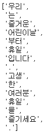
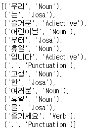
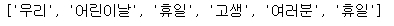
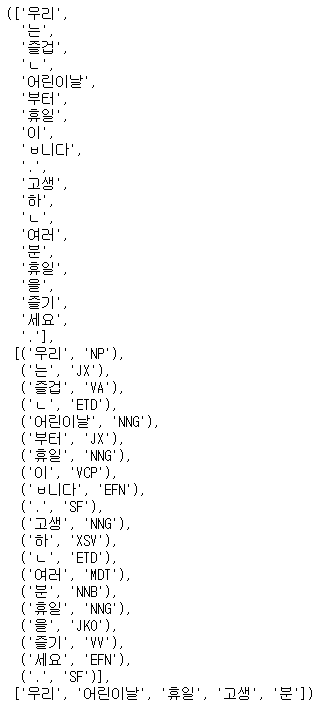

# 한국어 비정형 텍스트 데이터 전처리


## 1. 한국어의 전처리 문제점


- 한국어는 띄워쓰기로 의미를 구분할 수 없다. 
- 한국어의 의미는 형태소 단위로 구분되기 때문에 형태소 분류가 필요하다.


## 2. 한국어 형태소 분석 코드


### 1) import

```python
from konlpy.tag import Okt
from konlpy.tag import Kkma
```


## 2) 형태소로 토큰화

```python
n1 = Okt()
t7 = "우리는 즐거운 어린이날부터 휴일 입니다. 고생한 여러분 휴일을 즐기세요."
n1.morphs(t7) # 형태소분석 메서드
```



[품사태깅]

```python
# 품사 태깅
n1.pos(t7)
```



[명사추출]

```python
n1.nouns(t7)
```



[Kkma 모듈로 형태소 토큰화]

```python
n2 = Kkma()
n2.morphs(t7), n2.pos(t7), n2.nouns(t7)
```



### 3) 정규화

```python
t8 = "I am actively looking for Ph.D. students. and you are a Ph.D. student."

import re # 문자열에 대한 정규화의 요소를 가진 모듈 == 정규표현식

ck = re.compile(r'\W*\b\w{1,2}\b') # 정규화 규칙 설정
ck.sub('', t8) # 정제함
t7 = '우리는 즐거운 어린이날 입니다. 난 여러분들이 고생했으니 휴일을 좀 많이 즐겁게 보냈으면 해요.'
ck.sub('', t7)
```

실행결과 : '우리는 즐거운 어린이날 입니다 여러분들이 고생했으니 휴일을 즐겁게 보냈으면.'
