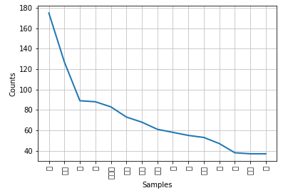
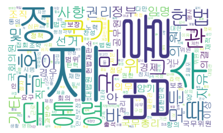

# 한글 비정형 텍스트 : 형태소 분석과 시각화

*단어의 분석을 목적으로 시각화*

## 1) 데이터 수집

```python
from konlpy.corpus import kolaw
t_data = kolaw.open(kolaw.fileids()[0]).read()
```


## 2) 텍스트 전처리 : 형태소 분석기 이용

```python
from konlpy.tag import Okt
tw = Okt()
n_t_data = tw.nouns(t_data)
```


## 3) 시각화 작업을 위한 nltk Text 클래스 이용

```python
from nltk import Text # 단어를 취급하는 Class
ck_data = Text(n_t_data, name='kolaw') # 데이터 정립
```


## 4) 시각화

#### (1) plot 활용

```python
import matplotlib.pyplot as plt
ck_data.plot(15)
plt.show()
```

실행결과 : 



#### (2) wordcloud 활용

```python
from wordcloud import WordCloud
f = r'C:\Windows\Fonts\gulim.ttc'
wc = WordCloud(font_path=f, width=1000, height=600, background_color='white')
plt.imshow(wc.generate_from_frequencies(ck_data.vocab()))
plt.axis('off')
```

실행결과 :

