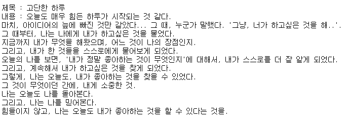
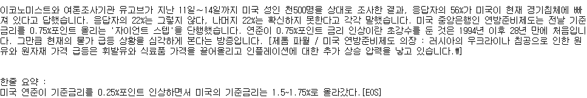
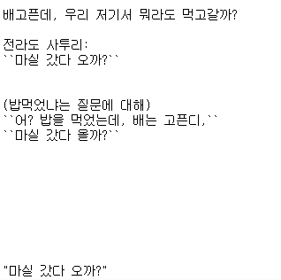
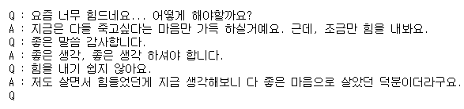

# KakaoBrain/KoGPT3 사용


## 1. 패키지 로드

```python
import torch
from transformers import AutoTokenizer, AutoModelForCausalLM 
```


## 2. 토크나이저, 모델 로드

```python
# 토크나이저 로드
tokenizer = AutoTokenizer.from_pretrained(
  'kakaobrain/kogpt', revision='KoGPT6B-ryan1.5b-float16',  # or float32 version: revision=KoGPT6B-ryan1.5b
  bos_token='[BOS]', eos_token='[EOS]', unk_token='[UNK]', pad_token='[PAD]', mask_token='[MASK]'
)
```

```python
# 모델 로드
model = AutoModelForCausalLM.from_pretrained(
  'kakaobrain/kogpt', revision='KoGPT6B-ryan1.5b-float16',  # or float32 version: revision=KoGPT6B-ryan1.5b
  pad_token_id=tokenizer.eos_token_id,
  torch_dtype='auto', low_cpu_mem_usage=True
).to(device='cuda', non_blocking=True)
_ = model.eval()
```

- 권장사양 : GPU 16GB
- 로딩시간 : 약 10분 (Tesla T4 사용)


## 3. 다양한 기능 사용


### 1) 소설 써보기

```python
prompt = '''
제목 : 고단한 하루
내용 : 오늘도 매우 힘든 하루가 시작되는 것 같다.
마치, 아이디어의 늪에 빠진 것만 같았다... 그 때, 누군가 말했다. \'그냥, 너가 하고싶은 것을 해..\'.
'''

with torch.no_grad():
    tokens = tokenizer.encode(prompt, return_tensors='pt').to(device='cuda', non_blocking=True)
    gen_tokens = model.generate(tokens, do_sample=True, temperature=0.85, max_length=512)
    generated = tokenizer.batch_decode(gen_tokens)[0]
  
print(generated)
```




### 2) 뉴스 요약해보기

```python
prompt = '''
이코노미스트와 여론조사기관 유고브가 지난 11일∼14일까지 미국 성인 천500명을 상대로 조사한 결과, 응답자의 56%가 미국이 현재 경기침체에 빠져 있다고 답했습니다. 응답자의 22%는 그렇지 않다, 나머지 22%는 확신하지 못한다고 각각 말했습니다. 미국 중앙은행인 연방준비제도는 전날 기준금리를 0.75%포인트 올리는 '자이언트 스텝'을 단행했습니다. 연준이 0.75%포인트 금리 인상이란 초강수를 둔 것은 1994년 이후 28년 만에 처음입니다. 그만큼 현재의 물가 급등 상황을 심각하게 본다는 방증입니다. [제롬 파월 / 미국 연방준비제도 의장 : 러시아의 우크라이나 침공으로 인한 원유와 원자재 가격 급등은 휘발유와 식료품 가격을 끌어올리고 인플레이션에 대한 추가 상승 압력을 낳고 있습니다.\]


한줄 요약 :
'''

with torch.no_grad():
    tokens = tokenizer.encode(prompt, return_tensors='pt').to(device='cuda', non_blocking=True)
    gen_tokens = model.generate(tokens, do_sample=True, temperature=0.85, max_length=512)
    generated = tokenizer.batch_decode(gen_tokens)[0]
  
print(generated)
```




### 3) 말투 변형

```python
prompt = '''
배고픈데, 우리 저기서 뭐라도 먹고갈까?

전라도 사투리:
'''

with torch.no_grad():
    tokens = tokenizer.encode(prompt, return_tensors='pt').to(device='cuda', non_blocking=True)
    gen_tokens = model.generate(tokens, do_sample=True, temperature=0.85, max_length=256)
    generated = tokenizer.batch_decode(gen_tokens)[0]
  
print(generated)
```




### 4) Q & A

```python
prompt = '''
떠오르는 아이돌, 걸그룹 에스파와 인터뷰를 나눠보겠습니다!
Q : 에스파님, 요즘은 어떤 활동을 하고 있나요?
A : '''

with torch.no_grad():
    tokens = tokenizer.encode(prompt, return_tensors='pt').to(device='cuda', non_blocking=True)
    gen_tokens = model.generate(tokens, do_sample=True, temperature=0.85, max_length=512)
    generated = tokenizer.batch_decode(gen_tokens)[0]
  
print(generated)
```

```
떠오르는 아이돌, 걸그룹 에스파와 인터뷰를 나눠보겠습니다!
Q : 에스파님, 요즘은 어떤 활동을 하고 있나요?
A : :) 요즘은 음방도 많이 못 나오고 있고요~ 팬사인회도 가고 싶어요!
Q : :) 코로나로 인해 팬사인회 일정이 많이 밀린 것 같네요.
A : :) 그런데 그게 저희는 오히려 더 좋아요!
Q : :) 팬들에게는 큰 힘이 되겠네요~
A : :) 너무 감사합니다.
Q : :) 이번에 또 어떤 곡으로 컴백하셨죠?
A : :) 이번에는 또 어떤 곡으로 나올까요~?
Q : :) 이번 곡은 어떤 컨셉으로 컴백하셨는지 궁금해요.
A : :) 이번 곡은 조금 더 강렬하고, 파워풀하고, 카리스마 있는 그런 곡입니다!
Q : :) 평소에 안무 연습도 많이 하시는지, 혹은 연습 영상도 자주 올라오는지 궁금합니다.
A : :) 물론이죠! 저희가 팬분들을 위해서 많이! 연습 영상으로 올려드리고 있습니다.
Q : :) 혹시 이 곡에 대해 안무 포인트도 설명해 주실 수 있나요?
A : :) 이 안무는 포인트가 조금 더 있어요!!! 이 안무를 잘 보시면, 동작이 좀 더 잘 보이실 거예요!
Q : :) 이번에 또 어떤 곡으로 컴백하셨죠?
A : :) 이번에는 또 어떤 곡으로 나올까요?
Q : :) 코로나로 인해 팬사인회도 많이 안 나오고 계신 거 같은데, 팬사인회 계획은 없으신가요?
A : :) 팬들에게 조금 더 자주 얼굴을 보여드리고, 소통하는 게 저희의 가장 큰 목표인 만큼, 팬사인회는 꼭! 하고 싶어요!
Q : :) 앞으로 어떤 활동으로 팬들과 자주 만나고 싶은지 궁금합니다!
A : :) 음! 이번 앨범은 좀 더 강렬하고, 파워풀하고, 카리스마 있는 곡입니다! 저희가 퍼포먼스도 파워풀하게, 강렬하게 해가지고 팬분들을 자주 볼 수 있으면 좋겠습니다.
[MERRY_NUMBER_ENHANCEST]
이번에 또 어떤 곡으로 컴백하셨죠?
A : :) 이번 곡은 또 어떤 곡으로 나올까요?
Q :
```


- 챗봇 응용?

```python
prompt = '''
Q : 요즘 너무 힘드네요... 어떻게 해야할까요?
A : 지금은 다들 죽고싶다는 마음만 가득 하실거예요. 근데, 조금만 힘을 내봐요.
Q : 좋은 말씀 감사합니다.
'''

with torch.no_grad():
    tokens = tokenizer.encode(prompt, return_tensors='pt').to(device='cuda', non_blocking=True)
    gen_tokens = model.generate(tokens, do_sample=True, temperature=0.85, max_length=len(prompt) + 10)
    generated = tokenizer.batch_decode(gen_tokens)[0]
  
print(generated)
```



