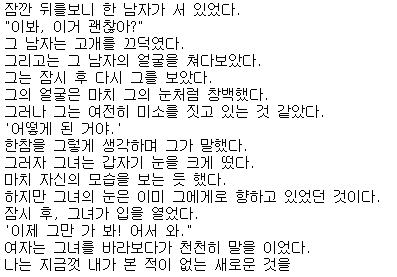

# KoGPT2를 이용한 한국어 문장 생성


## * 필요 패키지 설치

```python
!pip install opyrator transformers torch
```


## 1. 필요 패키지 import

```python
from transformers import PreTrainedTokenizerFast, GPT2LMHeadModel
import torch
from pydantic import BaseModel, Field
```


## 2. Pre-Trained 토크나이저, 모델 로드

```python
# 토크나이저 로드
tokenizer = PreTrainedTokenizerFast.from_pretrained("skt/kogpt2-base-v2",
                                                    bos_token='</s>', eos_token='</s>', unk_token='<unk>',
                                                    pad_token='<pad>', mask_token='<mask>') 
```

```python
# 모델 로드
model = GPT2LMHeadModel.from_pretrained('skt/kogpt2-base-v2')
```


## 3. 문장 생성 테스트

```python
text = "잠깐 뒤를보니"
input_ids = tokenizer.encode(text)
gen_ids = model.generate(torch.tensor([input_ids]),
                           max_length=128, # generate 할 개수
                           repetition_penalty=2.0, # 단어 반복시 패널티를 주어서 새로운 단어를 생성
                           pad_token_id=tokenizer.pad_token_id,
                           eos_token_id=tokenizer.eos_token_id,
                           bos_token_id=tokenizer.bos_token_id,
                           use_cache=True)
generated = tokenizer.decode(gen_ids[0,:].tolist())

print(generated)
```




