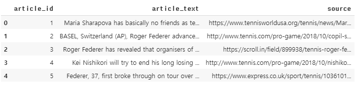
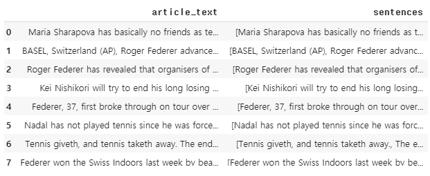
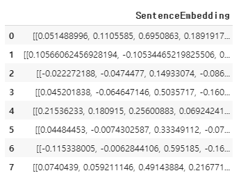
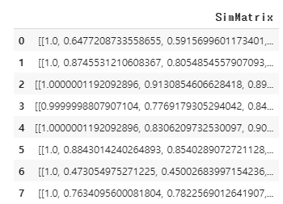
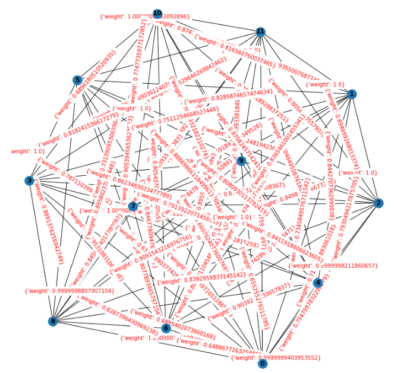
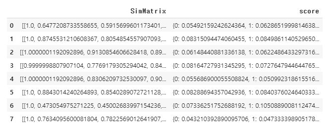

# 문장 임베딩 기반 텍스트 랭크(TextRank Based on Sentence Embedding)


## 1. 텍스트 랭크(TextRank)란?

- 텍스트 랭크 알고리즘의 기반은 페이지 랭크 알고리즘이다.
  - 페이지 랭크 알고리즘은 웹 페이지의 순위를 정하기 위해 사용되던 알고리즘이다.


## 2. Pre-Trained Glove 다운로드

### 1) 패키지 로드

```
import numpy as np
import gensim
from urllib.request import urlretrieve, urlopen
import gzip
import zipfile
```


### 2) Glove 다운로드

```python
urlretrieve("http://nlp.stanford.edu/data/glove.6B.zip", filename="glove.6B.zip")
zf = zipfile.ZipFile('glove.6B.zip')
zf.extractall() 
zf.close()

# glove 사전
glove_dict = dict()
f = open('glove.6B.100d.txt', encoding="utf8") # 100차원의 GloVe 벡터를 사용

for line in f:
    word_vector = line.split()
    word = word_vector[0]
    word_vector_arr = np.asarray(word_vector[1:], dtype='float32') # 100개의 값을 가지는 array로 변환
    glove_dict[word] = word_vector_arr
f.close()
```


## 3. 텍스트 랭크를 이용한 텍스트 요약


### 1) 패키지 로드

```python
import numpy as np
import re
import pandas as pd
import matplotlib.pyplot as plt
from nltk.tokenize import sent_tokenize, word_tokenize
from nltk.corpus import stopwords
from urllib.request import urlretrieve
import zipfile
from sklearn.metrics.pairwise import cosine_similarity
import networkx as nx
```


### 2) 데이터 로드

- NLTK에서 제공하는 불용어 다운로드

```python
stop_words = stopwords.words('english')
```

- 테니스 관련 기사 다운로드, 데이터 프레임 저장 => 텍스트 요약에 사용할 문장들

```python
urlretrieve("https://raw.githubusercontent.com/prateekjoshi565/textrank_text_summarization/master/tennis_articles_v4.csv", filename="tennis_articles_v4.csv")
data = pd.read_csv("tennis_articles_v4.csv")
data.head()
```




### 3) 전처리

- 문장 토큰화

```python
data = data[['article_text']]
data['sentences'] = data['article_text'].apply(sent_tokenize)
data
```




- 토큰화 및 전처리 함수 정의

```python
# 토큰화 함수
def tokenization(sentences):
    return [word_tokenize(sentence) for sentence in sentences]

# 전처리 함수
def preprocess_sentence(sentence):
  # 영어를 제외한 숫자, 특수 문자 등은 전부 제거. 모든 알파벳은 소문자화
  sentence = [re.sub(r'[^a-zA-z\s]', '', word).lower() for word in sentence]
  # 불용어가 아니면서 단어가 실제로 존재해야 한다.
  return [word for word in sentence if word not in stop_words and word]

# 위 전처리 함수를 모든 문장에 대해서 수행. 이 함수를 호출하면 모든 행에 대해서 수행.
def preprocess_sentences(sentences):
    return [preprocess_sentence(sentence) for sentence in sentences]
```


- 전처리 진행

```python
data['tokenized_sentences'] = data['sentences'].apply(tokenization)
data['tokenized_sentences'] = data['tokenized_sentences'].apply(preprocess_sentences)
data
```


### 4) Glove를 사용하여 문서 요약

- 사용할 Glove가 100차원이기 때문에 100차원의 영벡터 정의

```python
embedding_dim = 100
zero_vector = np.zeros(embedding_dim)
```


- 단어 벡터의 평균을 구하는 함수 정의, 문장의 길이가 0이면 100차원의 영벡터 리턴

```python
# 단어 벡터의 평균으로부터 문장 벡터를 얻는다.
def calculate_sentence_vector(sentence):
  if len(sentence) != 0:
    return sum([glove_dict.get(word, zero_vector) 
                  for word in sentence])/len(sentence)
  else:
    return zero_vector
```


- 각 문장에 대해서 벡터를 반환하는 함수 정의

```python
# 각 문장에 대해서 문장 벡터를 반환
def sentences_to_vectors(sentences):
    return [calculate_sentence_vector(sentence) 
              for sentence in sentences]
```


- 모든 문장에 대하여 문장 벡터 생성

```python
data['SentenceEmbedding'] = data['tokenized_sentences'].apply(sentences_to_vectors)
data[['SentenceEmbedding']]
```




- 문장 벡터들 간의 코사인 유사도를 구하는 유사도 행렬 함수를 정의

```python
def similarity_matrix(sentence_embedding):
  sim_mat = np.zeros([len(sentence_embedding), len(sentence_embedding)])
  for i in range(len(sentence_embedding)):
      for j in range(len(sentence_embedding)):
        sim_mat[i][j] = cosine_similarity(sentence_embedding[i].reshape(1, embedding_dim),
                                          sentence_embedding[j].reshape(1, embedding_dim))[0,0]
  return sim_mat
```


- 유사도 행렬 구하기

```python
data['SimMatrix'] = data['SentenceEmbedding'].apply(similarity_matrix)
data['SimMatrix']
```




- 유사도 행렬 그래프 확인

```python
def draw_graphs(sim_matrix):
  nx_graph = nx.from_numpy_array(sim_matrix)
  plt.figure(figsize=(10, 10))
  pos = nx.spring_layout(nx_graph)
  nx.draw(nx_graph, with_labels=True, font_weight='bold')
  nx.draw_networkx_edge_labels(nx_graph,pos,font_color='red')
  plt.show()
```

```python
draw_graphs(data['SimMatrix'][1])
```




- 각 문장별 점수 구하기

```python
def calculate_score(sim_matrix):
    nx_graph = nx.from_numpy_array(sim_matrix)
    scores = nx.pagerank(nx_graph)
    return scores
```

```python
data['score'] = data['SimMatrix'].apply(calculate_score)
data[['SimMatrix', 'score']]
```




- 구했던 점수를 바탕으로 가장 점수가 높은 3개의 문장을 요약문의 문장으로 삼는다.

```python
def ranked_sentences(sentences, scores, n=3):
    top_scores = sorted(((scores[i],s) 
                         for i,s in enumerate(sentences)), 
                                reverse=True)
    top_n_sentences = [sentence 
                        for score,sentence in top_scores[:n]]
    return " ".join(top_n_sentences)
```

```python
data['summary'] = data.apply(lambda x: 
                            ranked_sentences(x.sentences, 
                            x.score), axis=1)
```


- 모든 문서에 대한 요약문 출력

```python
for i in range(0, len(data)):
  print(i+1,'번 문서')
  print('원문 :',data.loc[i].article_text)
  print('')
  print('요약 :',data.loc[i].summary)
  print('')
```

```tex
1 번 문서
원문 : Maria Sharapova has basically no friends as tennis players on the WTA Tour. The Russian player has no problems in openly speaking about it and in a recent interview she said: 'I don't really hide any feelings too much. I think everyone knows this is my job here. When I'm on the courts or when I'm on the court playing, I'm a competitor and I want to beat every single person whether they're in the locker room or across the net.So I'm not the one to strike up a conversation about the weather and know that in the next few minutes I have to go and try to win a tennis match. I'm a pretty competitive girl. I say my hellos, but I'm not sending any players flowers as well. Uhm, I'm not really friendly or close to many players. I have not a lot of friends away from the courts.' When she said she is not really close to a lot of players, is that something strategic that she is doing? Is it different on the men's tour than the women's tour? 'No, not at all. I think just because you're in the same sport doesn't mean that you have to be friends with everyone just because you're categorized, you're a tennis player, so you're going to get along with tennis players. I think every person has different interests. I have friends that have completely different jobs and interests, and I've met them in very different parts of my life. I think everyone just thinks because we're tennis players we should be the greatest of friends. But ultimately tennis is just a very small part of what we do. There are so many other things that we're interested in, that we do.'

요약 : I think just because you're in the same sport doesn't mean that you have to be friends with everyone just because you're categorized, you're a tennis player, so you're going to get along with tennis players. When I'm on the courts or when I'm on the court playing, I'm a competitor and I want to beat every single person whether they're in the locker room or across the net.So I'm not the one to strike up a conversation about the weather and know that in the next few minutes I have to go and try to win a tennis match. I think everyone just thinks because we're tennis players we should be the greatest of friends.

2 번 문서
원문 : BASEL, Switzerland (AP), Roger Federer advanced to the 14th Swiss Indoors final of his career by beating seventh-seeded Daniil Medvedev 6-1, 6-4 on Saturday. Seeking a ninth title at his hometown event, and a 99th overall, Federer will play 93th-ranked Marius Copil on Sunday. Federer dominated the 20th-ranked Medvedev and had his first match-point chance to break serve again at 5-1. He then dropped his serve to love, and let another match point slip in Medvedev's next service game by netting a backhand. He clinched on his fourth chance when Medvedev netted from the baseline. Copil upset expectations of a Federer final against Alexander Zverev in a 6-3, 6-7 (6), 6-4 win over the fifth-ranked German in the earlier semifinal. The Romanian aims for a first title after arriving at Basel without a career win over a top-10 opponent. Copil has two after also beating No. 6 Marin Cilic in the second round. Copil fired 26 aces past Zverev and never dropped serve, clinching after 2 1/2 hours with a forehand volley winner to break Zverev for the second time in the semifinal. He came through two rounds of qualifying last weekend to reach the Basel main draw, including beating Zverev's older brother, Mischa. Federer had an easier time than in his only previous match against Medvedev, a three-setter at Shanghai two weeks ago.

요약 : Federer had an easier time than in his only previous match against Medvedev, a three-setter at Shanghai two weeks ago. Federer dominated the 20th-ranked Medvedev and had his first match-point chance to break serve again at 5-1. Copil fired 26 aces past Zverev and never dropped serve, clinching after 2 1/2 hours with a forehand volley winner to break Zverev for the second time in the semifinal.

3 번 문서
원문 : Roger Federer has revealed that organisers of the re-launched and condensed Davis Cup gave him three days to decide if he would commit to the controversial competition. Speaking at the Swiss Indoors tournament where he will play in Sundays final against Romanian qualifier Marius Copil, the world number three said that given the impossibly short time frame to make a decision, he opted out of any commitment. "They only left me three days to decide", Federer said. "I didn't to have time to consult with all the people I had to consult. "I could not make a decision in that time, so I told them to do what they wanted." The 20-time Grand Slam champion has voiced doubts about the wisdom of the one-week format to be introduced by organisers Kosmos, who have promised the International Tennis Federation up to $3 billion in prize money over the next quarter-century. The competition is set to feature 18 countries in the November 18-24 finals in Madrid next year, and will replace the classic home-and-away ties played four times per year for decades. Kosmos is headed by Barcelona footballer Gerard Pique, who is hoping fellow Spaniard Rafael Nadal will play in the upcoming event. Novak Djokovic has said he will give precedence to the ATP's intended re-launch of the defunct World Team Cup in January 2020, at various Australian venues. Major players feel that a big event in late November combined with one in January before the Australian Open will mean too much tennis and too little rest. Federer said earlier this month in Shanghai in that his chances of playing the Davis Cup were all but non-existent. "I highly doubt it, of course. We will see what happens," he said. "I do not think this was designed for me, anyhow. This was designed for the future generation of players." Argentina and Britain received wild cards to the new-look event, and will compete along with the four 2018 semi-finalists and the 12 teams who win qualifying rounds next February. "I don't like being under that kind of pressure," Federer said of the deadline Kosmos handed him.

요약 : Major players feel that a big event in late November combined with one in January before the Australian Open will mean too much tennis and too little rest. Speaking at the Swiss Indoors tournament where he will play in Sundays final against Romanian qualifier Marius Copil, the world number three said that given the impossibly short time frame to make a decision, he opted out of any commitment. "They only left me three days to decide", Federer said.

4 번 문서
원문 : Kei Nishikori will try to end his long losing streak in ATP finals and Kevin Anderson will go for his second title of the year at the Erste Bank Open on Sunday. The fifth-seeded Nishikori reached his third final of 2018 after beating Mikhail Kukushkin of Kazakhstan 6-4, 6-3 in the semifinals. A winner of 11 ATP events, Nishikori hasn't triumphed since winning in Memphis in February 2016. He has lost eight straight finals since. The second-seeded Anderson defeated Fernando Verdasco 6-3, 3-6, 6-4. Anderson has a shot at a fifth career title and second of the year after winning in New York in February. Nishikori leads Anderson 4-2 on career matchups, but the South African won their only previous meeting this year. With a victory on Sunday, Anderson will qualify for the ATP Finals. Currently in ninth place, Nishikori with a win could move to within 125 points of the cut for the eight-man event in London next month. Nishikori held serve throughout against Kukushkin, who came through qualifying. He used his first break point to close out the first set before going up 3-0 in the second and wrapping up the win on his first match point. Against Verdasco, Anderson hit nine of his 19 aces in the opening set. The Spaniard broke Anderson twice in the second but didn't get another chance on the South African's serve in the final set.

요약 : Kei Nishikori will try to end his long losing streak in ATP finals and Kevin Anderson will go for his second title of the year at the Erste Bank Open on Sunday. The Spaniard broke Anderson twice in the second but didn't get another chance on the South African's serve in the final set. He has lost eight straight finals since.

5 번 문서
원문 : Federer, 37, first broke through on tour over two decades ago and he has since gone on to enjoy a glittering career. The 20-time Grand Slam winner is chasing his 99th ATP title at the Swiss Indoors this week and he faces Jan-Lennard Struff in the second round on Thursday (6pm BST). Davenport enjoyed most of her success in the late 1990s and her third and final major tournament win came at the 2000 Australian Open. But she claims the mentality of professional tennis players slowly began to change after the new millennium. "It seems pretty friendly right now," said Davenport. "I think there is a really nice environment and a great atmosphere, especially between some of the veteran players helping some of the younger players out. "It's a very pleasant atmosphere, I'd have to say, around the locker rooms. "I felt like the best weeks that I had to get to know players when I was playing were the Fed Cup weeks or the Olympic weeks, not necessarily during the tournaments. "And even though maybe we had smaller teams, I still think we kept to ourselves quite a bit. "Not always, but I really feel like in the mid-2000 years there was a huge shift of the attitudes of the top players and being more friendly and being more giving, and a lot of that had to do with players like Roger coming up. "I just felt like it really kind of changed where people were a little bit, definitely in the 90s, a lot more quiet, into themselves, and then it started to become better." Meanwhile, Federer is hoping he can improve his service game as he hunts his ninth Swiss Indoors title this week. "I didn't serve very well [against first-round opponent Filip Kranjovic," Federer said. "I think I was misfiring the corners, I was not hitting the lines enough. "Clearly you make your life more difficult, but still I was up 6-2, 3-1, break points, so things could have ended very quickly today, even though I didn't have the best serve percentage stats. "But maybe that's exactly what caught up to me eventually. It's just getting used to it. This is where the first rounds can be tricky."

요약 : "Not always, but I really feel like in the mid-2000 years there was a huge shift of the attitudes of the top players and being more friendly and being more giving, and a lot of that had to do with players like Roger coming up. "I felt like the best weeks that I had to get to know players when I was playing were the Fed Cup weeks or the Olympic weeks, not necessarily during the tournaments. "Clearly you make your life more difficult, but still I was up 6-2, 3-1, break points, so things could have ended very quickly today, even though I didn't have the best serve percentage stats.

6 번 문서
원문 : Nadal has not played tennis since he was forced to retire from the US Open semi-finals against Juan Martin Del Porto with a knee injury. The world No 1 has been forced to miss Spain's Davis Cup clash with France and the Asian hard court season. But with the ATP World Tour Finals due to begin next month, Nadal is ready to prove his fitness before the season-ending event at the 02 Arena. Nadal flew to Paris on Friday and footage from the Paris Masters official Twitter account shows the Spaniard smiling as he strides onto court for practice. The Paris Masters draw has been made and Nadal will start his campaign on Tuesday or Wednesday against either Fernando Verdasco or Jeremy Chardy. Nadal could then play defending champion Jack Sock in the third round before a potential quarter-final with either Borna Coric or Dominic Thiem. Nadal's appearance in Paris is a big boost to the tournament organisers who could see Roger Federer withdraw. Federer is in action at the Swiss Indoors in Basel and if he reaches the final, he could pull out of Paris in a bid to stay fresh for London. But as it stands, Federer is in the draw and is scheduled to face either former world No 3 Milos Raonic or Jo-Wilfried Tsonga in the second round. Federer's projected route to the Paris final could also lead to matches against Kevin Anderson and Novak Djokovic. Djokovic could play Marco Cecchinato in the second round. British No 1 Kyle Edmund is the 12th seed in Paris and will get underway in round two against either Karen Khachanov or Filip Krajinovic.

요약 : Nadal's appearance in Paris is a big boost to the tournament organisers who could see Roger Federer withdraw. Federer's projected route to the Paris final could also lead to matches against Kevin Anderson and Novak Djokovic. But as it stands, Federer is in the draw and is scheduled to face either former world No 3 Milos Raonic or Jo-Wilfried Tsonga in the second round.

7 번 문서
원문 : Tennis giveth, and tennis taketh away. The end of the season is finally in sight, and with so many players defending,or losing,huge chunks of points in Singapore, Zhuhai and London, podcast co-hosts Nina Pantic and Irina Falconi discuss the art of defending points (02:14). It's no secret that Jack Sock has struggled on the singles court this year (his record is 7-19). He could lose 1,400 points in the next few weeks, but instead of focusing on the negative, it can all be about perspective (06:28). Let's also not forget his two Grand Slam doubles triumphs this season. Two players, Stefanos Tsitsipas and Kyle Edmund, won their first career ATP titles last week (13:26). It's a big deal because you never forget your first. Irina looks back at her WTA title win in Bogota in 2016, and tells an unforgettable story about her semifinal drama (14:04). In Singapore, one of the biggest storylines (aside from the matches, of course) has been the on-court coaching debate. Nina and Irina give their opinions on what coaching should look like in the future, on both tours (18:55).

요약 : Let's also not forget his two Grand Slam doubles triumphs this season. The end of the season is finally in sight, and with so many players defending,or losing,huge chunks of points in Singapore, Zhuhai and London, podcast co-hosts Nina Pantic and Irina Falconi discuss the art of defending points (02:14). In Singapore, one of the biggest storylines (aside from the matches, of course) has been the on-court coaching debate.

8 번 문서
원문 : Federer won the Swiss Indoors last week by beating Romanian qualifier Marius Copil in the final. The 37-year-old claimed his 99th ATP title and is hunting the century in the French capital this week. Federer has been handed a difficult draw where could could come across Kevin Anderson, Novak Djokovic and Rafael Nadal in the latter rounds. But first the 20-time Grand Slam winner wants to train on the Paris Masters court this afternoon before deciding whether to appear for his opening match against either Milos Raonic or Jo-Wilfried Tsonga. "On Monday, I am free and will look how I feel," Federer said after winning the Swiss Indoors. "On Tuesday I will fly to Paris and train in the afternoon to be ready for my first match on Wednesday night. "I felt good all week and better every day. "We also had the impression that at this stage it might be better to play matches than to train. "And as long as I fear no injury, I play." Federer's success in Basel last week was the ninth time he has won his hometown tournament. And he was delighted to be watched on by all of his family and friends as he purchased 60 tickets for the final for those dearest to him. "My children, my parents, my sister and my team are all there," Federer added. "It is always very emotional for me to thank my team. And sometimes it tilts with the emotions, sometimes I just stumble. "It means the world to me. It makes me incredibly happy to win my home tournament and make people happy here. "I do not know if it's maybe my last title, so today I try a lot more to absorb that and enjoy the moments much more consciously. "Maybe I should celebrate as if it were my last title. "There are very touching moments: seeing the ball children, the standing ovations, all the familiar faces in the audience. Because it was not always easy in the last weeks."

요약 : "We also had the impression that at this stage it might be better to play matches than to train. "Maybe I should celebrate as if it were my last title. "On Monday, I am free and will look how I feel," Federer said after winning the Swiss Indoors.
```

