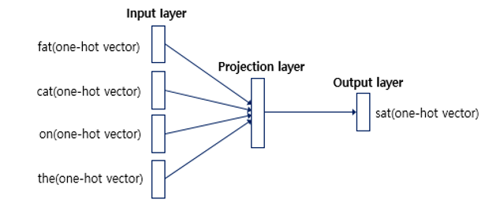
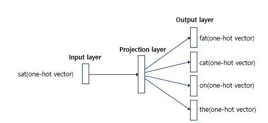

# 워드 임베딩(Word Embedding)

## 1. 워드 임베딩(Word Embedding)이란?

- 단어를 벡터로 표현하는 방법으로, 단어를 밀집 표현으로 변환(밀집 표현의 반대가 희소표현이고, CBOW 등이 이에 해당한다)
- 밀집표현은 벡터의 차원을 단어의 집합의 크기로 상정하지않고 사용자가 설정한 값으로 모든 단어의 벡터 차원을 맞춘다. 또한 더이상 0과 1만의 값이 아닌 실수값을 가지게 된다.
  - 희소표현 예시 : 강아지 = [ 0 0 0 0 1 0 0 0 0 0 0 0 ... 중략 ... 0]  # 이때 1 뒤의 0의 수는 9995개. 차원은 10,000
  - 밀집표현 예시 : 강아지 = [0.2  1.8  1.1  -2.1  1.1  2.8 ...  중략 ...]   # 이 벡터의 차원은 128
- 워드 임베딩의 방법론으로는 LSA, Word2Vec, FastText, Glove 등이 있다. 또한 Keras에서 제공하는 Embedding()이 있는데, 이는 단어를 랜덤한 값을 가지는 밀집 벡터로 변환한 뒤에 인공 신경망의 가중치를 학습하는 것과 같은 방식으로 단어 벡터를 학습한다.

## 2. 희소 표현(Sparse Representation)

- 원-핫 인코딩을 통해서 벡터를 표현하는 방법
- 벡터 또는 행렬의 값이 대부분이 0으로 표현되는 방법

## 3. 분산 표현(Distributed Representation)

- 기본적으로 분포 가설(distributional hypothesis)이라는 가정 하에 만들어진 표현 방법
- 즉, 비슷한 문맥의 단어들은 비슷한 의미를 가진다는 방법론
- 예시로, 강아지란 단어는 귀엽다, 예쁘다, 애교 등의 단어가 주로 함께 등장하는데 분포 가설에 따라서 해당 내용을 가진 텍스트의 단어들을 벡터화한다면 해당 단어 벡터들은 유사한 벡터값을 가진다.
- 분포 가설을 이용하여 텍스트를 학습하고, 단어의 의미를 벡터의 여러 차원에 분산하여 표현

## 4. CBOW(Continuous Bag of Words)

- 주변 단어를 통해서 중심단어를 예측하는 기법
- 윈도우(window) : 앞, 뒤로 몇 개의 단어를 볼지를 결정하는 범위
- 슬라이딩 윈도우(sliding window) : 윈도우 크기가 정해지면 윈도우를 옆으로 움직여서 주변 단어와 중심 단어의 선택을 변경해가며 학습을 위한 데이터 셋을 만드는 방법

- CBOW의 인공신경망

Word2Vec는 해당 신경망을 차용하여 사용하며 은닉층이 1개인 얕은 신경망(shallow neural network)이다.

- Word2Vec의 은닉층은 일반적인 은닉층과는 달리 활성화 함수가 존재하지 않으며 룩업 테이블이라는 연산을 담당하는 층으로 투사층(projection layer)이라고 부르기도 한다.

## 5. Skip-gram

- 주변 단어로부터 중심단어를 예측하는 CBOW와 달리, Skip-gram은 중심단어로부터 주변 단어를 예측한다.

- Skip-gram의 인공신경망

- 중심 단어에 대해서 주변 단어를 예측하므로 투사층에서 벡터들의 평균을 구하는 과정은 없다.
- 여러 논문에서 성능 비교를 진행했을 때 전반적으로 Skip-gram이 CBOW보다 성능이 좋다고 알려져 있다.

## 6. Word2Vec

- 단어 간의 유사도를 측정할 때, 많이 사용되는 방법
- 단어의 의미를 수치화한다.
- 단, Word2Vec는 학습되지 않은 단어에 대해서는 인식을 하지 못한다는 단점이 존재한다. (이것을 개선한 것이 FastText)
- CBOW의 인공신경망을 사용한다.

