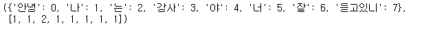
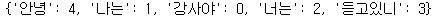
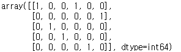
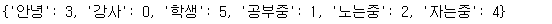
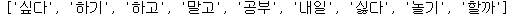
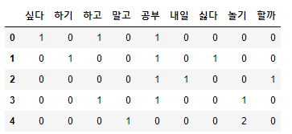
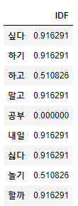
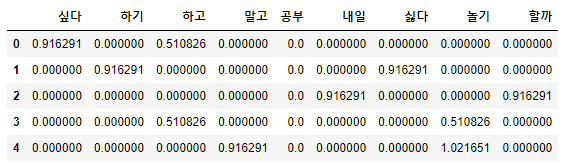
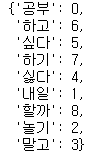
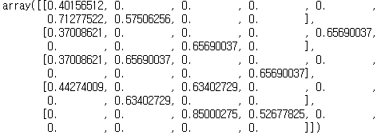

# 단어 표현(벡터화) 이론 및 예시

---

## 1. 단어 표현 방법

### 1) 국소 표현(Local Representation)

- 해당 단어 그 자체만 보고, 특정값을 맵핑하여 단어를 표현하는 방법
- 이산표현(Discrete Representation)
- 기법 : BoW, DTM TF-IDF


#### (1) Bag of Words(BoW)

- 단어들의 순서는 전혀 고려하지 않고, 단어들의 출현 빈도에만 집중하는 텍스트 데이터의 수치화 표현 방법


#### (2) 문서 단어 행렬(DTM, Document-Term Matrix)

- 다수의 문서에서 등장하는 각 단어들의 빈도를 행렬로 표현
- BoW들을 결합한 방법
- BoW의 표현을 다수의 문서에 대해서 행렬로 표현하고 부르는 용어
- 한계
  - 희소 표현
  - 단순 빈도 수 기반 접근(부정확성)


#### (3) TF-IDF(Term Frequency-Inverse Document Frequency)

- 단어의 빈도와 역 문서 빈도를 사용하여 DTM 내의 각 단어들마다 중요도를 가중치로 주는 방법
- 주로 문서의 유사도를 구하는 작업, 검색 시스템에서 검색 결과의 중요도를 정하는 작업, 문서 내에서 특정 단어의 중요도를 구하는 작업 등 사용


### 2) 분산 표현(Distributed Representation)

- 그 단어를 표현하고자 주변을 참고하여 단어를 표현하는 방법
- 연속 표현(Continuous Representation)


---

## 2. 코드

---

### 1) BoW : 함수 표현

1. 테스트 문자열

   ```python
   text = "안녕 나는 강사야 너는 잘 듣고있니?"
   ```

2. Bow 함수 정의

   ```python
   # BoW를 함수로 표현
   from konlpy.tag import Okt
   tk = Okt()
   
   def sentence_processing(t):
       t = t.replace('?', '')
       tk_data = tk.morphs(t)
       
       idx = {} # key(단어) : value(인덱스)
       data_list = [] # 단어(인덱스) 별 빈도수
       
       for i in tk_data:
           if i not in idx.keys():
               idx[i] = len(idx)
               data_list.insert(len(idx)-1, 1) # 앞 줄에서 len이 늘어났으므로 -1
           else:
               ix = idx.get(i)
               data_list[ix] += 1
       return idx, data_list
   
   sentence_processing(text)
   ```

   


### 2) BoW : sklearn 패키지 사용

1. 테스트 문자열

   ```python
   text = "안녕 나는 강사야 너는 잘 듣고있니?"
   ```

2. 문장 그대로 벡터화

   ```python
   # 패키지를 활용하여 BoW(단어집합)만들기
   from sklearn.feature_extraction.text import CountVectorizer
   
   tr_text = text.replace('?', '')
   #tr_text = tk.morphs(tr_text) # 형태소 분석시 사용
   
   v = CountVectorizer()
   v.fit_transform([tr_text]).toarray()
   v.vocabulary_
   ```

   

   - 형태소 분석 후 -> vector화 (형태소 별로 단일 문자 취급)
   - 문장 그대로 -> vector화 (띄워쓰기 기준으로 단일 문자 취급)

3. 여러 개의 문자열을 벡터화

   ```python
   sentence_set = ['안녕 나는 강사', '나는 학생', '나는 공부중', '나는 노는중', '나는 자는중']
   
   v2 = CountVectorizer(stop_words=['나는']) # 불용어 제시
   v2.fit_transform(sentence_set).toarray()
   ```

   

   ```python
   v2.vocabulary_ # 나는 이 불용어로 취급되어 등록되지않음
   ```

   


### 3) TF-IDF : 수식적 코드

1. 테스트 문자열

   ```python
   text = [
       '공부 하고 싶다', 
       '공부 하기 싫다',
       '공부 내일 할까', 
       '공부 하고 놀기', 
       '놀기 말고 놀기'
   ]
   ```

2. import

   ```python
   from math import log
   import pandas as pd
   ```

3. 단순 공백으로 단어 분리 후 리스트 저장(중복 제거)

   ```python
   voc = list(set(word for sentence in text for word in sentence.split()))
   voc
   ```

   

4. 문서의 수

   ```python
   n = len(text) # 문서의 수
   ```

5. tf 함수 정의 : 문서 안 특정 단어의 수

   ```python
   # t : 특정단어, d : 문서
   def tf(t, d):
       return d.count(t)
   ```

6. idf 함수 정의 : 특정 단어 t가 등장한 문서의 수

   ```python
   def idf(t):
       df = 0
       for sentence in text:
           df += t in sentence
       return log(n / (df + 1))
   ```

7. tfidf 함수 정의 : 각 단어별 중요도

   ```python
   def tfidf(t, d):
       return tf(t, d) * idf(t)
   ```

8. DTM

   ```python
   t_l = []
   for i in range(n):
       t_l.append([])
       d = text[i]
       for j in range(len(voc)):
           t = voc[j]
           t_l[-1].append(tf(t, d))
   tf_ = pd.DataFrame(t_l, columns=voc)
   tf_ # 횟수만 표현
   ```

   

   문장 별 단어의 빈도 수

   ```python
   idf_l = []
   for i in range(len(voc)):
       t = voc[i]
       idf_l.append(idf(t))
   idf_ = pd.DataFrame(idf_l, index = voc, columns = ['IDF'])
   idf_
   ```

   

   단어 별 중요도

   ```python
   tf_idf_l = []
   
   for i in range(n):
       tf_idf_l.append([])
       d = text[i]
       for j in range(len(voc)):
           t = voc[j]
           tf_idf_l[-1].append(tfidf(t, d))
   tf_idf_ = pd.DataFrame(tf_idf_l, columns=voc)
   tf_idf_
   ```

   

   문서 별, 각 단어마다의 중요도


### 4) TF-IDF sklearn 패키지 사용

1. 테스트 문자열

   ```python
   text = [
       '공부 하고 싶다', 
       '공부 하기 싫다',
       '공부 내일 할까', 
       '공부 하고 놀기', 
       '놀기 말고 놀기'
   ]
   ```

2. TfidfVectorizer 모델을 이용하여 단어 학습

   ```python
   tfidfv = TfidfVectorizer().fit(text)
   tfidfv.vocabulary_
   ```

   

3. 문장 별 단어 중요도

   ```python
   tfidfv.transform(text).toarray()
   ```

   

   


