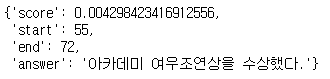

# kcbert QA와 korquad fine-tunning

- kcbert 모델을 이용한 한국어 질의 응답


## 코드

### 1. 패키지 로드

```python
from transformers import AutoTokenizer, TFAutoModelForQuestionAnswering, QuestionAnsweringPipeline
import tensorflow as tf
import tqdm.notebook
import math
import urllib.request
import json
```

### 2. 모델 및 데이터 로드

#### 1) 모델 로드

```python
model = TFAutoModelForQuestionAnswering.from_pretrained('beomi/kcbert-base', from_pt=True)
tokenizer = AutoTokenizer.from_pretrained('beomi/kcbert-base')
```

#### 2) 파이프라인 구성

```
qa = QuestionAnsweringPipeline(model=model, tokenizer=tokenizer)
```


#### * 파인 튜닝 전 성능 확인

```python
context = '윤여정은 1966년 연극 배우로 연기 경력을 시작하였고, 2021년 영화 《미나리》의 순자 역으로 아카데미 여우조연상을 수상했다.'
question = '윤여정의 직업은?'
```

```python
qa(question=question, context=context)
```


```python
qa(question='윤여정은 2021년 무엇을 했나?', context=context)
```



```python
qa(question='윤여정의 미나리에서의 역할은?', context=context)
```


- 학습이 제대로 되지않아 성능이 좋지않은 모습을 보인다.


## 3. korquad QA fine-tunning

- korquad : 한국어 QA 데이터 셋(https://korquad.github.io/)


#### 1) korquad 데이터 다운로드

````python
urllib.request.urlretrieve('https://korquad.github.io/dataset/KorQuAD_v1.0_train.json', 'korquad.json')
korquad = json.load(open('korquad.json', encoding='utf8'))
````


#### 2) korquad 데이터 확인

```python
korquad['data'][0]
```


```python
para = korquad['data'][0]['paragraphs'][0]
para
```


#### 3) 입력 데이터 전처리

```python
inputs = tokenizer(para['context'], 
                   qas['question'], 
                   truncation=True, 
                   max_length=tokenizer.model_max_length,
                   return_tensors='tf')
inputs
```


```python
q = qas['answers'][0]

# 글자의 위치
start_char = q['answer_start']
end_char = start_char + len(q['text']) - 1

# 토큰의 위치
start = inputs.char_to_token(0, start_char)
end = inputs.char_to_token(0, end_char)
```

```python
# 글자의 위치
print(start_char)
print(end_char)
```


````python
# 토큰의 위치
print(start)
print(end)
````


```python
# 정답을 실제 텍스트로 변환
tokenizer.decode(inputs['input_ids'].numpy()[0, start:end+1])
```


```python
inputs['start_positions'] = [start]
inputs['end_positions'] = [end]
```


#### 4) TFRecord 저장

```python
def int_feature(value):
    return tf.train.Feature(int64_list=tf.train.Int64List(value=value))

def make_inputs(context, qas):
    inputs = tokenizer(
        context, 
        qas['question'], 
        truncation=True, 
        max_length=tokenizer.model_max_length)
    q = qas['answers'][0]
    start_char = q['answer_start']
    end_char = start_char + len(q['text']) - 1
    start = inputs.char_to_token(0, start_char)
    end = inputs.char_to_token(0, end_char)
    inputs['start_positions'] = [start]
    inputs['end_positions'] = [end]
    return inputs
```

```python
%%time
n = 0
filename = 'korquad.tfrecord'
with tf.io.TFRecordWriter(filename) as writer:
    for item in korquad['data']:   # 각 아이템 순환
        for para in item['paragraphs']:  # 아이템마다 
            context = para['context']
            for qas in para['qas']:
                inputs = make_inputs(context, qas)
                if inputs['start_positions'][0] and inputs['end_positions'][0]:
                    feature = {k: int_feature(v) for k, v in inputs.items()}
                    example = tf.train.Example(features=tf.train.Features(feature=feature))
                    s = example.SerializeToString()
                    writer.write(s)
                    n += 1

```


```python
# 사례 수
n
```


#### 5) 불러오기

```python
int_seq = tf.io.FixedLenSequenceFeature(shape=(), dtype=tf.int64, allow_missing=True)
int_value = tf.io.FixedLenFeature(shape=(), dtype=tf.int64)
feature_description = {
    'input_ids': int_seq,
    'token_type_ids': int_seq,
    'attention_mask': int_seq,
    'start_positions': int_value,
    'end_positions': int_value
}
```

```python
def preproc(example):
    example = tf.io.parse_single_example(example, feature_description)
    example = {k : tf.cast(v, tf.int32) for k, v in example.items()}
    return example
```

```python
# korquad 데이터셋 불러오기
dataset = tf.data.TFRecordDataset(['korquad.tfrecord']).map(preproc).padded_batch(8)
batch = next(iter(dataset))
result = model(batch)
```


#### 6) 학습

```python
%%time
# 옵티마이저는 adam
opt = tf.keras.optimizers.Adam(learning_rate=5e-5)

n = 57653
for batch in tqdm.notebook.tqdm(dataset, total=math.ceil(n / 32)):
    with tf.GradientTape() as tape:
        result = model(batch)
        loss = tf.reduce_mean(result['loss'])
    grads = tape.gradient(loss, model.trainable_variables)
    opt.apply_gradients(zip(grads, model.trainable_variables)) # loss가 감소하는 방향으로 파라미터 업데이트
```


## 4. Test

```python
context = '윤여정은 1966년 연극 배우로 연기 경력을 시작하였고, 2021년 영화 《미나리》의 순자 역으로 아카데미 여우조연상을 수상했다.'
```

```python
def qa(question, context):
    inputs = tokenizer(context, question, add_special_tokens=True, return_tensors="tf")
    outputs = model(inputs)
    start = tf.argmax(outputs.start_logits, axis=1).numpy()[0]
    end = tf.argmax(outputs.end_logits, axis=1).numpy()[0]
    return tokenizer.decode(inputs['input_ids'][0, start:end+1])
```

```python
qa('윤여정은 언제 연기를 시작했나?', context)
```


```python
qa('윤여정은 언제 상을 받았나?', context)
```


```python
qa('윤여정이 2021년 받은 상은?', context)
```


```python
qa('윤여정의 출연작은?', context)
```


