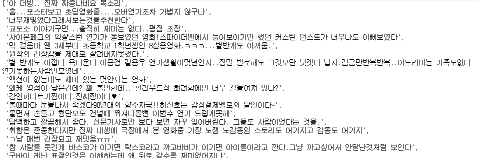

# 통계적 언어 모델

---

## 1. 이론

### 1) 정의

- 단어 시퀀스에 확률을 할당하는 모델로, 이전 단어들을 이용하여 다음 단어를 예측한다.
- 통계를 이용한 방법과 인공신경망을 이용한 방법이 있다.


### 2) 통계적 언어 모델

- 확률 기반의 언어 모델
- 조건부 확률
- 문장에 대한 확률을 카운트 기반의 접근으로 계산

- 여러 모델
  - 유니그램 모델(Unigram Model)
    - 모든 단어의 활용이 완전히 서로 독립이면 단어 열의 확률은 각 단어의 곱이되는 기반의 모델
  - 바이그램 모델(Bigram Model)
    - 단어의 활용이 바로 전 단어에만 의존(바로 직전)
  - N그램 모델(N-gram Model)
    - 단어의 활용이 전 단어에만 의존(N개 직전)
- 통계적 언어 모델의 한계
  - 훈련 corpus에 확률을 계산하고 싶은 문장이나 단어가 없을 수 있다.
  - 확률을 계산하고 싶은 문장이 길어질수록, 훈련 corpus에 그 문장이 존재하지 않을 가능성이 높다.
  - 단어 중 임의의 개수만 포함하기 때문에 부정확할 수 있다.

---

## 2. 코드

### 1) 바이그램 테스트

1. import

   ```python
   from nltk import bigrams 
   from nltk import word_tokenize
   ```

2. 테스트 문자열

   ```python
   text = 'I am a boy'
   ```

3. 토큰화

   ```python
   token = word_tokenize(text)
   ```

4. 바이그램

   ```python
   bg = bigrams(token)
   ```

5. 결과

   ```python
   list(bg)
   ```

   

### 2) N-그램 테스트

1. import

   ```python
   from nltk.util import ngrams
   from nltk import word_tokenize
   ```

2. 테스트 문자열

   ```python
   text = 'I am a boy'
   ```

3. 토큰화

   ```python
   token = word_tokenize(text)
   ```

4. n-그램

   ```python
   ng = ngrams(token, n=3) # 직전 n개의 단어로 예측
   ```

5. 결과

   ```python
   list(ng) 
   ```

   

### 3) 조건부 확률 테스트

1. import

   ```python
   from nltk.util import ngrams
   from nltk import word_tokenize
   from nltk import ConditionalFreqDist
   ```

2. 테스트 문자열

   ```python
   text = 'I am a boy'
   ```

3. 토큰화

   ```python
   token = word_tokenize(text)
   ```

4. n-그램

   ```python
   ng_2 = ngrams(token, 2, pad_left=True, pad_right=True, left_pad_symbol="SS", right_pad_symbol="SE")
   ```

   - pad_left : 시작점 활성화 여부
   - pad_right : 끝점 활성화 여부
   - left_pad_symbol : 시작점 명명
   - right_pad_symbol : 끝점 명명

5. 빈도수 사전 생성

   ```python
   # ng_2는 zip 형태이므로 꺼내야한다
   fd = ConditionalFreqDist([(i[0], i[1]) for i in ng_2])
   ```

6. 사전 내의 값 확인

   ```python
   fd.conditions()
   ```

   

   - SE가 없는 이유 : 문맥을 예측(직전의 단어)하므로 SE 즉, 문장의 끝은 취급하지 않는다. 정답 접근 정보만 포함한다.

7. 예측 테스트

   ```python
   fd['SS']
   ```

   

   - 예측 테스트 -> 'I'가 예측된다.(SS 다음에 나올 단어의 빈도수 표시)

---

## 3. 영화 리뷰 데이터 예시 : 확률적 언어 모델 (영어)

### * import

```python
# 아래의 클래스의 동작 언어에 관계없다
from nltk.util import ngrams # 앞 단어와 뒷 단어를 갖고있는 data 생성
from nltk import ConditionalFreqDist # 문맥별 단어 빈도수 측정
from nltk.probability import ConditionalProbDist # 조건부 확률 추정 클래스
from nltk.probability import MLEProbDist # 최대 우도 추정값 클래스
# MLEProbDist.generate() : 샘플 추출 (임의의 값을 추출)
```

### 1. 데이터 수집

```python
from nltk.corpus import movie_reviews
data = movie_reviews.sents()
```

### 2. 데이터 전처리

```python
data_l = [] # 처리된 단어 토큰 조합
for sentence in data:
    bg = ngrams(sentence, 2, pad_left=True, pad_right=True, left_pad_symbol="SS", right_pad_symbol="SE")
    data_l += [t for t in bg]
```

### 3. 모델 학습

```python
cfd = ConditionalFreqDist(data_l)
cpd = ConditionalProbDist(cfd, MLEProbDist)
```

### 4. 검증(생략) : 실제로 확률적 모델은 성능이 떨어져서 사용하지 않으므로 검증과정을 생략한다

### 5. 최종동작

```python
st = 'SS'
all_str = []
import random
# SS부터 SE 까지 출력
while True:
    random.seed(10)
    st = cpd[st].generate()
    all_str.append(st+' ')
    if st== 'SE':
        all_str.pop()
        break
created_data = ''.join(all_str)

created_data
```


---

## 4. 영화 리뷰 데이터 예시 : 확률적 언어 모델 (한글)

### 1) 데이터 수집

```python
import codecs
with codecs.open('data2.txt', encoding='utf-8') as f:
    data = [sentence.split('\t') for sentence in f.read().splitlines()]
    data = data[1:]
```

### 2) 데이터 전처리 : 문장 토큰화 및 정제

```python
t_data = [sentence[1] for sentence in data] # 문장만 추출
t_data # 문장 토큰화 완료된 데이터
```



### 3) 데이터 전처리 : 단어 토큰화(형태소 토큰화)

```python
from konlpy.tag import Okt
tg = Okt()

def tk_f(t_data):
    tk_d = ['/'.join(x) for x in tg.pos(t_data)]
    return tk_d
```

### 4) n-gram + 동작시간 측정

```python
from tqdm import tqdm # 작업의 진행사항을 알려주는 패키지
from nltk.util import ngrams
end_data = []

for sentence in tqdm(t_data): # 반복문을 통한 작업 진행사항 확인
    tk_data = tk_f(sentence) # 형태소 분석기를 이용하여 토큰화
    bigram = ngrams(tk_data, 2, pad_left=True, pad_right=True, left_pad_symbol='SS', right_pad_symbol='SE')
    end_data += [t for t in bigram]
```

### 5) 조건부 확률 사전 생성

```python
from nltk import ConditionalFreqDist
from nltk.probability import ConditionalProbDist, MLEProbDist

cfd = ConditionalFreqDist(end_data)
cpd = ConditionalProbDist(cfd, MLEProbDist)
```

### 6) 결과확인

```python
st = 'SS'
all_str = []
import random
random.seed(0)
# SS부터 SE 까지 출력
while True:
    if st not in cpd:
        break
    st = cpd[st].generate()
    if st== 'SE':
        break
    d = st.split("/")[0]
    all_str.append(d)
created_data = ''.join(all_str)

from pykospacing import Spacing # 자동 띄워쓰기
spacing = Spacing()
kospacing_sent = spacing(created_data)
kospacing_sent
```


