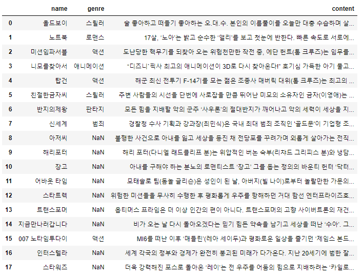
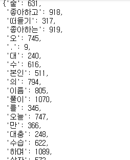
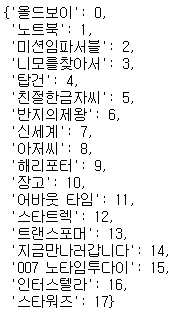

# 유사도 : 영화 3종 추천 예시

---

## 1. 데이터 로드

```python
import pandas as pd

original_data = pd.read_csv('data2.csv', encoding='utf-8')
original_data
```



```python
# 결측치 점검
original_data.isnull().sum()

# 결측치 채우기
original_data['genre'] = original_data['genre'].fillna('')
original_data['genre']
```


## 2. 데이터 전처리 : 형태소 토큰화 및 TD-IDF 벡터화

```python
from sklearn.feature_extraction.text import TfidfVectorizer
from konlpy.tag import Okt

ok = Okt()

tf_idf = TfidfVectorizer(tokenizer=ok.morphs)
tf_idf_table = tf_idf.fit_transform(original_data['content'])

tf_idf.vocabulary_
```




## 3. 코사인 유사도 기반 영화 3종 추천

```python
from sklearn.metrics.pairwise import cosine_similarity

# 코사인 유사도 계산
cos = cosine_similarity(tf_idf_table, tf_idf_table)

# 제목 : index 형식의 dict 생성
title_idx = dict(zip(original_data['name'], original_data.index))
title_idx
```



```python
def cos_sim(title, cosine_sim=cos):
    idx = title_idx[title]
    cosin_score = list(enumerate(cosine_sim[idx]))
    cosin_score = sorted(cosin_score, key = lambda x : x[1], reverse = True)
    high_score_3 = cosin_score[1:4]
    high_score_3_idx = [i[0] for i in high_score_3]
    return original_data['name'].iloc[high_score_3_idx]

cos_sim('올드보이')
```

```
11    어바웃 타임
5     친절한금자씨
16     인터스텔라
Name: name, dtype: object
```

---

## * 유클리드 유사도 이용

```python
import numpy as np
from sklearn.metrics.pairwise import euclidean_distances

e_tf_idf = tf_idf_table / np.sum(tf_idf_table)
euc = euclidean_distances(e_tf_idf, e_tf_idf)

def euc_sim(title, euc_sim=euc):
    idx = title_idx[title]
    euc_score = list(enumerate(euc_sim[idx]))
    euc_score = sorted(euc_score, key = lambda x : x[1], reverse = False)
    high_score_3 = euc_score[1:4]
    high_score_3_idx = [i[0] for i in high_score_3]
    return original_data['name'].iloc[high_score_3_idx]

euc_sim('올드보이')
```

```
11    어바웃 타임
5     친절한금자씨
16     인터스텔라
Name: name, dtype: object
```

---

## * 맨허튼 유사도 이용

```python
from sklearn.metrics.pairwise import manhattan_distances

e_tf_idf = tf_idf_table / np.sum(tf_idf_table)
mht = euclidean_distances(e_tf_idf, e_tf_idf)

def mht_sim(title, mht_sim=mht):
    idx = title_idx[title]
    mht_score = list(enumerate(mht_sim[idx]))
    mht_score = sorted(mht_score, key = lambda x : x[1], reverse = False)
    high_score_3 = mht_score[1:4]
    high_score_3_idx = [i[0] for i in high_score_3]
    return original_data['name'].iloc[high_score_3_idx]

mht_sim('올드보이')
```

```
11    어바웃 타임
5     친절한금자씨
16     인터스텔라
Name: name, dtype: object
```