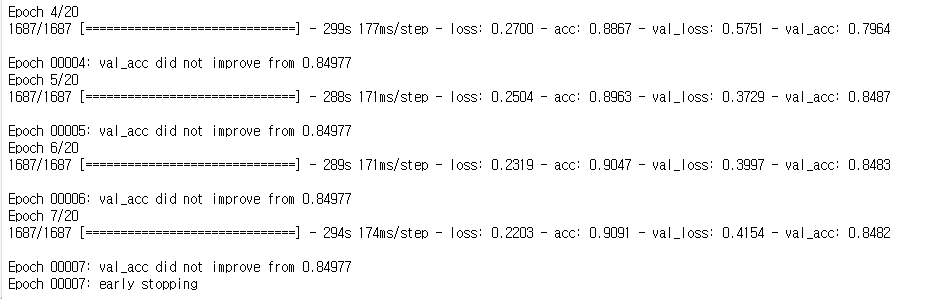
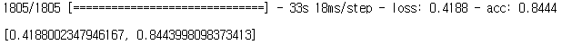
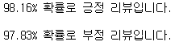

# 한글 전처리 클래스를 이용한 리뷰 분류

- 패키지 로드

  ```python
  from konlpy.tag import Okt
  from tensorflow.keras.preprocessing.text import Tokenizer
  from tensorflow.keras.preprocessing.sequence import pad_sequences
  from sklearn.preprocessing import LabelEncoder
  from sklearn.model_selection import train_test_split
  from tensorflow.keras.utils import to_categorical 
  import numpy as np 
  from nltk.corpus import stopwords 
  from bs4 import BeautifulSoup 
  import re
  from tqdm import tqdm
  import pandas as pd
  from tensorflow.keras.models import Sequential
  from tensorflow.keras.layers import Dense, Embedding, LSTM, BatchNormalization
  from tensorflow.keras.optimizers import Adam
  from tensorflow import keras
  from tensorflow.keras.callbacks import EarlyStopping, ModelCheckpoint
  import tensorflow as tf
  from tensorflow.keras.models import load_model
  ```

- 전처리 클래스

  ```python
  class ko_preprocessing:
      def __init__(self, data, x_col_name, y_col_name):
          data = data.rename(columns = {x_col_name : 'X', y_col_name : 'y'})
          self.__data = data
          self.__stopwords = set(['은','는','이','가','를','들','에게','의','을','도','으로','만','라서','하다'])
          self.__wc = 0
          self.__sl = 0
          self.__tobj = None
          
      def add_stopwords(self, stopwords: list):
          for i in stopwords:
              self.__stopwords.add(i)
          return None
      
      def get_stopwords(self):
          return self.__stopwords
      
      def get_word_count(self):
          return self.__wc
      
      def get_sent_maxlen(self):
          return self.__sl
      
      def get_token_object(self):
          return self.__tobj
      
      def ko_preprocessing_func(self, select_y=False, tk_word_bin=4):
          data = self.__data.copy()
          data = data.drop_duplicates(subset=['X'])
          data['clean_X'] = data.X.str.replace('[^ㄱ-ㅎㅏ-ㅣ가-힣 ]','')
          data['clean_X'] = data.clean_X.str.replace('^ +','')
          data['clean_X'] = data.clean_X.replace('',np.nan)
          data = data.dropna(how='any')
          
          okt = Okt()
          X_data = []
          
          for i in tqdm(data['clean_X']): 
              tk_d=okt.morphs(i) 
              end_d=[w for w in tk_d if not w in self.__stopwords] 
              X_data.append(' '.join(end_d)) 
              
          data['y_name'] = data['y']
          data['encoder_y'] = LabelEncoder().fit_transform(data['y'])
          data['categorical_y'] = list(to_categorical(data['encoder_y']))
          
          
          X=np.array(X_data)
          if select_y:
              Y = to_categorical(data['encoder_y'])
          else:
              Y = np.array(data['encoder_y'])
          
          x_data,test_x,y_data,test_y = train_test_split(X,Y,test_size=0.3,random_state=0)
          train_x,val_x,train_y,val_y = train_test_split(x_data,y_data,test_size=0.2,random_state=0)
          
          tk = Tokenizer()
          tk.fit_on_texts(train_x)
          n = len([d for d in sorted(list(tk.word_counts.items()),key=lambda x:x[1]) if d[1]>tk_word_bin])+1
          token = Tokenizer(n)
          token.fit_on_texts(train_x)
          
          token_train_x=token.texts_to_sequences(train_x)
          token_test_x=token.texts_to_sequences(test_x)
          token_val_x=token.texts_to_sequences(val_x)
          
          drop_train = [index for index, sentence in enumerate(token_train_x) if len(sentence) < 1]
          drop_test = [index for index, sentence in enumerate(token_test_x) if len(sentence) < 1]
          drop_val = [index for index, sentence in enumerate(token_val_x) if len(sentence) < 1]
          
          token_train_x = np.delete(token_train_x, drop_train, axis=0)
          train_y = np.delete(train_y, drop_train, axis=0)
          token_test_x = np.delete(token_test_x, drop_test, axis=0)
          test_y = np.delete(test_y, drop_test, axis=0)
          token_val_x = np.delete(token_val_x, drop_val, axis=0)
          val_y = np.delete(val_y, drop_val, axis=0)
          
          w_l = max(len(pad_sequences(token_train_x)[0]),
                    len(pad_sequences(token_test_x)[0]),
                    len(pad_sequences(token_val_x)[0]))
          
          train_inputs = pad_sequences(token_train_x,maxlen=w_l)
          test_inputs = pad_sequences(token_test_x,maxlen=w_l)
          val_inputs = pad_sequences(token_val_x,maxlen=w_l)
          
          train_outputs = train_y
          test_outputs = test_y
          val_outputs = val_y
          
          self.__wc = len(token.word_index) + 1
          self.__sl = w_l
          self.__tobj = token
          
          return train_inputs, train_outputs, test_inputs, test_outputs, val_inputs, val_outputs
  ```

- 데이터 로드 및 전처리 클래스를 이용한 전처리

  ```python
  train_data = pd.read_table('ratings_train.txt')[['document','label']]
  test_data = pd.read_table('ratings_test.txt')[['document','label']]
  data = pd.concat((train_data,test_data),axis=0)
  
  k_pr = ko_preprocessing(data, x_col_name='document', y_col_name='label')
  t_x, t_y, tt_x, tt_y, v_x, v_y = k_pr.ko_preprocessing_func()
  ```

- 모델 옵션 설정

  ```python
  batch_size = 64
  total_word_n = k_pr.get_word_count()
  max_sent_len = k_pr.get_sent_maxlen()
  embedding_len = 100
  nl_n = 64
  drop_out_size = 0.5
  ada_learing_rate = 0.001
  epochs_n = 20
  ```

- 조기종료 및 최적 모델 저장 콜백함수

  ```python
  e_st = EarlyStopping(monitor='val_loss', mode='min', verbose=1, patience=4)
  mc = ModelCheckpoint('ko_best_model.h5py', monitor='val_acc', mode='max', verbose=1, save_best_only=True)
  ```

- 모델 구축 및 학습

  ```python
  m = Sequential()
  m.add(Embedding(total_word_n, embedding_len, input_length=max_sent_len))
  m.add(BatchNormalization())
  m.add(LSTM(nl_n, dropout=drop_out_size, return_sequences=True))
  m.add(BatchNormalization())
  m.add(LSTM(nl_n, dropout=drop_out_size))
  m.add(BatchNormalization())
  m.add(Dense(1, activation='sigmoid'))
  m.compile(optimizer=Adam(ada_learing_rate), loss=tf.losses.BinaryCrossentropy(), metrics='acc') # acc = accuracy
  
  hy = m.fit(t_x, t_y, epochs=epochs_n, validation_data=(v_x, v_y), batch_size=batch_size, callbacks=[e_st, mc])
  ```

  

- 모델 평가

  ```python
  m.evaluate(tt_x, tt_y)
  ```

  

- 모델 불러오기

  ```python
  loaded_model = load_model('ko_best_model.h5py')
  ```

- input 전처리 및 결과 출력 함수

  ```python
  def input_preprocessing(sent):
      okt = Okt()
      #tobj = get_token_object()
      
      sent = re.sub(r'[^ㄱ-ㅎㅏ-ㅣ가-힣 ]','', sent)
      sent = okt.morphs(sent, stem=True)
      sent = [w for w in sent if not w in k_pr.get_stopwords()] 
      encoded = k_pr.get_token_object().texts_to_sequences([sent])
      pad_new = pad_sequences(encoded, maxlen = max_sent_len) 
      score = float(loaded_model.predict(pad_new))
      if(score > 0.5):
          print(f"{score * 100:.2f}% 확률로 긍정 리뷰입니다.\n")
      else:
          print(f"{(1 - score) * 100:.2f}% 확률로 부정 리뷰입니다.\n")
  ```

- 임의의 input 값으로 테스트

  ```python
  input_preprocessing('너무 재미있는 영화인걸?')
  input_preprocessing('좀 별로였던 영화같아')
  ```

  

