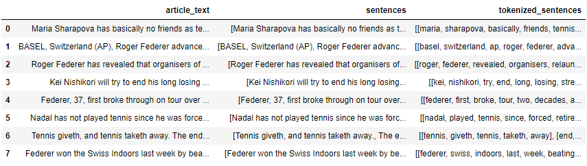

# 문장 임베딩 기반 텍스트 랭크(추출요약) 기법

- 텍스트랭크(TextRank) 알고리즘을 사용한 텍스트 추출적 요약
- 페이지랭크 알고리즘
  - 텍스트 랭크 알고리즘의 기반이 되는 알고리즘
  - 검색 엔진에서 웹 페이지의 순위를 정하기 위해 사용되던 알고리즘
- 텍스트 랭크 알고리즘
  - 페이지랭크를 기반으로 한 텍스트 요약 알고리즘
  - 텍스트 랭크에서 그래프의 노드들은 문장이다.
  - 각 간선의 가중치는 문장들 간의 유사도를 의미한다.


## 1. 코드

### 1) 패키지 로드

```python
import numpy as np
import gensim
from urllib.request import urlretrieve, urlopen
import gzip
import zipfile
import fasttext.util
import numpy as np
import re
import pandas as pd
import matplotlib.pyplot as plt
from nltk.tokenize import sent_tokenize, word_tokenize
from nltk.corpus import stopwords
from urllib.request import urlretrieve
import zipfile
from sklearn.metrics.pairwise import cosine_similarity
import networkx as nx
```

### 2) 사전 훈련된 임베딩 모델 다운로드(Pre-trained Embedding)

#### (1) Pre-trained glove 다운로드

```python
urlretrieve("http://nlp.stanford.edu/data/glove.6B.zip", filename="glove.6B.zip")
zf = zipfile.ZipFile('glove.6B.zip')
zf.extractall() 
zf.close()
```

```python
glove_dict = dict()
f = open('glove.6B.100d.txt', encoding="utf8")    # 100차원의 GloVe 벡터를 사용

for line in f:
    word_vector = line.split()
    word = word_vector[0]
    word_vector_arr = np.asarray(word_vector[1:], dtype='float32') # 100개의 값을 가지는 array로 변환
    glove_dict[word] = word_vector_arr
f.close()
```

#### (2) Pre-trained FastText 다운

```python
# 300차원의 FastText 벡터 사용
fasttext.util.download_model('en', if_exists='ignore')
ft = fasttext.load_model('cc.en.300.bin')
```

```python
# 만약 단어 'cat'에 대한 임베딩 벡터를 얻고싶다면 다음과 같이 얻을 수 있습니다.
ft.get_word_vector('cat')
```


### 3) 문장 임베딩(Sentence Embedding)

- 다음 코드에서는 문장에 존재하는 단어 벡터의 평균을 구하여 문장벡터를 구한다.
- 사용할 임베딩 모델은 앞서 다운받은 사전훈련된 glove 모델이다.
- 현재 glove_dict에는 100차원의 GloVe 벡터들이 저장되어있다.
- OOB 문제, 즉, glove_dict에 존재하지 않는 단어가 문장에 존재할 경우 해당 단어의 임베딩 값으로 사용할 100차원의 영벡터도 만들어둔다.

#### (1) 100차원의 영벡터 만들기

```python
embedding_dim = 100
zero_vector = np.zeros(embedding_dim)
```

#### (2) 문장 벡터를 얻는 함수 정의

```python
# 단어 벡터의 평균으로부터 문장 벡터를 얻는다.
def calculate_sentence_vector(sentence):
    return sum([glove_dict.get(word, zero_vector) 
                for word in sentence])/len(sentence)
```

- 문장의 각 단어를 사전 훈련된 GloVe 벡터로 변환한다.
- OOV 문제가 발생할 경우에는 해당 단어를 영벡터로 변환한다.
- 모인 단어 벡터들의 평균을 구하여 반환한다.

- 예시

  ```python
  eng_sent = ['I', 'am', 'a', 'student']
  sentence_vector = calculate_sentence_vector(eng_sent)
  print(len(sentence_vector))
  ```

  - 다음과 같이 문장 벡터 값을 얻고 싶다면 위 함수의 입력으로 사용한다.
  - 현재 사용하는 GloVe 모델은 영어에 대해서만 학습된 모델이므로, 한글을 입력하면 모두 OOV 문제가 발생한다.


### 4) 텍스트 랭크를 이용한 텍스트 요약

#### (1) 불용어 지정

```python
# NLTK에서 제공하는 불용어를 받아옵니다.
stop_words = stopwords.words('english')
```

#### (2) 텍스트 요약에 사용할 기사 데이터 다운로드

```python
# 텍스트 요약에 사용할 테니스 관련 기사를 다운로드하고, 데이터프레임에 저장합니다.
urlretrieve("https://raw.githubusercontent.com/prateekjoshi565/textrank_text_summarization/master/tennis_articles_v4.csv", filename="tennis_articles_v4.csv")
data = pd.read_csv("tennis_articles_v4.csv")
data.head()
```


- article_text만 사용하기 때문에, article_text 열만 사용하고, 해당 기사를 문장 토큰화한 결과를 저장한 sentences라는 열을 새로 만든다.

```python
data = data[['article_text']]
data['sentences'] = data['article_text'].apply(sent_tokenize)
data
```


#### (3) 텍스트 전처리 함수 정의

```python
# 토큰화 함수
def tokenization(sentences):
    return [word_tokenize(sentence) for sentence in sentences]

# 전처리 함수
def preprocess_sentence(sentence):
  # 영어를 제외한 숫자, 특수 문자 등은 전부 제거. 모든 알파벳은 소문자화
  sentence = [re.sub(r'[^a-zA-z\s]', '', word).lower() for word in sentence]
  # 불용어가 아니면서 단어가 실제로 존재해야 한다.
  return [word for word in sentence if word not in stop_words and word]

# 위 전처리 함수를 모든 문장에 대해서 수행. 이 함수를 호출하면 모든 행에 대해서 수행.
def preprocess_sentences(sentences):
    return [preprocess_sentence(sentence) for sentence in sentences]
```

- 문장 토큰화를 진행한 'sentences'열에 대해서 단어 토큰화화 전처리를 적용한 'tokenized_sentences'열을 새로 만든다.

```python
data['tokenized_sentences'] = data['sentences'].apply(tokenization)
data['tokenized_sentences'] = data['tokenized_sentences'].apply(preprocess_sentences)
data
```



#### (4) OOV 영벡터 정의

- 현재 사용할 GloVe 벡터의 차원은 100이므로, 100차원의 영벡터를 만든다.

```python
embedding_dim = 100
zero_vector = np.zeros(embedding_dim)
```

#### (5) 문장 벡터를 구하는 함수 정의

- 문장의 길이가 0인 경우에는 100차원의 영벡터를 리턴한다.
- 현재 불용어를 제거하였기 때문에 문장의 모든 단어가 불용어인 경우에는 길기아 0인 문장이 생길 수 있다.

```python
# 단어 벡터의 평균으로부터 문장 벡터를 얻는다.
def calculate_sentence_vector(sentence):
    if len(sentence) != 0:
        return sum([glove_dict.get(word, zero_vector) 
                  for word in sentence])/len(sentence)
    else:
        return zero_vector
```

- 모든 행에 대하여 수행하는 함수 정의

```python
# 각 문장에 대해서 문장 벡터를 반환
def sentences_to_vectors(sentences):
    return [calculate_sentence_vector(sentence) 
              for sentence in sentences]
```

#### (6) 모든 문장에 대해서 문장 벡터 만들기

```python
data['SentenceEmbedding'] = data['tokenized_sentences'].apply(sentences_to_vectors)
data[['SentenceEmbedding']]
```


#### (7) 문장 벡터들 간의 코사인 유사도를 구하는 함수 정의

- 문장 벡터들 간의 코사인 유사도를 구한 유사도 행렬을 만든다.
- 이 유사도 행렬의 크기는 (문장 개수 X 문장 개수)이다.

```python
def similarity_matrix(sentence_embedding):
    sim_mat = np.zeros([len(sentence_embedding), len(sentence_embedding)])
    for i in range(len(sentence_embedding)):
        for j in range(len(sentence_embedding)):
            sim_mat[i][j] = cosine_similarity(sentence_embedding[i].reshape(1, embedding_dim),
                                          sentence_embedding[j].reshape(1, embedding_dim))[0,0]
    return sim_mat
```

- 유사도 행렬 함수를 적용하고 이 결과를 가진 'SimMatrix'열을 만든다.

```python
# 이 결과를 저장한 'SimMatrix'열을 만듭니다.
data['SimMatrix'] = data['SentenceEmbedding'].apply(similarity_matrix)
data['SimMatrix']
```


- 두번째 샘플을 기준으로 지금까지 만든 열들의 크기 확인

```python
# 두번째 샘플을 기준으로 지금까지 만든 열들의 크기를 확인해봅시다.
print('두번째 샘플의 문장 개수 :',len(data['tokenized_sentences'][1]))
print('두번째 샘플의 문장 벡터가 모인 문장 행렬의 크기(shape) :',np.shape(data['SentenceEmbedding'][1]))
print('두번째 샘플의 유사도 행렬의 크기(shape) :',data['SimMatrix'][1].shape)
```


#### (8) 유사도 행렬을 그래프로 나타내기

- 두번째 샘플의 경우 총 12개의 문장이 존재한다. 그래서 문장 벡터 또한 12개가 존재하며, 각 문장 벡터는 100의 크기를 가진다.
- 유사도 행렬은 각 문장 벡터들의 유사도가 기록된 유사도 행렬이므로 (문장 개수 X 문장 개수)의 크기를 가진다.

- 유사도 행렬을 그래프로 그리는 함수 정의

  ```python
  def draw_graphs(sim_matrix):
      nx_graph = nx.from_numpy_array(sim_matrix)
      plt.figure(figsize=(10, 10))
      pos = nx.spring_layout(nx_graph)
      nx.draw(nx_graph, with_labels=True, font_weight='bold')
      nx.draw_networkx_edge_labels(nx_graph,pos,font_color='red')
      plt.show()
  ```

- 결과

  ```python
  draw_graphs(data['SimMatrix'][1])
  ```

  

