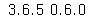
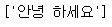
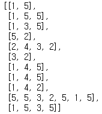
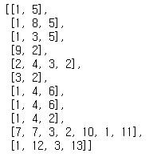
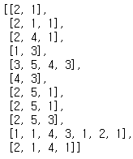
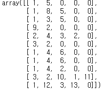
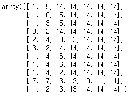
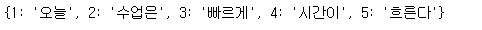
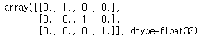

# 텍스트 전처리


## 1. 설치 패키지

- ``pip install konlpy`` : 형태소 분석

- ``pip install nltk`` : 자연어 처리

  - 추가설치코드 입력(토큰화를 위한 추가 패키지)

    ```python
    nltk.download('punkt')
    nltk.download('averaged_perceptron_tagger')
    nltk.download('wordnet')
    nltk.download('stopwords')
    ```

- ``pip install kss`` : 문장 분할


- 설치확인

  설치 후 아래 코드가 실행이 되면 설치가 정상적으로 된 것이다.

  ```python
  import nltk, kss, konlpy
  print(nltk.__version__, konlpy.__version__)
  ```

  

  ```python
  tt = '안녕 하세요'
  kss.split_sentences(tt)
  ```

  

---

## 2. 말뭉치(corpus)

- 자연언어 연구를 위해 특정한 목적을 가지고 언어의 표본을 추출한 집합 == 방대한 양의 데이터(데이터 셋)

- 복수형은 corpora라고 한다. (둘 이상의 코퍼스)

- 즉, corpus는 하나의 언어이다.

---

## 3. 텍스트 전처리란?

- 수집한 전처리되지 않은 상태의 데이터(비정형 텍스트)에 대해서 토큰화, 정제, 정규화를 진행하는 것이다.


### 1) 토큰화

- 유의사항

  1. 구두점이나 특수문자를 단순제외해서는 안된다.

     ```markdown
     - 구두점조차도 하나의 토큰으로 분류한다.
     ex.
     - 마침표를 문장의 경계를 통한 단어 추출용 기준으로 사용할 수 있다.
     - 단어 자체의 구두점
     	- m.p.h, AT&T나 $45.55와 같은 단어
     	- 123,456,789 처럼 숫자사이의 컴마
     ```

     

  2. 줄임말과 단어 내의 띄워쓰기를 고려해야한다.

     ```markdown
     - we're이나 New York 같은 경우
     ```


- 단어 토큰화(Word Tokenization)
  - 토큰의 기준을 단어(단어구, 의미를 갖는 문자열)로 하여 토큰화 하는것
  - 단어의 의미를 훼손하지않고 토큰화하는 방법을 사용해야 한다.
  - 한국어는 단순 공백으로 구분하면 토큰이 의미를 잃어버린다.(토큰 구분이 망가짐) 또한 영어도 축약형태가 존재하므로 토큰화에 유의해야한다(ex. Don't).
- 문장 토큰화(Sentence Tokenization)
  - 단어 토큰화를 사용하기 위해서 먼저는 문장으로 나눠야한다.
  - 문장 단위로 구분하는 작업으로 문장 분류
  - 마침표 .는 문장의 끝이 아니라도 등장할 수 있다. ex) IP주소, 이메일 주소, 이름 축약


- 한국어의 토큰화 문제점

  - **띄워쓰기만으로 토큰화하기에는 부족, 모여있는 단어가 많다.**
  - 따라서 어절 토큰화를 진행해야하는데 NLP에서 지양된다.
  - 형태소에 대한 개념의 이해가 필요하다.

  *따라서 한국어의 토큰화는 **형태소 토큰화**로 수행되어야한다.*

  - **영어와 달리 띄워쓰기가 안되어도 의미가 전달이된다.**


#### * 품사 태깅

- 제대로된 의미를 파악하기 위해서는 각 단어가 어떤 품사로 쓰였는지를 구분해야함.
- 한국어는 형태소 토큰화를 진행하기때문에 형태소에 품사 태깅을 진행한다.


### 3) 정제

- 코퍼스로부터 노이즈 데이터를 제거
- 완벽한 정제는 어렵고 과적합의 문제가 있을 수 있다. 또한 너무 완벽해버리면 오차가 존재하지않아서 학습이되지 않는다.
- 완벽한 정제보다는 합의점을 찾아서 정제를 한다.


### 4) 정규화

- 표현이 다른 단어들을 통합시켜서 같은 단어로 만든다. 특정 단어에 대해서 편향이 발생하여 과적합이 발생하는 것을 방지한다.(중요도를 빈도수로 측정하지 않음)


#### * 규칙에 기반한 통합

- 표기가 다른 단어들을 하나의 단어로 정규화


#### * 대, 소문자 통합

- 영어에서 발생하는 현상
- 대부분의 글은 소문자로 작성하기 때문에 대, 소문자 통합 작업은 대부분 대문자를 소문자로 변환하는 소문자 변환작업 -> 대문자와 소문자를 같은 취급하기 위함.


#### * 불필요한 단어의 제거

- 정규화라기보다는 정제에 가깝다.
- 등장 빈도가 적은 단어, 길이가 짧은 단어를 제거한다.


#### * 표제어 추출과 어간추출

- 표제어 추출(lemmatization)
  - 단어들이 다른 형태를 가지더라도, 그 뿌리 단어를 찾아가서 단어의 개수를 줄일 수 있는지 판단
  - 형태학적 파싱 : 어간과 접사로 분리하는 작업
- 어간추출(stemming)
  - 어간(stem)을 추출하는 작업
  - 정해진 규칙만 보고 단어의 어미를 자르는 어림짐작의 작업
  - 정확하지 x -> 사전에 존재하지 않는 단어일 수 있다.


#### * 한글의 특성

- 동사변화
  - 규칙적 동사변화 : 어간이 어미의 모습을 취할 때, 어간의 모습이 일정
  - 불규칙적 동사변화 : 어간이 어미를 취할 때 어간의 모습이 바뀌거나 취하는 어미가 특수한 어미일 경우 -> 단순분리가 불가능해서 좀 더 복잡한 규칙을 필요로한다.


### 5) 불용어

- 실제 의미 분석을 하는데 거의 기여하는 바가 없는 단어들
- 한국어에서 불용어 제거 : 토큰화 후 조사, 접속사 등을 제거
- 사용자가 직접 불용어 사전을 만들게 되는 경우가 많다.(txt 파일이나 csv 파일로 정리해놓고 불러와서 사용하기도한다.)


### 6) 정규표현식

|    기호     |                             내용                             |
| :---------: | :----------------------------------------------------------: |
|      .      |    한 개의 임의의 문자를 나타낸다.(줄바꿈 문자 \n은 예외)    |
|      ?      | 입력 이후 중간 문자의 유무에 상관없이 끝 문자가 나오면 인식된다. |
|      *      |     연결된 문자의 중복 개수 상관없이 인식한다(0개 이상).     |
|      +      |     연결된 문자의 중복 개수 상관없이 인식한다(1개이상).      |
|      ^      |         기호이후 문자열로 시작되는 문자열 인식한다.          |
|   {숫자}    | 기호 앞에 있는 단어의 개수가 기호 안의 숫자만큼 있을 때 인식한다. |
| {숫자,숫자} | 기호 앞에 있는 단어의 개수가 기호 안의 숫자범위만큼 있을 때 인식한다. |
|   {숫자,}   |               슬라이싱과 같은 원리로 인식한다.               |
|     []      | 괄호 안에 있는 문자의 유무를 인식한다. [-]로 범위를 지정할 수 있다. ex) [A-Z] 대문자 A-Z 까지 |
|     [^]     |           관호 안에 있는 문자가 없을 때 인식한다.            |

정규표현식을 사용하면 문자열처리가 용의하다.

[정규 표현식 문법]

| 기호 |                             내용                             |
| :--: | :----------------------------------------------------------: |
|  \   |               역 슬래쉬 문자 자체를 의미한다.                |
|  \d  |        모든 숫자를 의미한다. [0-9]와 의미가 동일하다.        |
|  \D  | 숫자를 제외한 모든 문자를 의미한다. \[^0-9]와 의미가 동일하다. |
|  \s  |       공백을 의미한다. [\t\n\r\f\v]와 의미가 동일하다.       |
|  \S  | 공백을 제외한 문자를 의미한다.  \[^\t\n\r\f\v]와 의미가 동일하다. |
|  \w  |  문자 또는 숫자를 의미한다. [a-zA-Z0-9]와 의미가 동일하다.   |
|  \W  | 문자 또는 숫자가 아닌 문자를 의미한다. \[^a-zA-Z0-9]와 의미가 동일하다. |

[정규 표현식 모듈 함수]

| 메서드                           | 내용                                                         |
| -------------------------------- | ------------------------------------------------------------ |
| re.compile(조건)                 | 정규 표현식을 컴파일하는 함수                                |
| re.search(문자열)                | 문자열 전체에 대해서 정규표현식과 매치되는지를 검색          |
| re.match(문자열)                 | 문자열의 처음이 정규표현식과 매치되는지 검색                 |
| re.split(조건, 문자열)           | 정규표현식을 기준으로 문자열을 분리하여 리스트로 리턴        |
| re.findall(조건, 문자열)         | 문자열에서 정규 표현식과 매치되는 모든 경우의 문자열을 찾아서 리스트로 리턴한다. 매치가 안되면 빈 리스트를 리턴 |
| re.finditer(조건, 문자열)        | 문자열에서 정규표현식과 매치되는 모든 경우의 문자열에 대한 이터레이터 객체를 리턴 |
| re.sub(조건, 바꿀문자열, 문자열) | 문자열에서 정규 표현식과 일치하는 부분에 대해서 다른 문자열로 대체 |


### 7) 정수 인코딩

- 각 단어를 고유한 정수에 맵핑(mapping)시키는 전처리 작업
- 단어를 빈도수 순으로 정렬한 단어 집합을 만들고, 빈도수가 높은 순서대로 차례로 낮은 숫자부터 정수를 부여하는 방법
- dictionary
- Counter


### 8) 패딩

- 병렬 연산을 위해 여러 문장의 길이를 동일하게 맞춰주는 작업


### 9) 원-핫 인코딩

- 단어 집합의 크기를 벡터의 차원으로하고, 표현하고 싶은 단어의 인덱스는 1, 아니면 0을 부여하는 단어 벡터 표현 방식
- 벡터를 저장하기 위해 필요한 공간이 계속 늘어난다는 단점이 존재한다. -> 과대적합이 발생할 확률이 매우 높아진다.


---

## 4. 비정형 텍스트 전처리 코드(영어 처리)

### 사전 기반 정수 인코딩 방법

---

### * import

```python
from nltk.tokenize import sent_tokenize
from nltk.tokenize import word_tokenize
from nltk.corpus import stopwords
```


### 1) 데이터 수집

```python
text = "A barber is a person. a barber is good person. a barber is huge person. he Knew A Secret! The Secret He Kept is huge secret. Huge secret. His barber kept his word. a barber kept his word. His barber kept his secret. But keeping and keeping such a huge secret to himself was driving the barber crazy. the barber went up a huge mountain."
```

수집을 통해서 다음과 같은 데이터를 얻었다고 가정.


### 2) 데이터 전처리 : 문장 토큰화

```python
data1 = sent_tokenize(text)
```


### 3) 데이터 전처리 : 단어 토큰화

```python
wordSet = {}
pr_data = []
stop_w = set(stopwords.words('english'))
for 문장 in data1:
    t_data = word_tokenize(문장)
    l = []
    for 단어 in t_data:
        소문자화_된_단어 = 단어.lower() # 단어를 소문자로 바꿈
        if 소문자화_된_단어 not in stop_w:
            if len(소문자화_된_단어) > 2: #단어수 2이하 제거
                l.append(소문자화_된_단어)
                if 소문자화_된_단어 not in wordSet:
                    wordSet[소문자화_된_단어] = 0
                wordSet[소문자화_된_단어] += 1
    pr_data.append(l) # 문장별로 처리된 단어를 저장
```

빈도수별 정렬

```python
정렬된_단어_모음 = sorted(wordSet.items(), key=lambda x:x[1], reverse=True) # 내림차순 정렬
```

빈도수가 높은 순으로 낮은 인덱스 부여

```python
단어_인덱스 = {}
i = 0
for (단어, 빈도수) in 정렬된_단어_모음:
    if 빈도수 > 1: # 빈도수 1이하 제거
        i += 1
        단어_인덱스[단어] = i
```

단어 종류의 수를 제한

```python
# 단어 종류 수 제한
n = 4
삭제_결정된_data = [단어 for 단어, i in 단어_인덱스.items() if n < i]
for i in 삭제_결정된_data:
    del 단어_인덱스[i]
```

기타 단어를 표시할 단어 추가

```python
# 단어 추가
단어_인덱스['OOV'] = len(단어_인덱스) + 1
```


### 4) 정규화

```python
# 정규화
ec_data = []
for i in pr_data:
    ec_d = []
    for 단어 in i:
        try:
            ec_d.append(단어_인덱스[단어])
        except KeyError:
            ec_d.append(단어_인덱스['OOV'])
    ec_data.append(ec_d)
```

실행결과 : 

---

### NLTK 모듈을 이용한 정수인코딩

---

#### * import

```python
from nltk import FreqDist
import numpy as np
```


### 1) 단어별 빈도수 측정

```python
단어_모음 = FreqDist(np.hstack(pr_data))
```


### 2) 단어 종류 수 제한

```python
단어_모음 = 단어_모음.most_common(4)
```


---

### Keras 이용 Data 토큰화 및 정수 인코딩

---

#### * import

```python
from tensorflow.keras.preprocessing.text import Tokenizer
```


### 1) 토큰화 및 빈도수 측정

```python
ck_t = Tokenizer()
ck_t.fit_on_texts(pr_data) # 특성을 기억하고 가지고 있게된다.
ck_t.word_index
ck_t.word_counts
```

 

### 2) 정수 인코딩

```python
ck_t.texts_to_sequences(pr_data)
```




### 3) 단어 종류 수 제한 및 기타 단어 포함

```python
n = 4
end_ck = Tokenizer(num_words=n+2, oov_token='OOV') # OOV가 빈도수 높게 측정되어서 수정해주어야한다. -> 어떻게?
end_ck.fit_on_texts(pr_data)
end_ck.texts_to_sequences(pr_data)
```



---

### Keras를 이용한 페딩

---

#### * import

```python
from tensorflow.keras.preprocessing.sequence import pad_sequences
```

### 1) 패딩

```python
tk = Tokenizer()
tk.fit_on_texts(pr_data)
encoded = tk.texts_to_sequences(pr_data)
# 패팅을 앞단부터할지 뒷단부터할지 결정, 어느부분의 데이터를 자를지 결정,최대길이결정
end_data = pad_sequences(encoded, padding='post', truncating='post',maxlen=5)
```



### 1-1) 패딩할 숫자를 결정

```python
v = len(tk.word_index) + 1
end_data = pad_sequences(encoded, padding='post', truncating='post', value=v) # 페딩할 숫자를 결정
end_data
```




---

### Tensorflow를 이용한 간단한 원-핫 인코딩

---


#### * import

```python
from tensorflow.keras.utils import to_categorical
from tensorflow.keras.preprocessing.text import Tokenizer
```

### 1) 데이터

```python
# 데이터 1 토큰화
t = '오늘 수업은 빠르게 시간이 흐른다.'
t_k = Tokenizer()
t_k.fit_on_texts([t])
t_k.index_word
```



```python
# 데이터 2에서 데이터 1에서 토큰화된 인덱스 추출
t2 = '오늘 수업은 빠르게 끝나고 마무리된다.'
e = t_k.texts_to_sequences([t2])[0]
```

원-핫 인코딩

```python
end_d = to_categorical(e)
```



